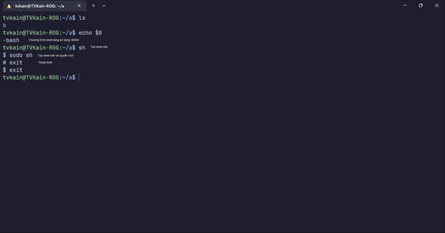

  

# Linux

## 1. Linux là gì ?
- Hệ điều hành
- Mã nguồn mở, người dùng có thể truy cập vào mã nguồn của hệ điều hành, thay đổi, cải tiến,...
- Dựa trên Unix
- Phát triển bởi Linux Torvalds
2. Các bản phân phối Linux
- Thực chất Linux chỉ là nhân hệ điều hành, ngày trước những ai muốn sử dụng Linux phải tự build từ mã nguồn, sau đó tự cài đặt và build các package cần thiết.

&#8594; Để dễ dàng hơn cho người sử dụng, các bản phân phối Linux được ra đời

- Các bản phân phối Linux khác nhau phục vụ cho nhiều mục đích khác nhau
Một số bản phân phối Linux phổ biến bao gồm:

||RHEL|Ubuntu|Arch|
|---|------|-------|------|
|Năm ra đời|1995|2004|2002|
|Package manager|rpm,dnf/yum|apt,dpkg|pacman|
|Sử dụng|Phát triển phần mềm, điện toán đám mây, container, lưu trữ, ảo hóa,...|Desktop, server, IOT,...|Cá nhân

 

## Phụ lục

### 1. Hệ điều hành là gì ?
- Tập hợp các chương trình quản lý tài nguyên phần cứng và các tiến trình đang thực thi
- Thường bao gồm nhiều chương trình khác nhau.
- "Trái tim" của hệ điều hành là một chương trình được gọi là nhân (kernel)
### 2. Nhân (Kernel) của hệ điều hành
- Được nạp vào bộ nhớ khi máy tính được khởi động, ở bên trong bộ nhớ đến khi máy tắt
- Vai trò chính là quản lý tài nguyên và xử lý tiến trình
### 3. Shell
- Trình phiên dịch xử lý câu lệnh của người dùng 
### 4. Terminal
- Cung cấp giao diện để người dùng tương tác với Shell

  

  

