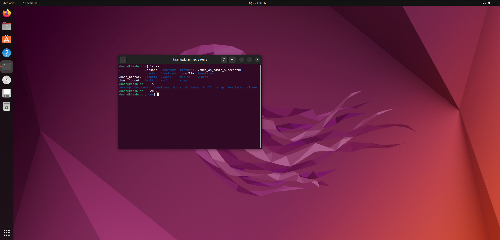
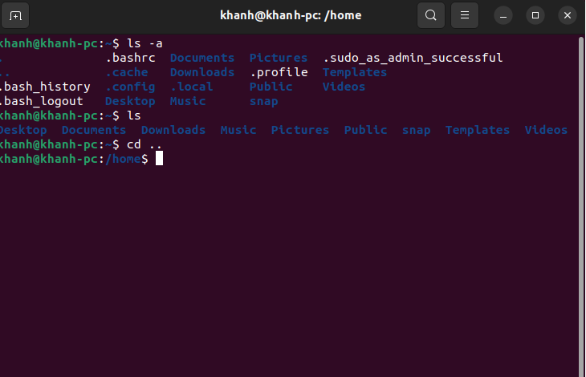
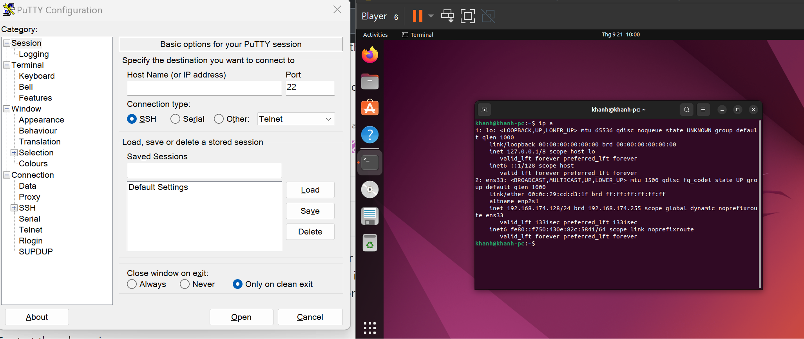
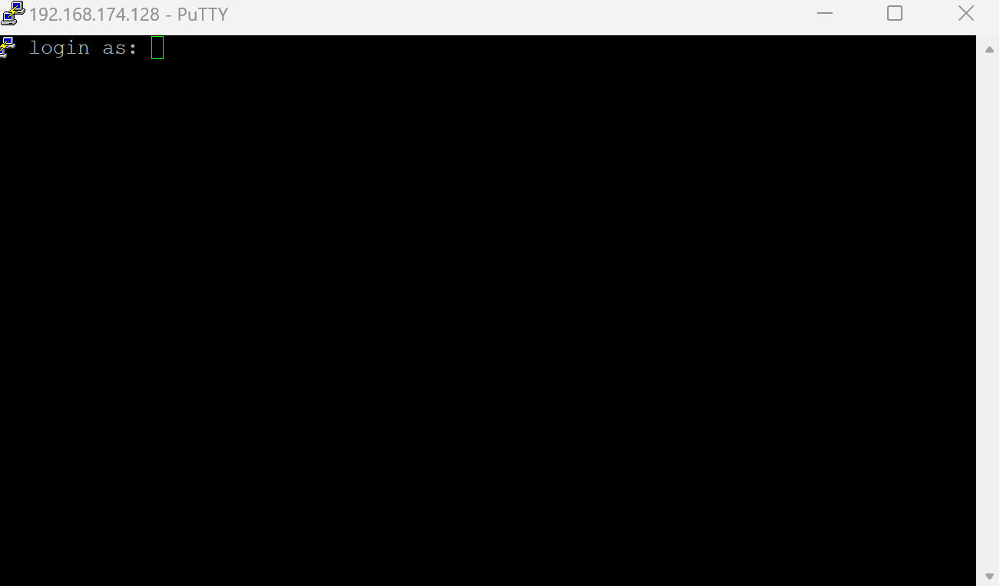
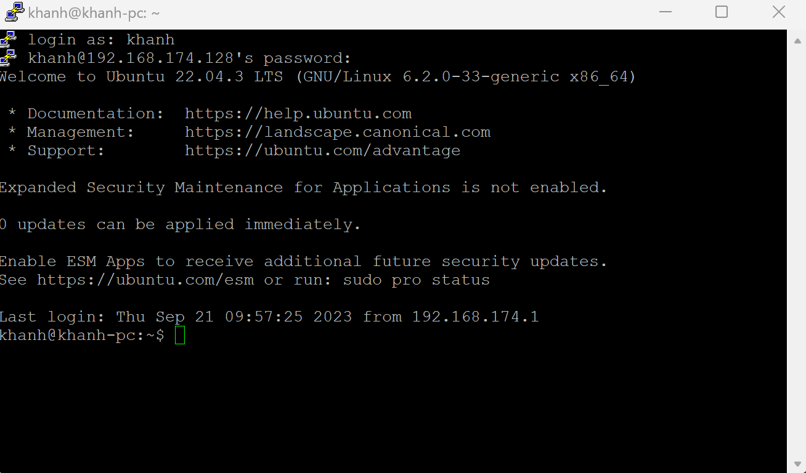
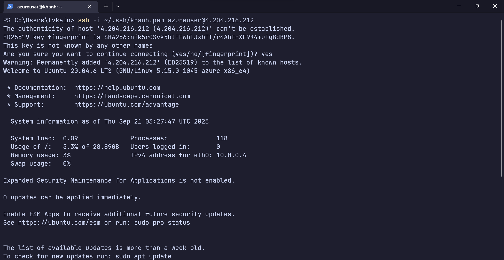
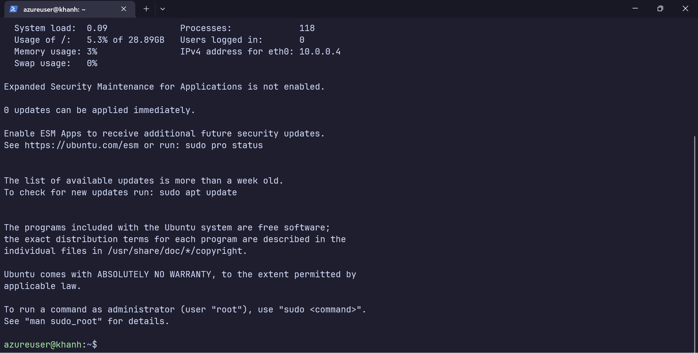

## 1. Cài đặt HĐH Ubuntu

## 2. Các cách tương tác với HĐH Linux 
### 2.1 Terminal (Local)
- Tương tác thông qua cửa sổ dòng lệnh với máy tính cục bộ

### 2.2 Giao thức SSH 
- Tương tác thông qua cửa sổ dòng lệnh với máy tính từ xa
#### Sử dụng PuTTY SSH vào máy ảo Ubuntu 

#### SSH vào máy ảo Ubuntu trên Azure Cloud

## Phụ lục
### 1. Giao thức SSH 
- Giao thức SSH là giao thức ở tầng ứng dụng được sử dụng để truy cập vào terminal của máy tính khác từ xa qua mạng không bảo mật 
- Ở tầng giao vận, SSH sử dụng giao thức TCP
- Sử dụng các thuật toán mã hóa bảo mật để đảm bảo trao đổi thông tin an toàn 
5.1 Sử dụng giao thức SSH 
Cần hai thành phần
	1. SSH Client
	Hệ điều hành Linux có sẵn, Windows có thể sử dụng PuTTY 
	2. OpenSSH Server  

Bên server, thành phần SSH daemon liên tục nghe cổng 22 (cổng sử dụng cho SSH) để xem có yêu cầu kết nối hay không. Khi client gửi yêu cầu với thông tin hợp lệ, kết nối bảo mật sẽ được thiết lập, SSH sẽ tạo phiên làm việc mới cho người dùng. 