# Hệ thống tệp tin trong Linux

## 1. Tổ chức

Được tổ chức phân cấp
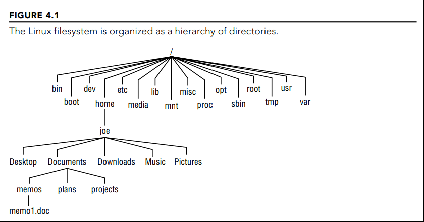

Chức năng của các thư mục

<div align="center">
  <table>
    <tr align="left">
      <th>
      Tên thư mục
      <th/>
      <th>
      Chức năng
      <th/>
    </tr>
    <tr>
      <td>
        <strong>/bin</strong>
      </td>
      <td>
        Chứa các chương trình thực thi được như ls,sort, date,...
      </td>
    </tr>
    <tr>
      <td>
        <strong>/boot</strong>
      </td>
      <td>
        Chứa nhân Linux lúc boot, các file cài đặt bootloader
      </td>
    </tr>
    <tr>
      <td>
        <strong>/dev</strong>
      </td>
      <td>
        Chứa các tệp tin được dùng làm điểm truy cập cho các thiết bị trên hệ thống. Bao gồm các thiết bị như đĩa cứng, RAM, và CD-ROM. Người dùng có thể truy cập trục tiếp những thiết bị trên thông qua các tệp tin. 
      </td>
    </tr>
    <tr>
      <td>
        <strong>/etc</strong>
      </td>
      <td>
        Chứa các tệp tin cài đặt cấu hình hệ thống 
      </td>
    </tr>
    <tr>
      <td>
        <strong>/home</strong>
      </td>
      <td>
        Chứa các thư mục cho mỗi người dùng bình thường với tài khoản đăng nhập (Người dùng root là ngoại lệ, sử dụng /root làm thư mục home)
      </td>
    </tr>
    <tr>
      <td>
        <strong>/root</strong>
      </td>
      <td>
        Thư mục home của root 
      </td>
    </tr>
    <tr>
      <td>
        <strong>/media</strong>
      </td>
      <td>
        Cung cấp vị trí tiêu chuẩn để mount tự động các thiết bị. Nếu thiết bị có tên thì tên đó sẽ được dùng làm điểm mount. Ví dụ, USB với tên mysub sẽ được mount ở /media/myusb
      </td>
    </tr>
    <tr>
      <td>
        <strong>/lib</strong>
      </td>
      <td>
        Chứa các thư viện cần thiết cho các chương trình trong /bin và /sbin (để khởi động hệ thống)
      </td>
    </tr>
    <tr>
      <td>
        <strong>/mnt</strong>
      </td>
      <td>
        Từng được sử dụng làm điểm mount nhiều thiết bị. Đã bị thay thế bởi /media
      </td>
    </tr>
    <tr>
      <td>
        <strong>/sbin</strong>
      </td>
      <td>
        Chứa các câu lệnh admin và các daemon 
      </td>
    </tr>
    <tr>
      <td>
        <strong>/proc</strong>
      </td>
      <td>
        Chứa thông tin về tài nguyên hệ thống  
      </td>
    </tr>
    <tr>
      <td>
        <strong>/sys</strong>
      </td>
      <td>
        Cung cấp giao diện tương tác với kernel  
      </td>
    </tr>
    <tr>
      <td>
        <strong>/tmp</strong>
      </td>
      <td>
        Chứa các tệp tin tạm thời được dùng bởi các ứng dụng 
      </td>
    </tr>
    <tr>
      <td>
        <strong>/usr</strong>
      </td>
      <td>
        Chứa thư viện, game, tệp tin đồ họa, thư viện
      </td>
    </tr>
    <tr>
      <td>
        <strong>/var</strong>
      </td>
      <td>
        Chứa các thư mục được sử dụng với nhiều ứng dụng. Cụ thể, đây là nơi đặt các tệp tin khi sử dụng làm server chia sẻ file (/var/ftp) hoặc web server (/var/www). Chứa các tệp tin log của hệ thống (/var/log). Thư mục này chứa các thư mục và file thường hay thay đổi.  
      </td>
    </tr>
  </table>
</div>

## 2. Đường dẫn
```
Đường dẫn là mô tả để di chuyển đến một vị trí cụ thể trong hệ thống tệp tin 
```
Có hai loại đường dẫn

1. Đường dẫn tuyệt đối
   
   Bắt đầu bằng root (/) 
2. Đường dẫn tương đối 
   
   Bắt đầu tại vị trí của thư mục hiện tại

## 3. Các câu lệnh thao tác với thư mục
Xem hướng dẫn sử dụng chi tiết các câu lệnh bằng cách 
```
man [câu lệnh]
hoặc 
[câu lệnh] --help
```
<table>
  <tr>
    <th>
      Câu lệnh
    </th>
    <th>
      Chức năng
    </th>
    <th>
      Ví dụ
    </th>
  </tr>

  <tr>
    <td>
      cd
    </td>
    <td>
      Thay đổi thư mục hiện tại
    </td>
    <td>
      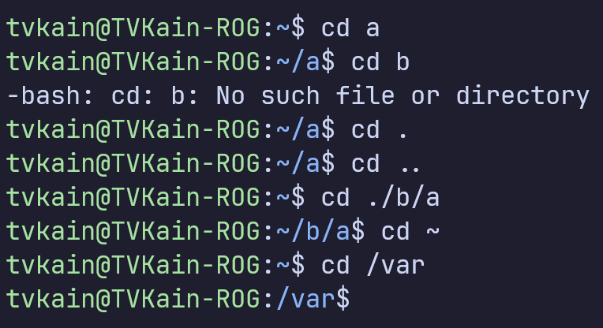
    </td>
  </tr>

  <tr>
    <td>
      pwd
    </td>
    <td>
      In đường dẫn tuyệt đối tới thư mục hiện tại
    </td>
    <td>
      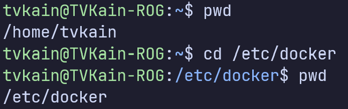
    </td>
  </tr>

  <tr>
    <td>
      mkdir
    </td>
    <td>
      Tạo một hoặc nhiều thư mục mới 
    </td>
    <td>
      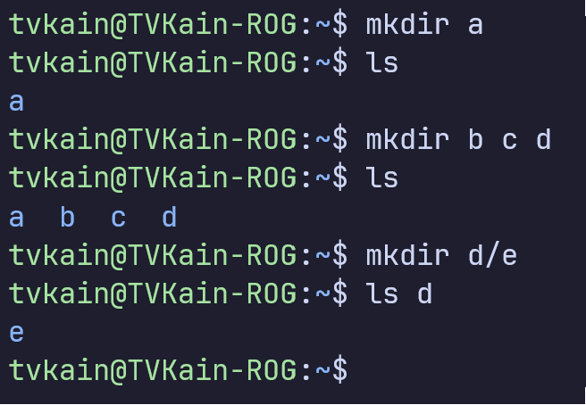
    </td>
  </tr>

  <tr>
    <td>
      rm
    </td>
    <td>
      Xóa tệp tin hoặc thư mục
    </td>
    <td>
      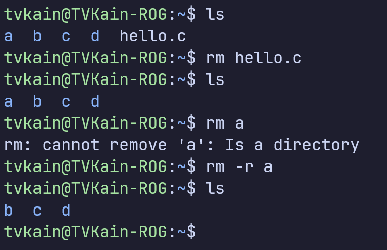
    </td>
  </tr>

  <tr>
    <td>
      rmdir
    </td>
    <td>
      Xóa một thư mục rỗng 
    </td>
    <td>
      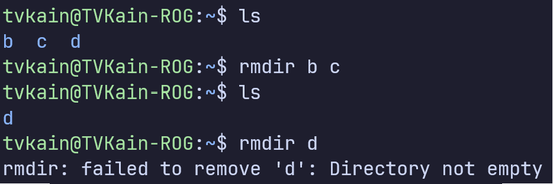
    </td>
  </tr>
  <tr>
    <td>
      pushd 
    </td>
    <td>
      Thêm thư mục vào đầu của stack thư mục, hoặc đẩy stack lên hoặc xuống
    </td>
    <td>
      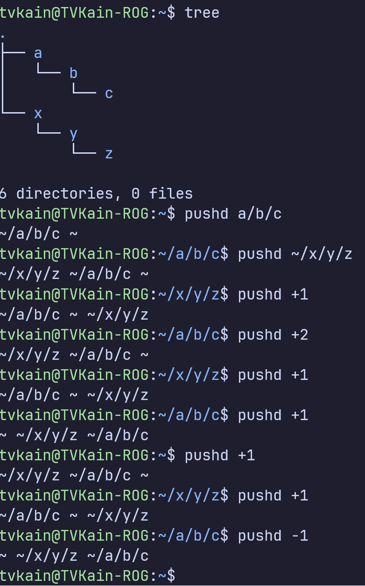
    </td>
  </tr>
  <tr>
    <td>
      popd
    </td>
    <td>
      Xóa các thư mục ra khỏi stack thư mục
    </td>
    <td>
      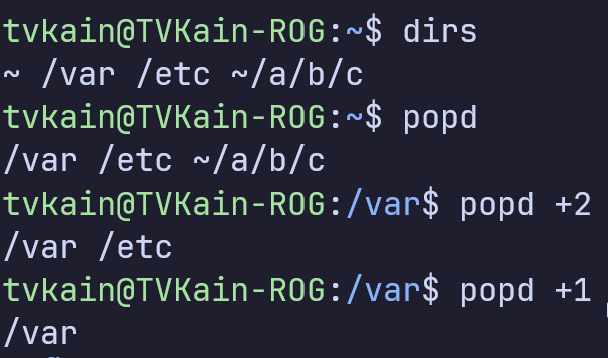
    </td>
  </tr>
  <tr>
    <td>
      tree
    </td>
    <td>
      Liệt kê nội dung của thư mục hiện tại dưới định dạng cây 
    </td>
    <td>
      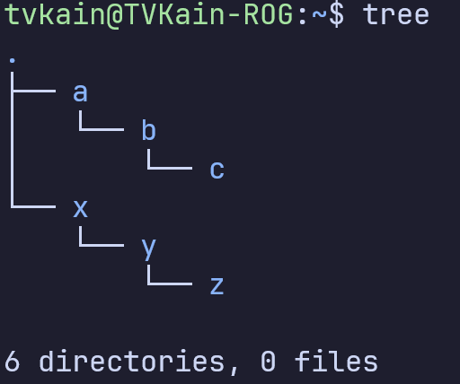
    </td>
  </tr>
  <tr>
    <td>
      mv 
    </td>
    <td>
      Di chuyển (đổi tên) thư mục, file
    </td>
    <td>
    </td>
  </tr>
</table>

## 4. Các câu lệnh thao tác với file
<table>
  <tr>
    <th>
      Câu lệnh
    </th>
    <th>
      Chức năng
    </th>
    <th>
      Ví dụ
    </th>
  </tr>

  <tr>
    <td>
      cat
    </td>
    <td>
      Gán các file với nhau và in nội dung file ra đầu ra tiêu chuẩn 
    </td>
    <td>
      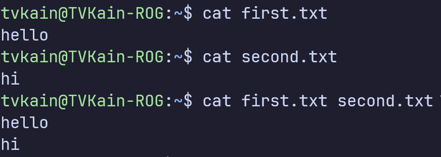
    </td>
  </tr>

  <tr>
    <td>
      head
    </td>
    <td>
      In 10 dòng đầu tiên của mỗi file ra đầu ra tiêu chuẩn
    </td>
    <td>
      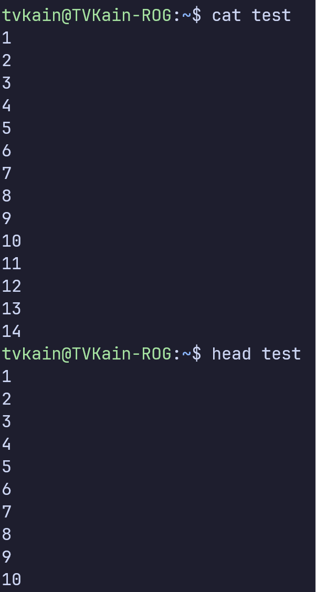
    </td>
  </tr>

  <tr>
    <td>
      tail
    </td>
    <td>
      In 10 dòng cuối của mỗi file ra đầu ra tiêu chuẩn 
    </td>
    <td>
      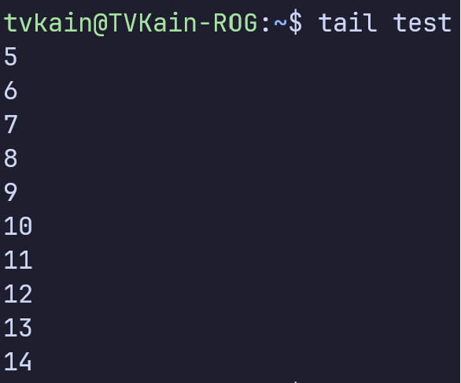
    </td>
  </tr>

  <tr>
    <td>
      more
    </td>
    <td>
      Đọc nội dung của file từng trang một 
    </td>
    <td>
      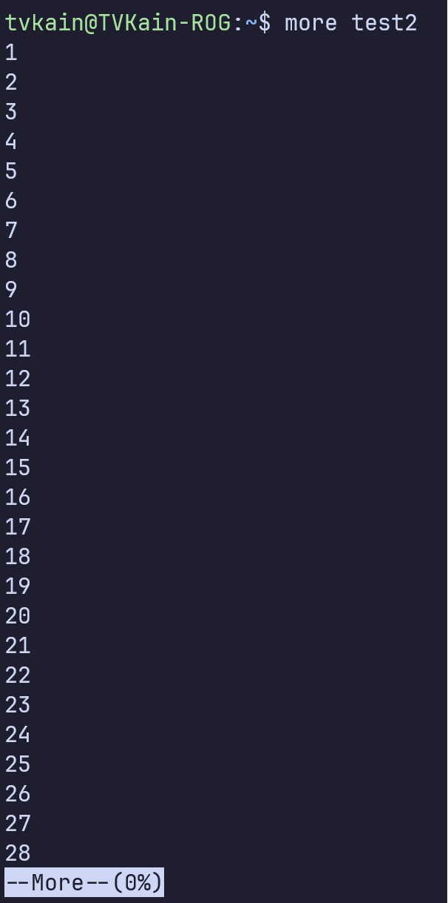
    </td>
  </tr>

  <tr>
    <td>
      less
    </td>
    <td>
      Tương tự như more, nhưng nhanh hơn vì không nạp toàn bộ file vào cùng một lúc 
    </td>
    <td>
      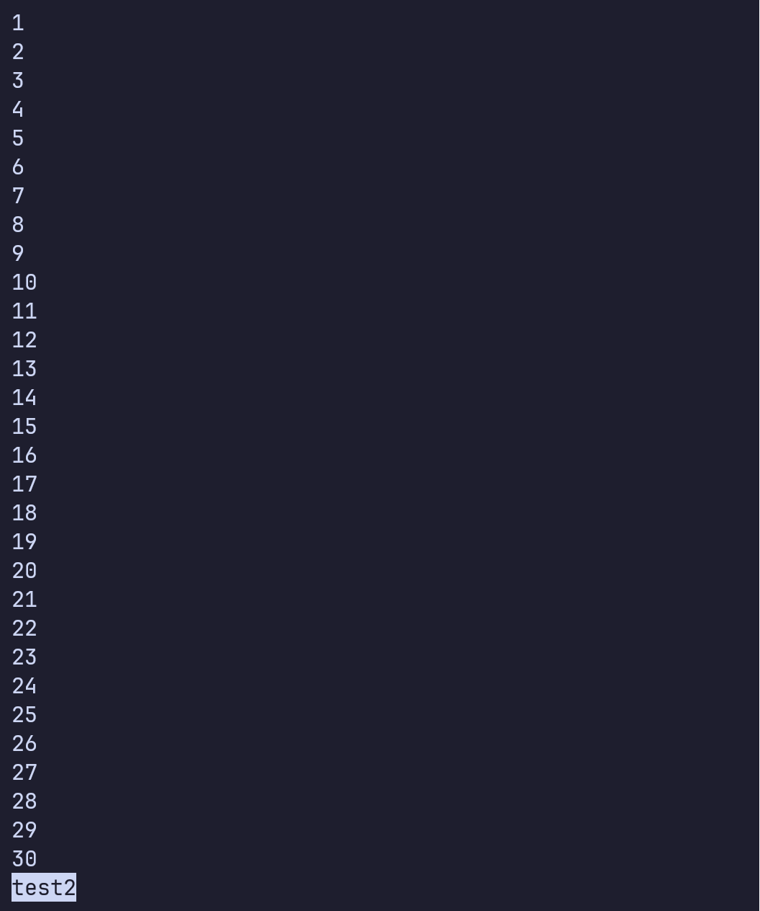
    </td>
  </tr>
  <tr>
    <td>
      vim 
    </td>
    <td>
      Text editor có thể chạy trên dòng lệnh
    </td>
    <td>
      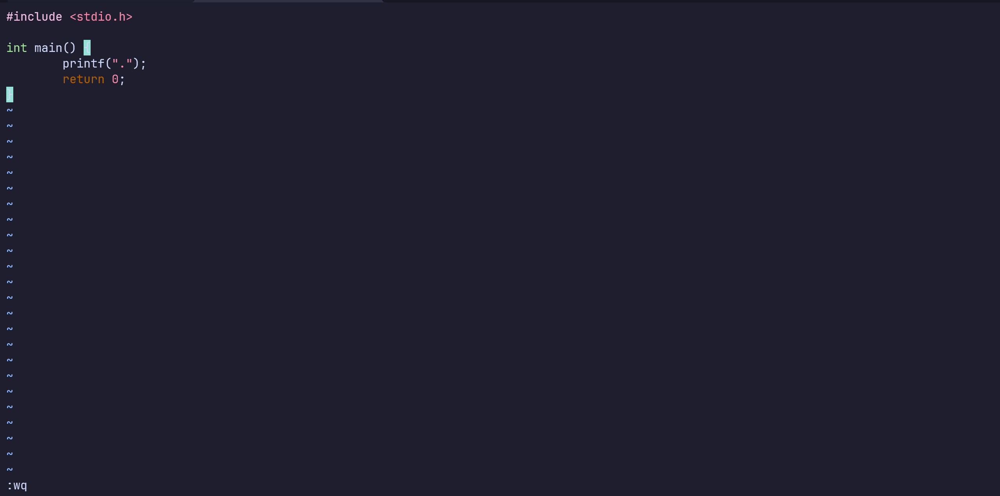
    </td>
  </tr>
  <tr>
    <td>
      nano
    </td>
    <td>
      Text editor có thể chạy trên dòng lệnh 
    </td>
    <td>
      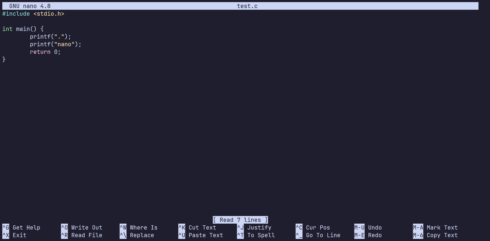
    </td>
  </tr>
  <tr>
    <td>
      grep
    </td>
    <td>
      Tìm pattern của xâu kí tự trong file 
    </td>
    <td>
      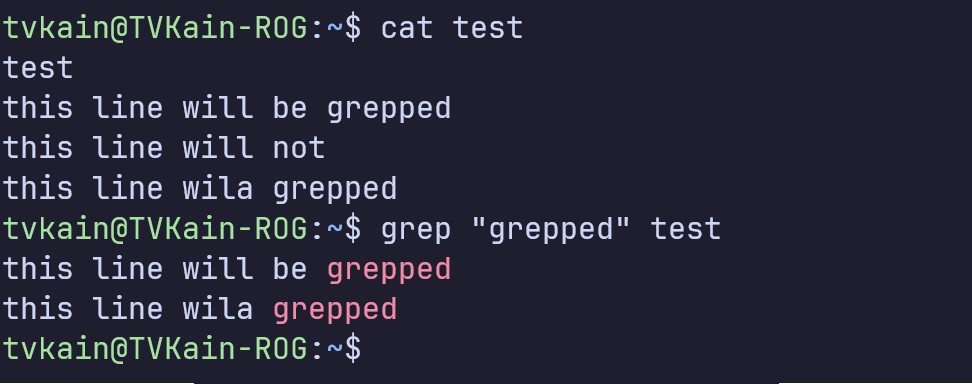
    </td>
  </tr>
</table>

## 5. Điều hướng STDIN, STDOUT, STDERR 
- Thông thường Linux nhận đầu vào từ STDIN và gửi đầu ra cho STDOUT. Mặc định STDIN là bàn phím, và cả STDOUT và STDERR là cửa sổ terminal
- Điều hướng là thay đổi STDIN, STDOUT, STDERR tới các vị trí khác 
- Sử dụng các toán tử <, >, <<, >>, và | (Pipe) 
<div align="center">
<table>
  <tr>
    <th>
      Câu lệnh
    </th>
    <th>
      Giải thích
    </th>
  </tr>
  <tr>
    <td>cat *.txt > newfile.txt</td>
    <td>
      Kết hợp tất cả nội dung của các file có đuôi .txt trong thư mục hiện tại và ghi đè vào file newfile.txt
    </td>
  </tr>
  <tr>
    <td>cat *.txt >> newfile.txt</td>
    <td>
      Tương tự với > nhưng gán thay vì ghi đè
    </td>
  </tr>
  <tr>
    <td>cat < [file-name].txt</td>
    <td>
      Gửi file có đuôi txt vào câu lệnh cat để output. Vì cat nhân tham số đầu vào là file nên câu lệnh trên tương tự với cat [file-name].txt 
    </td>
  </tr>
  <tr>
    <td>cat << quit</td>
    <td>
      Nhận đầu vào từ người dùng cho tới khi người dùng gõ quit [enter], gửi đầu vào đó cho cat 
    </td>
  </tr>
  <tr>
    <td>ls | grep ".txt" </td>
    <td>
      Liệt kê tất cả các file có đuôi .txt trong thư mục hiện tại 
    </td>
  </tr>
</table>
</div>

## 6. File Linking 
- Mỗi file trong hệ thống tại thời điểm được tạo được gán các thuộc tính. Những thuộc tính này được gọi là metadata, chúng thay đổi khi file được truy cập hay thay đổi. 
- Metadata của file bao gồm kiểu file, kích cỡ, quyền, chủ sở hữu, nhóm sở hữu, lần truy cập/thay đổi cuối, số link, số block được cấp phát, con trỏ tới vị trí lưu trữ dữ liệu. 
- Metadata chiếm 128 bytes cho mỗi file. Vị trí lưu trữ trên được gọi là inode (index node) của file
### 6.1 Inode 
- Kernel gán cho mỗi inode một id dùng để truy cập, theo dõi và quản lý 
- Filename được gán cho inode giúp truy cập vào inode và dữ liệu mà nó trỏ tới. Ánh xạ giữa inode và filename được gọi là <strong>link</strong>
- Inode không lưu filename trong metadata; filename và số inode mà nó ánh xạ tới được lưu trong metadata của thư mục chứa file. 
- Link file hoặc thư mục sẽ tạo ra thêm thể hiện của chúng, nhưng tất cả đều trỏ tới cùng dữ liệu vật lý. Các linked file có thể có số inode giống hoặc khác nhau, có thể có metadata hoặc không tùy thuộc vào việc chúng được link như thế nào
- Có hai cách để tạo file link và thư mục link
  
  1. hard link 
  2. soft link 

- Link được tạo giữa các file với nhau, hoặc giữa các thư mục với nhau, nhưng không được tạo giữa thư mục và file 

### 6.2 Hard Link 
- Là ánh xạ giữa một hoặc nhiều filename tới một inode 
- Tất cả các file hardlink là như nhau, chúng có cùng metadata 
- Truy cập qua bất kì filename nào cũng có thể thay đổi metadata và nội dung file 
- Hard link không thể được sử dụng để link thư mục
- Hard link chỉ có thể được tạo ra trên cùng một hệ thống file, không thể link files ở hệ thống file khác  

<div align="center">
  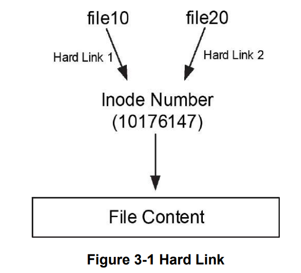
</div>

Ví dụ tạo file tên file10 và sử dụng câu lệnh ln để tạo hard link tên file20 trong cùng một thư mục

<div align="center">
  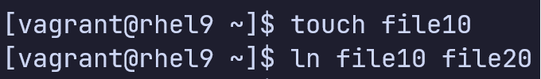
</div>

Sử dụng câu lệnh ls với cờ -li 

<div align="center">
  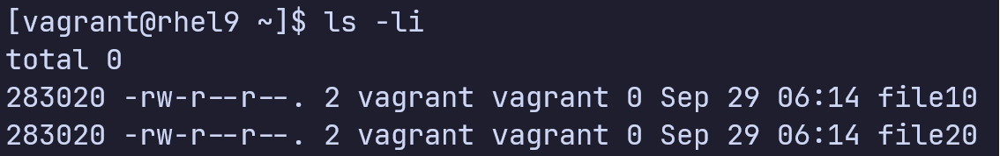
</div>

Cột 1 là số inode, cột 3 là số link

Nếu file10 bị xóa, dữ liệu vẫn có thể truy cập được thông qua file20. 

### 6.3 Soft link 
- Liên kết một file với một file khác. Giống shortcut trên windows, file thật sự ở đâu đó trong hệ thống file, có thể có nhiều file với các tên khác nhau cùng trỏ đến file đó. 
- Soft link cho phép truy cập vào file thông qua bất kì shortcut nào. 
- Mỗi soft link có một số inode đặc biệt lưu trữ đường dẫn (có thể tuyệt đối hoặc tương đối) của file nó link với. 
- Với mỗi soft link mới, link count không tăng lên, mà mỗi file được linked sẽ nhận một số inode mới
- Kích cỡ của soft link là số kí tự của đường dẫn tới mục tiêu 
- Soft link có thể được dùng để link với file hoặc thư mục ở hệ thống file khác

<div align="center">
  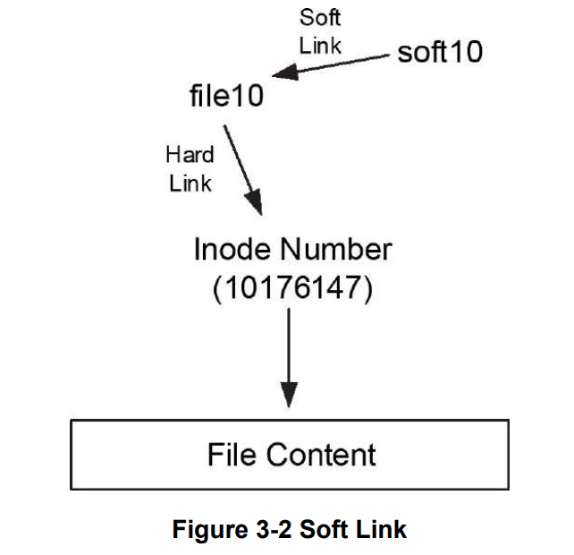
</div>

Ví dụ tạo soft link cho file10 tên soft10 trong cùng một thư mục, sử dụng câu lệnh ln với cờ -s

<div align="center">
  
</div>

Chạy câu lệnh ls -il 

<div align="center">
  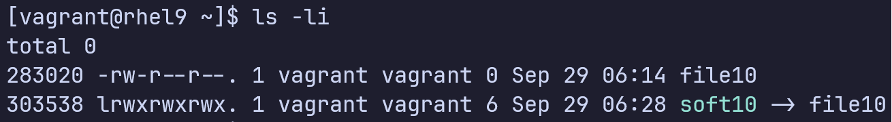
</div>

Nếu file10 bị xóa, soft10 vẫn tồn tại và trỏ vào một thứ mà không tòn tại. 

RHEL 8 có 4 thư mục soft-linked

<div align="center">
  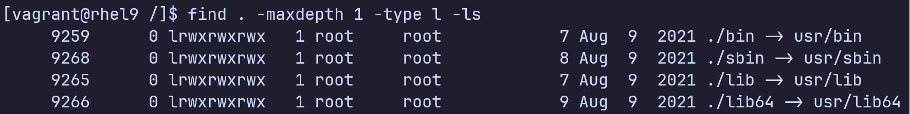
</div>

### 6.4 Khác biệt giữa Copying và Linking 

<div align="center">
<table>
  <tr>
    <th>
      Copy
    </th>
    <th>
      Link
    </th>
  </tr>
  <tr>
    <td>
      Tạo một sao chép của file gốc. Nếu file bất kì bị thay đổi, file còn lại không bị thay đổi
    </td>
    <td>
      Tạo một đường tắt trỏ tới file gốc. File gốc có thể được truy cập hoặc thay đổi sử dụng file gốc hoặc link
    </td>
  </tr>
  <tr>
    <td>
      Mỗi bản copy lưu dữ liệu tại vị trí khác nhau
    </td>
    <td>
      Tất cả các linked files trỏ tới cùng dữ liệu
    </td>
  </tr>
  <tr>
    <td>
      Mỗi file copy có inode riêng, với metadata riêng
    </td>
    <td>
      <strong>Hard Link</strong>: Tất cả các hard link chia sẻ inode, metadata 
      <strong>Soft Link</strong>: Mỗi file có inode riêng, nhưng inode chỉ lưu đường dẫn tới file gốc
    </td>
  </tr>
  <tr>
    <td>
      Nếu một copy bị di chuyển, xóa, hoặc đặt lại tên, file gốc không bị ảnh hưởng, và ngược lại
    </td>
    <td>
      <strong>Hard Link</strong>: Nếu hard link bị xóa, các file khác và dữ liệu không bị xóa, dữ liệu thật bị xóa khi hard link cuối cùng bị xóa. <strong>Soft link</strong>: Nếu file nguồn bị xóa, soft link sẽ trở nên vô nghĩa. Nếu soft link bị xóa, file nguồn không bị ảnh hưởng 
    </td>
  </tr>
  <tr>
    <td>
      Sử dụng copy nếu dữ liệu cần được thay đổi độc lập với nhau
    </td>
    <td>
      Sử dụng link nếu truy cập vào cùng dữ liệu từ nhiều vị trí khác nhau 
    </td>
  </tr>
  <tr>
    <td>
      Quyền của file nguồn và file copy độc lập với nhau 
    </td>
    <td>
      Quyền được quản lý ở file nguồn  
    </td>
  </tr>
</table>
</div>