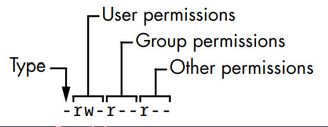
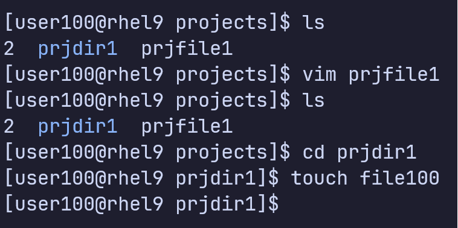
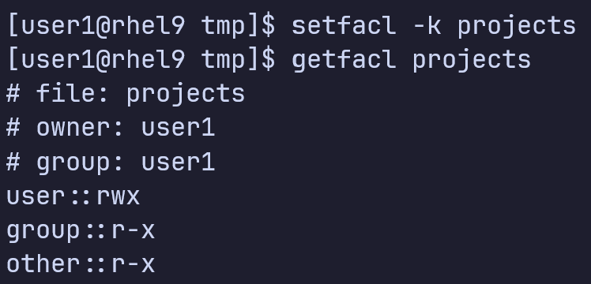

# Người dùng, nhóm người dùng

## Giới thiệu

- Tài khoản là cơ chế bảo mật của hệ điều hành Linux
- Đảm bảo người dùng không xóa, sửa, xem nhũng tài nguyên mà họ không có quyền truy cập vào
- Nhóm người dùng là tập hợp các tài khoản người dùng

## Các loại tài khoản

1. Tài khoản root

   Có quyền truy cập vào tất cả các tài nguyên hệ thống. Được tạo tự động trong quá trình cài đặt Linux

2. Tài khoản nguòi dùng
   Bị giới hạn quyền truy cập các tài nguyên của hệ thống
3. Tài khoản ứng dụng

   Chỉ dùng khi ứng dụng cần có không gian thư mục và file riêng. Phần lớn các ứng dụng không sử dụng tài khoản ứng dụng

## Các câu lệnh tương tác với tài khoản, nhóm

Có thể xem thông tin chi tiết cách sử dụng các câu lệnh bằng

```
man [câu lệnh]
```

<table>
   <tr>
      <th>Câu lệnh</th>
      <th>Chức năng</th>
   </tr>
   <tr>
      <td>useradd</td>
      <td>Tạo một người dùng mới hoặc cập nhật thông tin người dùng mặc định</td>
   </tr>
   <tr>
      <td>groupadd</td>
      <td>Tạo nhóm mới</td>
   </tr>
   <tr>
      <td>passwd</td>
      <td>Thay đổi mật khẩu tài khoản người dùng</td>
   </tr>
   <tr>
      <td>usermod</td>
      <td>
         Thay đổi thông tin tài khoản người dùng (userid, username, mật khẩu, thư mục Home,...) 
      </td>
   </tr>
   <tr>
      <td>userdel</td>
      <td>
         Xóa tài khoản người dùng và các tập tin liên quan 
      </td>
   </tr>
</table>

# Quyền trong Linux

Trong Linux mỗi file đều có một chủ sở hữu (owner) và một nhóm (group). Những giá trị này có thể được hiển thị sử dụng <strong>ls -l</strong> như sau

Với file admin.txt, chủ sở hữu và nhóm là root. Hai file còn lại có chủ sở hữu là người dùng bình thường trên hệ thống

## Quyền đọc, viết, thực thi

Chế độ của file mô tả quyền của file. Có bốn phần của file mode

Kí tự đầu tiên là kiểu file. Dấu (-) có nghĩa là đó là file bình thường. Kiểu thư mục sẽ là kí tự d.

Mỗi quyền được biểu diễn bằng một kí tự

1. r: đọc
2. w: viết
3. x: thực thi
4. -: không có quyền

Mỗi quyền tương ứng với một bitflag

1. r: 4 (100<sub>2</sub>)
2. w: 2 (010<sub>2</sub>)
3. x: 1 (001<sub>2</sub>)

Mỗi giá trị trên bao gồm bit duy nhất, toán tử bitwise OR sẽ cho ra kết quả giống như cộng các số trên ở hệ 10. Những giá trị này có thể được cộng vào để định nghĩa quyền cho chủ sở hữu, nhóm, và người khác
Ví dụ

- 7 = 4 + 2 + 1, có quyền đọc, viết, thực thi
- 6 = 4 + 2, có quyền đọc, viết, không có quyền thực thi
- 5 = 4 + 1, có quyền đọc, không có quyền viết, có quyền thực thi
- 4, chỉ có quyền đọc
  ...

## Các câu lệnh chmod, chown

<div align="center">
<table> 
   <tr>
      <th>
         Câu lệnh
      </th>
      <th>
         Chức năng
      </th>
      <th>
         Ví dụ 
      </th>
   </tr>
   <tr>
      <td>
         chmod
      </td>
      <td>
         Thay đổi file mode 
      </td>
      <td>
         
      </td>
   </tr>
   <tr>
      <td>
         chown
      </td>
      <td>
         Thay đổi chủ sở hữu và nhóm của file 
      </td>
      <td>
         
      </td>
   </tr>

</table>
</div>

## User ID và Effective User ID

Mỗi người dùng trên hệ thống Linux đều có uid duy nhất, và các id nhóm

<div align="center">
   
</div>

Thông thường khi thực thi một chương trình bất kì, chương trình đó sẽ được thực thi dưới UID của người thực thi nó

<div align="center" >
   
</div>
Khi biên dịch và chạy chương trình trên ta có

<div align="center">
   
</div>
Khi thực thi chương trình dưới UID của người dùng nào thì chương trình đó sẽ có quyền tương ứng với quyền của người dùng đó, tuy nhiên một số chương trình khi thực thi có thể cần quyền hạn cao hơn quyền của nguòi thực thi chương trình.

Ví dụ trong Linux, chương trình <strong>passwd</strong> của người dùng <strong>root</strong> cho phép bất cứ người dùng nào thực thi để thay đổi mật khẩu đăng nhập, nhưng chương trình này cần có quyền để viết vào file <strong>/etc/shadow (chủ sở hữu là root, chỉ root có quyền viết)</strong>

Quyền <strong>set user ID</strong> là giải pháp cho vấn đề trên. Đây là một bit có thể được đặt sử dụng câu lệnh <strong> chmod u+s [path to program] </strong>, khi bit này được đặt quyền thực thi của chương trình sẽ là <strong>'s'</strong> thay vì <strong>'x'</strong>


Khi bit này được bật, chương trình passwd sẽ được thực thi dưới ID của root
với bất kì người dùng thực thi, tuy nhiên chương trình chỉ viết vào một phần
của file - phần của người dùng thực thi, nên chương trình trên có 2 loại ID:

1. real user ID (ID của người dùng thực thi chương trình)
2. effective user ID (ID mà chương trình chạy dưới - ID của chủ sở hữu
chương trình)

Logic của chương trình passwd được thiết kế để chỉ ghi vào phần tương ứng với người dùng thực thi. Ở trong C, chúng ta có thể lấy ra các giá trị ID này sử dụng hàm getuid() cho real user ID và geteuid() cho effective user ID

## Quyền mặc định 
- File có quyền mặc định là 666 (đọc/viết cho tất cả)
- Thư mục có quyền mặc định là 777 (đọc/viết/thực thi cho tất cả)
Khi một file hoặc thư mục mới được tạo quyền của nó sẽ được tính bằng 
```
   [quyền] = [quyền mặc định] - [giá trị umask]
```
Giá trị umask có thể được đặt bằng câu lệnh <strong>umask</strong>

Ví dụ


## Các quyền đặc biệt của file 
- Linux cung cấp 3 loại bit quyền đặc biệt có thể được bật trên các file thực thi hoặc các thư mục có hành vi khác nhau tùy vào người dùng không root trên một số thao tác 
- Những bit quyền này là
  
  1. set user identifier bit (setuid hoặc suid)
  2. set group identifier bit (setgid hoặc sgid)
  3. sticky bit

Bit setuid và setgid có thể được định nghĩa trên các file thực thi để cung cấp khả năng thực thi cho những người không phải chủ sở hữu của file hoặc không phải nhóm sở hữu của file thực thi file với quyền hạn của người sở hữu hoặc nhóm sở hữu

Bit setuid và sticky có thể được bật cho thư mục và file nhưng chúng không có hiệu ứng gì 

### setuid bit cho file thực thi 
- Khi bit này được bật trên một file thực thi, file này được thực thi dưới quyền chủ sở hữu bởi những người không phải chủ sở hữu 

Ví dụ: câu lệnh su có chủ sở hữu bởi người dùng root. Câu lệnh này mặc định bật setuid bit 


Ở phần quyền thực thi của người dùng, thay vì x như thông thường, thì là s. 

Lưu ý nếu như trước khi setuid bit được bật, nếu như file đã có quyền "x" thì sẽ thành "s" nhưng nếu trước đó file không có quyền "x" thì sẽ thành "S"


#### Bật setuid bit cho file thực thi 

```
chmod +4000 [đường dẫn tới file]
chmod u+s [đường dẫn tới file]
```

### setgid bit cho file thực thi 
- Khi bit này được bật trên một file thực thi, file này được thực thi dưới quyền nhóm sở hữu bởi những người không phải chủ sở hữu 

Ví dụ: câu lệnh write có chủ sở hữu là root với tty là nhóm sở hữu. Câu lệnh này mặc định bât setgid bit 


#### Bật setgid bit cho file thực thi 

```
chmod +2000 [đường dẫn tới file]
chmod g+s [đường dẫn tới file]
```

### setgid bit cho các thư mục được chia sẻ 
- setgid bit có thể được bật cho các thư mục chia sẻ trong nhóm, cho phép các file và thư mục con của nó tự động kế thừa nhóm sở hữu 
- Giúp các thành viên trong nhóm - đang chia sẻ nội dung của nhóm khỏi việc thay đổi id nhóm cho mỗi file và thư mục con mà họ thêm vào
- Hành vi mặc định cho mỗi file và thư mục con là nhận nhóm của người tạo thư mục mẹ 

Nhóm sở hữu file khi bật setgid bit là nhóm của thư mục mẹ


Nhóm sở hữu file khi không bật setgid bit là nhóm chính của người dùng 


### sticky bit trên các thư mục công cộng có thể được viết vào
- Bảo vệ files và thư mục con của các thư mục công cộng có thể được viết vào khỏi bị xóa hoặc di chuyển bởi các người dùng khác mà không phải chủ sở hữu 

Sticky bit được bật với thư mục tmp 


Xóa file của một người dùng khác khi sticky bit được bật


Tắt sticky bit và xóa


## Access Control Lists (ACLs) 
- ACLs cung cấp tập mở rộng các quyền có thể được áp dụng lên file và thư mục 
- ACLs định nghĩa quyền cho named user và named groups
- Các named users có thể trong hoặc không trong cùng một group 
  
Có hai loại ACLs

1. access ACLs 
   
   Được đặt trên các file và thư mục độc lập
2. default ACLs
   
   Chỉ được đặt trên thư mục và các thư mục con sẽ tự động kế thừa, thư mục được đặt phải có bit x được bật ở other 

### Các câu lệnh quản lý ACL 
#### getfacl 


Kết quả trả về là tên của file, chủ sở hữu, nhóm sở hữu. Các quyền đặt lên file,...

Để ý cặp dấu :, nếu acl được đặt trên file thì đó là chỗ của named user hoặc named group 

Một cách nữa để biết acl được đặt là dấu cộng trong câu lệnh ls 


#### setfacl 

- Được dùng để áp dụng, thay đổi, loại bỏ cài đặt ACL 

Định dạng của câu lệnh được cho trong bảng dưới 
<div align="center">
   <table>
      <tr>
         <th>Định dạng</th>
         <th>Mô tả</th>
      </tr>
      <tr>
         <td>u[ser]:UID:perms</td>
         <td>Quyền gán cho named user. người dùng đó phải tồn tại trong /etc/passwd. Nếu trường này để trống, quyền sẽ áp dụng lên chủ sở hữu của file, tương đương với câu lệnh chmod </td>
      </tr>
      <tr>
         <td>g[roup]:GID:perms</td>
         <td>Quyền gán cho named group. nhóm đó phải tồn tại trong /etc/group. Nếu trường này để trống, quyền sẽ áp dụng lên nhóm sở hữu của file, tương đương với câu lệnh chmod </td>
      </tr>
      <tr>
         <td>o[ther]:perms</td>
         <td>Quyền gán cho người dùng không phải chủ cũng như không thuộc về nhóm sở hữu</td>
      </tr>
      <tr>
         <td>m[ask]:perms</td>
         <td>Quyền tối đa cho named user hoặc named group. Ví dụ được đặt thành rw-, thì không người dùng hoặc nhóm nào có quyền hơn là đọc và viết. </td>
      </tr>
   </table>
</div>

Câu lệnh setfacl cung cấp các cờ để dùng tùy vào mục đích sử dụng. Bảng dưới mô tả một vài cờ 
<div align="center">
   <table>
      <tr>
         <th>Cờ</th>
         <th>Mô tả</th>
      </tr>
      <tr>
         <td>-b</td>
         <td>Loại bỏ tất cả access ACLs</td>
      </tr>
      <tr>
         <td>-d</td>
         <td>Áp dụng cho default ACLs</td>
      </tr>
      <tr>
         <td>-k</td>
         <td>Loại bỏ tất cả default ACLs</td>
      </tr>
      <tr>
         <td>-m</td>
         <td>Đặt hoặc thay đổi ACLs</td>
      </tr>
      <tr>
         <td>-n</td>
         <td>Chặn tính lại mask</td>
      </tr>
      <tr>
         <td>-R</td>
         <td>Áp dụng đệ quy lên thư mục</td>
      </tr>
      <tr>
         <td>-x</td>
         <td>Loại bỏ một access ACL</td>
      </tr>
   </table>
</div>

### Vai trò của giá trị mask 
- Quyết định quyền tối đa cho phép được đặt cho named user hoặc group trên một file hoặc thư mục 
- Nếu giá trị mask được đặt thành rw, không named user hoặc group nào có thể có quyền cao hơn quyền này 
- Mỗi khi ACLs thay đổi quyền cho một file hoặc thu mực, giá trị mask được tự động tính lại trừ khi một giá trị được đi kèm câu lệnh setfacl hoặc cài đặt -n được bật. 

Ví dụ nếu bạn muốn cho người dùng quyền đọc và viết và thay đổi mask thành chỉ đọc cùng một lúc, câu lệnh setfacl sẽ đặt quyền như mong muốn; tuy nhiên quyền thật sự của người dùng là chỉ đọc 


Trong ví dụ trên, người dùng user100 không thể thay đổi file này mặc dù trông có vẻ như người đó có quyền viết. 

Thay đổi mask để cho người dùng user100 có quyền viết 


### Default ACLs 

- Có thể được đặt trên các thư mục được chia sẻ để đảm bảo rằng các thư mục con và các file tạo dưới thư mục đó có tập các quyền truy cập cho nhóm và những người không trong nhóm giống nhau. 
- Người dùng không phải điều chỉnh quyền trên mỗi file mói và thư mục con mới họ tạo 

Sự kế thừa hoạt động khác nhau đối vói file và thư mục 

- File nhận default ACLs của thư mục chia sẻ làm access ACLs
- Thư mục con nhận cả default ACLs và access ACLs 

Ví dụ 
1. Với user1 tạo thư mục projects trong /tmp 
   
2. Sử dụng câu lệnh getfacl để xem quyền của thư mục 
   
3. Cấp quyền đọc viết thực thi cho người dùng user100 và user200 
   
4. Tạo thư mục con prjdir1 dưới projects quan sát kế thừa ACL 
   
5. Tạo file prjfile1 dưới projects 
   
6. Với user100 thay đổi prjfile1. Đi vào prjdir1 và tạo file100 
   
7. Xóa tất cả default ACLs từ thư mục projects dưới user1 
   