# Tiến trình 
## 1. Tiến trình và độ ưu tiên 
- Tiến trình là đơn vị được cung cấp tài nguyên hệ thống 
- Khi một chương trình, ứng dụng, hay câu lệnh được khởi tạo, một tiến trình sẽ được tạo trong bộ nhớ 
- Mỗi tiến trình có một tiến trình mẹ (tiến trình gọi) sinh ra nó
- Một tiến trình mẹ có thể có một hoặc nhiều tiến trình con và truyền các thuộc tính của nó cho các con ở thời điểm tiến trình con được sinh ra 
- Mỗi tiến trình được gán một số định danh duy nhất gọi là Process IDentifier (PID), kernel sử dụng PID để quản lý và điều khiển tiến trình xuyên suốt vòng đời của tiến trình. 
- Khi một tiến trình kết thúc, sự kiện này được báo cho kernel, và tất cả các tài nguyên được cấp phát cho nó (bộ nhớ, cpu,...) sẽ được giải phóng và PID của tiến trình đó sẽ được loại bỏ ra khỏi hệ thống 
- Nhiều tiến trình được sinh ra khi khởi tạo hệ thống, nhiều tiến trình đặt trong bộ nhớ và chờ một sự kiện được khởi tạo để yêu cầu sử dụng dịch vụ của chúng. Những tiến trình background này được gọi là <strong>daemons</strong> và chúng rất quan trọng trong các thao tác của hệ thống  

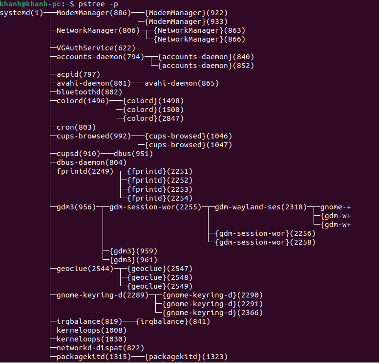

## 2. Trạng thái của tiến trình 
- Tiến trình thay đổi trạng thái nhiều lần trong vòng đời của nó 
- Các yếu tố như bộ nhớ trống, độ ưu tiên của tiến trình,... ảnh hưởng tới tần suất của việc tiến trình chuyển đổi trạng thái 

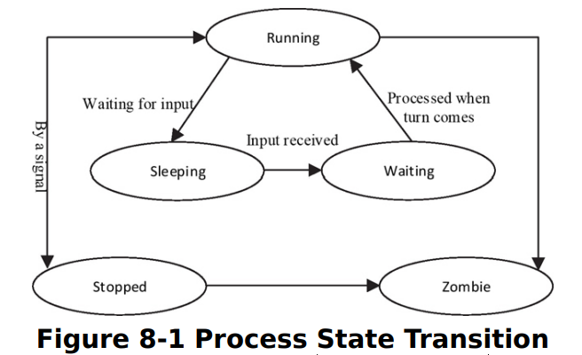

- Running: Tiến trình đang được CPU thực thi 
  
- Sleeping: Tiến trình đợi input từ người dùng hoặc tiến trình khác 

- Waiting: Tiến trình đã nhận đầu vào mà nó đợi và sẵn sàng thực thi ngay khi tới lượt

- Stopped: Tiến trình bị dừng và sẽ không thực thi ngay cả khi tới lượt nó, hành vi này chỉ được thay đổi khi có tín hiệu gửi tới tiến trình 

- Zombie: tiến trình chết. Tồn tại nhưng không chiếm tài nguyên. Chỉ kết thúc khi tiến  trình mẹ cho phép. 

## 3. Xem và giám sát các tiến trình với ps 

- Có thể xem và theo dõi các tiến trình bằng công cụ ps (process status) 

Nếu như không có tham số hoặc tùy chọn nào, ps liệt kê các tiến trình có liên quan đến terminal mà câu lệnh ps được chạy 

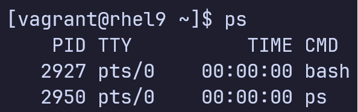 

Câu lệnh trên trả về các thông tin cơ bản về các tiến trình trên 4 cột. PID, terminal (TTY) mà tiến trình đó sinh ra, thời gian (TIME) của CPU đã cấp phát cho tiến trình, và tên của câu lệnh hoặc chương trình (CMD) đã được thực thi 

Một vài tùy chọn có thể được dùng vói câu lệnh ps để sinh ra báo cáo chi tiết bao gồm -e (every), -f (full-format), -F(extra full-format), và -l (long format). Việc kết hợp -e, -F, và -l (ps -eFI) sẽ sinh ra báo cáo rất chi tiết, tuy nhiên, phần lớn các trường hợp là không cần thiết. Một vài tùy chọn khác như --forest và -x sẽ đưa ra output dạng cây và bao gồm cả các tiến trình daemon. Xem man page của ps để biết thêm các tùy chọn và cách sử dụng 

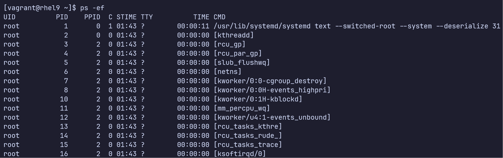

Đầu ra là chi tiết về tất cả các tiến trình chạy trên hệ thống. Bảng dưới mô tả ý nghĩa của mỗi cột 

  <table>
    <tr>
      <th>Cột</th>
      <th>Mô tả</th>
    </tr>
    <tr>
      <th>UID</th>
      <th>ID hoặc tên của chủ sở hữu tiến trình</th>
    </tr>
    <tr>
      <th>PID</th>
      <th>ID của tiến trình</th>
    </tr>
    <tr>
      <th>PPID</th>
      <th>ID của tiến trình mẹ của tiến tình</th>
    </tr>
    <tr>
      <th>C</th>
      <th> sử dụng CPU của tiến trình</th>
    </tr>
    <tr>
      <th>STIME</th>
      <th>Thời gian tiến trình bắt đầu (có thể là ngày và giờ)</th>
    </tr>
    <tr>
      <th>TTY</th>
      <th>Terminal mà tiến trình được bắt đầu</th>
    </tr>
    <tr>
      <th>TIME</th>
      <th>Thời gian tiến trình sử dụng CPU</th>
    </tr>
    <tr>
      <th>CMD</th>
      <th>Câu lệnh dùng để thực thi tiến trình</th>
    </tr>
    
  </table>

Đầu ra ps ở bên trên có một vài tiến trình daemon. Những tiến trình này không có liên quan đến terminal nào cả, là lý do ở cột TTY có kí tự ?. Để ý PID và PPID. PID càng nhỏ thì tiến trình đó bắt đầu càng sớm. Tiến trình vói PID 0 được bắt đầu khi hệ thống khởi tạo, cùng với tiến trình với PID 1,... Mỗi PID có một PPID ở cột 3.

Thông tin về mỗi tiến trình đang chạy được lưu trữ bên trong /proc, được ps và các câu lệnh khác tham chiếu tới để lấy dữ liệu 

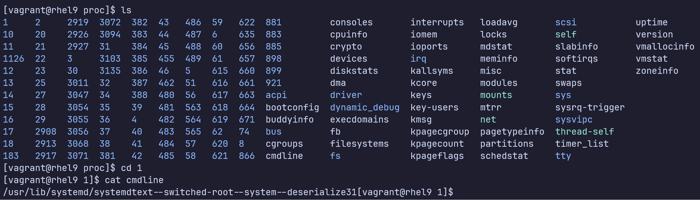

Câu lệnh ps có thể được tùy chỉnh để chỉ xem những cột cần thiết. 

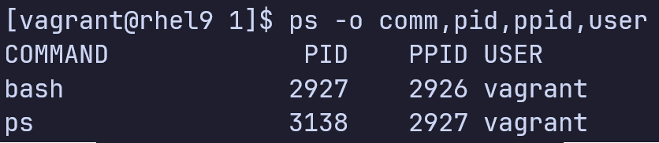

Sử dụng cờ -C (command list) để liệt kê những tiến trình có command giống với tên commmand được đặc tả 

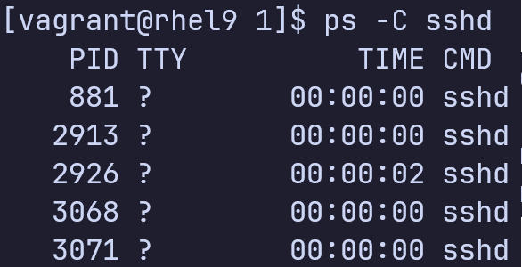

## 4. Xem và giám sát các tiến trình với top 
- Hiển thị thông tin tiến trình liên tục trong thời gian thực 

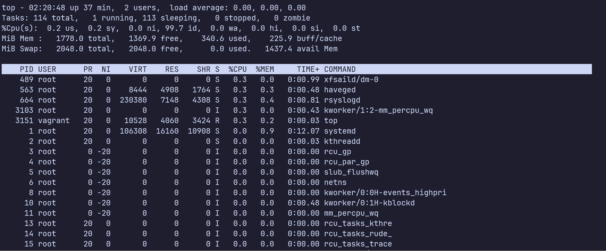

Đầu ra của top gồm hai phần 

- Phần tổng quát 
- Phần tiến trình

Phần tổng quát gồm 5 dòng đầu tiên có các thông tin sau: 
1. Dòng 1: Thời gian hệ thống chạy (system uptime), số lượng người dùng đang có trên hệ thống, và trung bình system load theo các khoảng thời gian 1,5 và 15 phút 
2. Dòng 2: Hiển thị thông tin về tiến trình, số tiến trình đang chạy trên hệ thống, số tiến trình trong các trạng thái running, sleeping, stopped, zombie. 
3. Phần trăm sử dụng CPU
   1. us: Thời gian các tiến trình của người dùng 
   2. sy: Thời gian các tiến trình của hệ thống 
   3. ni: Thời gian các tiến trình của người dùng với giá trị nice được thay đổi bởi người dùng 
   4. id: Thời gian CPU không làm gì cả 
   5. wa: Thời gian CPU đợi IO 
   6. hi: Thời gian xử lý ngắt phần cứng 
   7. si: Thời gian xử lý ngắt phần mềm 
   8. st: Thời gian đợi bởi cpu ảo, thời gian CPU vật lý không cho phép máy ảo sử dụng
4. Hiển thị thông tin về bộ nhớ, tổng bộ nhớ được cấp phát cho hệ thống, tổng bộ nhớ trống, đang sử dụng, được cấp phát để sử dụng trong buffering và caching
5. Hiển thị thông tin về bộ nhớ ảo, tổng bộ nhớ ảo cấp phát cho hệ thống, tổng bộ nhớ ảo trống và đang sử dụng. Trường 'avail Mem' cho thấy ước lượng số lượng bộ nhớ trống dùng để bắt đầu tiến trình mà không sử dụng swap 

Phần thứ 2 của câu lệnh top cho thấy chi tiết của mỗi tiến trình trong 12 cột 
- Cột 1 và 2: PID và USER 
- Cột 3 và 4: PR và giá trị nice - NI 
- Cột 5 và 6: Bộ nhớ ảo - VIRT và bộ nhớ không swap - RES đang sử dụng 
- Cột 7: Bộ nhớ 
- Cột 8: Trạng thái của tiến trình - S
- Cột 9 và 10: Phần trăm sử dụng CPU và bộ nhớ 
- Cột 11: Thời gian CPU trong một phần một trăm giây - TIME+
- Cột 12: Tên tiến trình - COMMAND

Khi dùng top, bạn có thể ấn "o" để lọc danh sách tiến trình, "f" để thêm hoặc xóa cột, "F" để lựa chọn sắp xếp theo cột, "h" để trợ giúp. Xem man page để biết thêm chi tiết. 

## 5. Liệt kê một tiến trình cụ thể 

- Linux cung cấp câu lệnh pidof và pgrep để liệt kê PID của một tiến trình cụ thể 
- Thường được sử dụng để xem PID của một tiến trình khi biết tên 

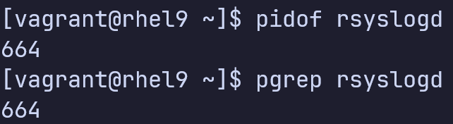

Khi sử dụng mặc định hai câu lệnh trên cho đầu ra giống hệt nhau 

## 6. Liệt kê các tiến trình theo Chủ sở hữu và Nhóm sở hữu 

Một tiến trình có thể được liệt kê theo chủ sở hữu hoặc nhóm sở hữu. 

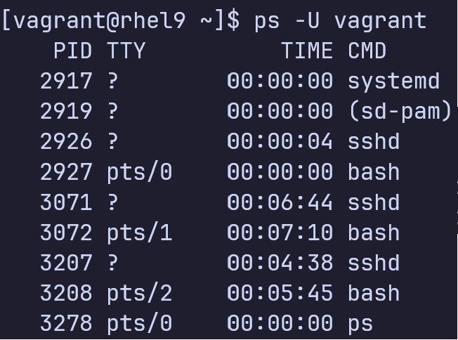

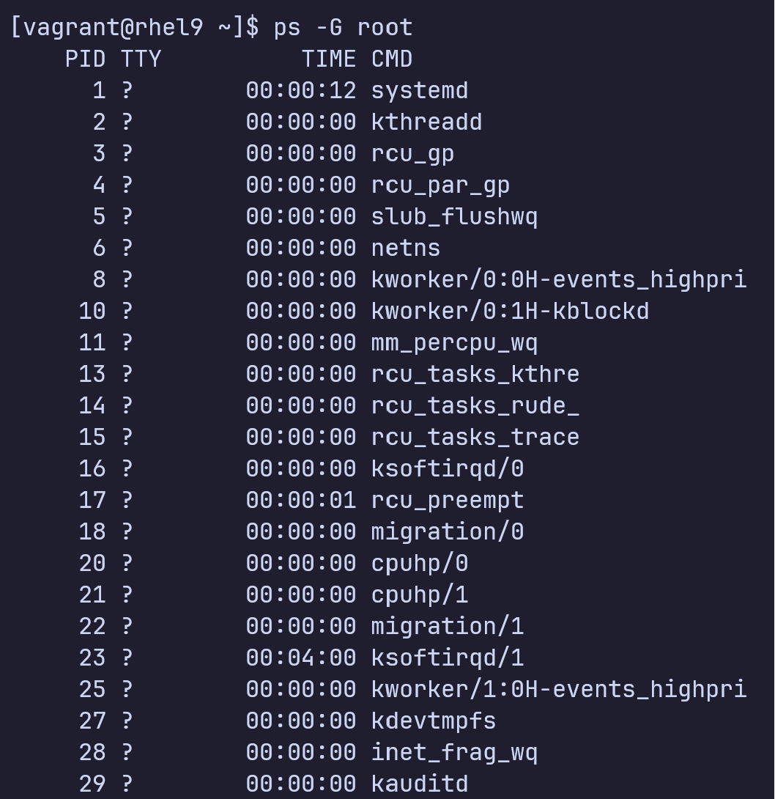

## 7. Giá trị Niceness và Priority 

Linux là một hệ điều hành đa nhiệm nó chạy nhiều tiến trình trên một bộ xử lý, cho mỗi tiến trình một phần thời gian. Process scehduler (Bộ lập lịch tiến trình) trên hệ thống thực thi chuyển đổi giữa các tiến trình, tạo ra cảm giác thực thi song song các tiến trình 

Một tiến trình được sinh ra với một độ ưu tiên nhất định, được thiết lập dựa trên giá trị gọi là niceness (nice value). Có 40 giá trị niceness, với -20 là cao nhất, +19 là thấp nhất. Phần lớn các tiến trình bắt đầu bởi hệ thống có niceness mặc định là 0. Niceness càng cao thì mức độ ưu tiên thực thi của tiến trình đó càng giảm, và ngược lại niceness càng thấp thì mức độ ưu tiên thực thi của tiến trình đó càng tăng. 

Tiến trình con kế thừa niceness của tiến trình mẹ khi tính toán độ ưu tiên. 

Các chương trình thường được chạy ở niceness mặc định, bạn có thể khởi tạo chúng ở giá trị niceness khác để tùy chỉnh độ ưu tiên. 

Người dùng bình thường chỉ có thể làm tiến trình nicer (tăng giá trị nice), người dùng root có thể tăng hoặc giảm giá trị nice của bất kì tiến trình nào 

RHEL cung cấp câu lệnh nice để chạy một tiến trình ở độ ưu tiên tùy chỉnh và renice để thay đổi độ ưu tiên của tiến trình đang chạy 

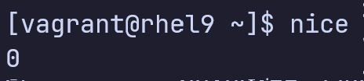

Câu lệnh ps cùng với tùy chọn -l và -ef có thể được sử dụng để liệt kê độ ưu tiên và niceness cho tất cả các tiến trình 

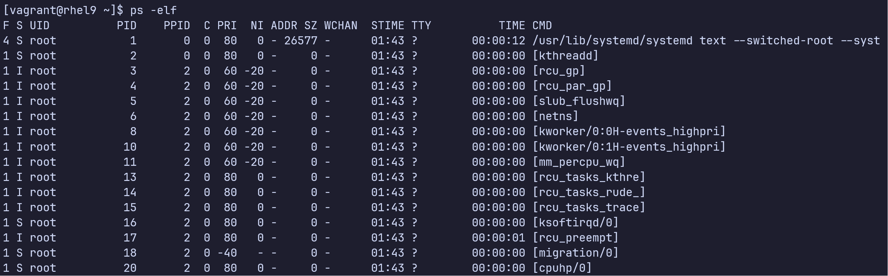

Câu lệnh ps ánh xạ từ niceness đến priority. 0 niceness tương đương với 80 priority, niceness -20 tương đương với 60 priority 

Đối với câu lệnh top, 0 niceness tuong đương với 20 priority, -20 niceness tương đương với 0 priority

Exercise 8-1 
Sử dụng hai terminal 

1. Chạy top với niceness mặc định ở terminal 1 
2. Kiểm tra priority và niceness của top sử dụng ps ở terminal 2
3. Kết thúc top ở terminal 1 bằng cách gõ q và chạy lại với nice value +2 
4. Kiểm tra priority và niceness ở Terminal 2 sử dụng ps 
5. Kết thúc top ở Terminal 1 bằng cách gõ q và chạy ở mức độ ưu tiên cao hơn với giá trị nice -10. Sử dụng sudo 
6. Kiểm tra priority và niceness của top ở Terminal 2 sử dụng ps 

Exercise 8-2
1. Chạy top với niceness mặc định ở terminal 1 
2. Kiểm tra priority và niceness của top sử dụng ps ở terminal 2
3. renice tiến trình top đang chạy ở terminal 1, sử dụng pidof để lấy pid của top
4. Xác thực sự thay đổi với ps 
5. Lặp lại buóc trên nhưng đặt tiến trình chạy ở độ ưu tiên thấp bằng renice lên 8 
6. Xác thực sự thay đổi với ps 

## 8. Điều khiển các tiến trình với Signals 

- Signals được sử dụng để thông báo đến tiến trình về sự xảy ra của sự kiện. Các tiến trình cũng có thể sử dụng signals để thông báo cho nhau 
- Tiến trình nhận được signal sẽ dừng thực thi và thực hiện các hành động phù hợp tùy thuộc vào signal 

Có rất nhiều signals, mỗi signals được gán một id, tên, và hành động. Danh sách các tín hiệu có thể được xem bằng câu lệnh kill sử dụng tùy chọn -l 

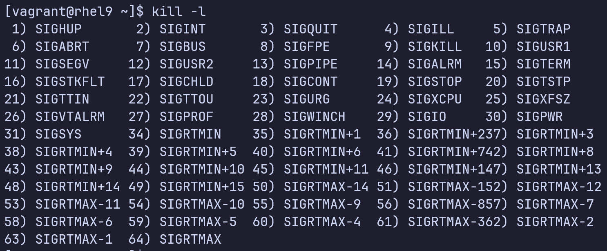

Bảng dưới mô tả các tín hiệu thường được sử dụng 

  <table>
    <tr>
      <th>
        Số hiệu
      </th>
      <th>
        Tên
      </th>
      <th>
        Hành động
      </th>
    </tr>
    <tr>
      <th>
        1
      </th>
      <th>
        SIGHUP
      </th>
      <th>
        Ngắt kết nối tiến trình khỏi terminal mà nó đang kết nối với. Khiến daemon đang chạy đọc lại config mà không restart 
      </th>
    </tr>
    <tr>
      <th>
        2
      </th>
      <th>
        SIGINT
      </th>
      <th>
        Ngắt thực thi của tiến trình (bằng với việc Ctrl+c)
      </th>
    </tr>
    <tr>
      <th>
        9 
      </th>
      <th>
        SIGKILL
      </th>
      <th>
        Hủy tiến trình, ngay lập tức. Không cho tiến trình thời gian để cleanup. 
      </th>
    </tr>
    <tr>
      <th>
        15
      </th>
      <th>
        SIGTERM
      </th>
      <th>
        Gửi tín hiệu hủy tiến trình cho phép tiến trình cleanup trước khi hủy. Là signal mặc định 
      </th>
    </tr>
    <tr>
      <th>
        18
      </th>
      <th>
        SIGCONT
      </th>
      <th>
        Giống như sử dụng câu lệnh bg để tiếp tục
      </th>
    </tr>
    <tr>
      <th>
        19
      </th>
      <th>
        SIGSTOP
      </th>
      <th>
        Giống như sử dụng Ctrl + z để tạm dừng tiến trình 
      </th>
    </tr>
    <tr>
      <th>
        20
      </th>
      <th>
        SIGSTOP
      </th>
      <th>
        Giống như sử dụng câu lệnh fg
      </th>
    </tr>
  </table>

Câu lệnh được dùng để gửi signal đến tiến trình là kill và pkill. Những câu lệnh này thường được dùng để hủy một tiến trình. Người dùng bình thường có thể hủy tiến trình mà họ là chủ, người dùng root có quyền hủy bất cứ tiến trình nào trên hệ thống 

kill cần một hay nhiều PIDs, pkill cần một hay nhiều tên tiến trình. 

Ví dụ 
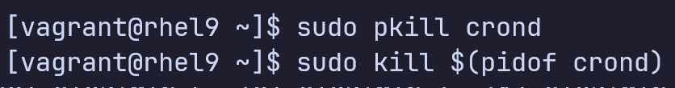

Sử dụng pkill hay kill mà không đặc tả tên hoặc số signal sẽ gửi signal mặc định là 15 tới tiến trình. Signal này có thể sẽ hủy tiến trình hoặc không. Một số tiến trình có thể lờ signal soft termination vì chúng ở trạng thái waiting. Những tiến trình này có thể được bắt buộc hủy bằng signal 9 

  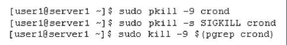

Câu lệnh killall có thể được sử dụng để hủy các tiến trình tương ứng với một tiêu chí nào đó. Ví dụ sử dụng để hủy các tiến trình crond

  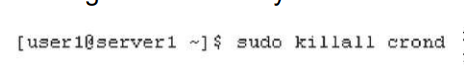

