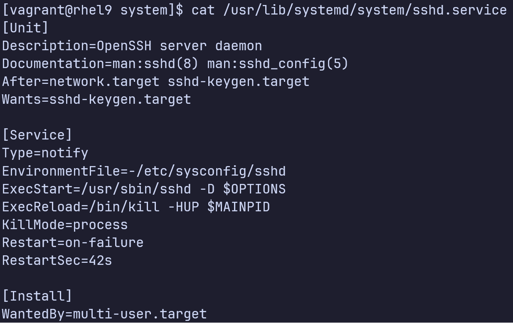

# Systemd, sysctl

## 1. Systemd (System daemon)

Systemd là trình quản lý hệ thống và dịch vụ, cung cấp các công cụ và dịch vụ để quản lý và khởi tạo hệ thống. Các tính năng chính của systemd bao gồm: 
  
1. Khởi động các dịch vụ hệ thống <strong>song song</strong> trong quá trình boot 
2. Kích hoạt các daemons <strong>khi có yêu cầu</strong> 
3. Điều khiển việc start, stop, restart của các service dựa trên <strong>phụ thuộc</strong> giữa các service 

Các cách dịch vụ được kích hoạt
  
1. [Sockets](## "socket là một phương thức giao tiếp cho phép một tiến trình giao tiếp với một tiến trình khác ở cùng hệ thống hoặc ở một hệ thống từ xa")
   
   

2. [D-bus](## "D-Bus là một phương thức giao tiếp cho phép nhiều tiến trình chạy song song trên một hệ thống giao tiếp với nhau trên cùng một hệ thông hoặc trên hệ thống từ xa") 
3. Device-based
4. Path-based 

Một vài thông tin khác về systemd 

- Systemd hỗ trợ snapshot hệ thống, theo dõi các tiến trình sử dụng [control group](## "- Systemd sinh nhiều tiến trình khi hệ thống khởi tạo. Nó đặt các tiến trình trong một hệ thống phân bậc gồm các control groups (cgroups) để giám sát quản lý các tài nguyên của hệ thống như bộ xử lý, bộ nhớ, băng thông, IO. Điều này bao gồm giới hạn, cô lập, đặt ưu tiên cho việc sử dụng các tài nguyên. Bằng cách này các tài nguyên có thể được phân phối giữa người dùng, cơ sở dữ liệu, và các úng dụng tùy thuộc vào độ ưu tiên giúp tăng độ hiệu quả của hệ thống "), và tự động quản lý các điểm mount.
- Systemd là tiến trình đầu tiên với PID 1 được sinh ra tại thời điểm khởi tạo hệ thống và là tiến trình cuối cùng bị hủy khi hệ thống tắt
- Để xử lý song song, systemd khởi tạo các dịch vụ độc lập song song với nhau, tận dụng nhiều core CPU và các tài nguyên tính toán khác


- Trong trạng thái hoạt động, systemd quản lý sockets và sử dụng chúng để kết nối các daemons và service mà đã tương tác với một thể hiện của daemon mà vừa bị hủy hoặc restart lại với daemon đó.


- Systemd sử dụng service autofs để tạm thời mount các file cài đặt hệ thống. Trong quá trình boot, việc kiểm tra các file hệ thống có thể gây trễ. Với autofs, các file hệ thống được mount tạm thời trên các điểm mount bình thường của chúng, và ngay khi việc kiểm tra các file hệ thống kết thống, systemd sẽ remount chúng sử dụng các thiết bị tiêu chuẩn. Xử lý song song trong việc mount file hệ thống không ảnh hưởng hệ thống file root và virtual

## 2. Units

- Là đối tượng cơ bản mà systemd quản lý, là một biểu diễn của các tài nguyên hệ thống và dịch vụ 
  
- Units có các trạng thái

  1. Active: Đang hoạt động
  2. Inactive: Đang không hoạt động
  3. Activating: Trong quá trình kích hoạt
  4. Deactivating: Trong quá trình vô hiệu hóa
  5. Failed: Thất bại

- Units có thể được enabled hoặc disabled

  1. enabled: có thể được bắt đầu để chuyển sang trạng thái active
  2. disabled: không thể được bắt đầu để chuyển sang trạng thái active

- Units có tên và kiểu, được mã hóa trong các file với tên có dạng <strong>unitname.type</strong>. Ví dụ như tmp.mount, sshd.service

Các file unit có ở các thư mục sau 
<div align="center">
<table>
  <tr>
    <th>
      Thư mục
    </th>
    <th>
      Mô tả
    </th>
    <th>
      Độ ưu tiên
    </th>
  </tr>
  <tr>
    <td>
      /usr/lib/systemd/system/
    </td>
    <td>
      unit files phân phối cùng các packages được cài đặt
    </td>
    <td>
      3
    </td>
  </tr>
  <tr>
    <td>
      /run/systemd/system/
    </td>
    <td>
      unit files tạo ra tại thời gian hệ thống chạy bị hủy khi không cần thiết nữa
    </td>
    <td>
      2
    </td>
  </tr>
  <tr>
    <td>
      /etc/systemd/system/
    </td>
    <td>
      unit files tạo ra sử dụng câu lệnh systemctl enable cũng như các unit files được thêm để mỏ rộng một service 
    </td>
    <td>
      1
    </td>
  </tr>
</table>
</div>

Systemd có 11 kiểu unit, được mô tả ở bảng dưới

<div align="center">
<table>
  <tr>
    <th>
      Kiểu Unit
    </th>
    <th>
      Mô tả
    </th>
  </tr>
  <tr>
    <th>
      Automount
    </th>
    <th>
      Cung cấp khả năng automount cho hệ thống mount theo yêu cầu
    </th>
  </tr>
  <tr>
    <th>
      Device
    </th>
    <th>
      Cung cấp các kernel devices trong systemd và có thể được dùng để cài đặt kích hoạt dựa trên thiết bị (device-based activation)
    </th>
  </tr>
  <tr>
    <th>
      Mount
    </th>
    <th>
      Kiểm soát thời điểm và cách thức mount và unmount hệ thống file
    </th>
  </tr>
  <tr>
    <th>
      Path
    </th>
    <th>
      Kích hoạt service khi file hoặc thư mục đang được giám sát được truy cập
    </th>
  </tr>
  <tr>
    <th>
      Scope
    </th>
    <th>
      Không được cài đặt thông qua file cài đặt unit, được tạo ra bằng cách sử dụng giao diện bus của sysetmd. Quản lý một tập các tiến trình hệ thống bên ngoài. 
    </th>
  </tr>
  <tr>
    <th>
      Service
    </th>
    <th>
      Bắt đầu, dừng, restart, reload, các service daemons và tiến trình 
    </th>
  </tr>
  <tr>
    <th>
      Slice
    </th>
    <th>
      Có thể được dùng để nhóm các units, quản lý cấu trúc phân bậc hình cây (cgroup tree) các tiến trình, dùng để quản lý tài nguyên 
    </th>
  </tr>
  <tr>
    <th>
      Socket
    </th>
    <th>
      Chứa thông tin về giao tiếp inter-process cục bộ, hoặc các network sockets tương ứng với các service units, dùng cho kích hoạt dựa trên socket 
    </th>
  </tr>
  <tr>
    <th>
      Swap
    </th>
    <th>
      Chứa thông tin về swap
    </th>
  </tr>
  <tr>
    <th>
      Target
    </th>
    <th>
      Nhóm logic các units
    </th>
  </tr>
  <tr>
    <th>
      Timer
    </th>
    <th>
      Dùng để kích hoạt các units khác dựa trên thời gian  
    </th>
  </tr>
</table>
</div>

Các unit files chứa các phần tử cài đặt. Các phần tử cơ bản thường ở dưới phần [Unit] và [Install]. Các phần tử cụ thể với loại unit ở dưới phần unit type: [Service] cho unit kiểu service, [Socket] cho unit kiểu socket,...

Ví dụ: unit file sshd.service 

<div align="center">
  
</div>


Một số tùy chọn unit cơ bản

Phần [Unit]
<div align="center">
  <table>
    <tr>
      <th>
        Option
      </th>
      <th>
        Mô tả
      </th>
    </tr>
    <tr>
      <td>
        Description
      </td>
      <td>
        Mô tả ngắn gọn về unit, sẽ được dùng cho đầu ra của lệnh systemctl status  
      </td>
    </tr>
    <tr>
      <td>
        Documentation
      </td>
      <td>
        Danh sách các URIs tham chiếu tới tài liệu cho unit
      </td>
    </tr>
    <tr>
      <td>
        After
      </td>
      <td>
        Định nghĩa thứ tự bắt đầu của các unit. Unit sẽ bắt đầu chỉ sau khi các units được đặt tả trong After đang hoạt động. After không trực tiếp kích hoạt các units được đặc tả 
      </td>
    </tr>
    <tr>
      <td>
        Requires
      </td>
      <td>
        Định nghĩa phụ thuộc với các units được đặc tả ở trong Requires. Các units đặc tả ở trong Requires sẽ kích hoạt cùng với unit. Nếu bất kì units trong Requires gặp lỗi và không bắt đầu được, unit sẽ không được kích hoạt
      </td>
    </tr>
    <tr>
      <td>
        Wants
      </td>
      <td>
        Tương tự với Requires, nhưng nếu bất kì units nào được đặc tả trong Wants gặp lỗi và không bắt đầu được, unit vẫn sẽ được kích hoạt
      </td>
    </tr>
    <tr>
      <td>
        Conflicts
      </td>
      <td>
        Ngược lại với Requires, unit sẽ chỉ chạy khi các unit đặc tả trong Conflicts đang không chạy 
      </td>
    </tr>
  </table>
</div>

Phần [Service]
<div align="center">
  <table>
    <tr>
      <th>
        Option
      </th>
      <th>
        Mô tả
      </th>
    </tr>
    <tr>
      <td>
        Type
      </td>
      <td>
        Cài đặt kiểu start up của tiến trình unit, ảnh hưởng tới chức năng của ExecStart và các tùy chọn khác 
        <ul>
          <li>simple (mặc định): tiến trình được bắt đầu với ExacStart là tiến trình chính của dịch vụ</li>
          <li>forking: tiến trình bắt đầu với ExecStart sẽ sinh ra tiến trình con, tiến trình con đó sẽ trở thành tiến trình chính của dịch vụ. Tiến trình mẹ sẽ kết thúc khi quá trình startup kết thúc</li>
          <li>oneshot: tương tự như simple nhưng tiến trình sẽ kết thúc trước khi bắt đầu các unit tiếp theo</li>
          <li>dbus: tương tự như simple, các tiến trình tiếp theo sẽ chỉ bắt đầu sau khi tiến trình chính có được tên D-bus</li>
          <li>notify: tương tự như simple, các units tiếp theo được bắt đầu sau khi một thông điệp thông báo được gửi thông qua hàm sd_notify()</li>
          <li>idle: tương tự như simple, việc thực thi service bị trì hoãn tới khi tất cả các jobs được hoàn thành</li>
        </ul>  
      </td>
    </tr>
    <tr>
      <td>
        ExecStart
      </td>
      <td>
        Đặc tả câu lệnh hoặc script để thực thi khi unit bắt đầu. ExecStartPre và ExecStartPost đặc tả các câu lệnh thực thi trước và sau ExecStart. Type=oneshot cho phép đặc tả nhiều custom commands để được thực thi tuần tự
      </td>
    </tr>
    <tr>
      <td>
        ExecStop
      </td>
      <td>
        Đặc tả câu lệnh hoặc script để thực thi khi unit bị dừng
      </td>
    </tr>
    <tr>
      <td>
        ExecReload 
      </td>
      <td>
        Đặc tả câu lệnh hoặc script để thực thi khi unit được nạp lại
      </td>
    </tr>
    <tr>
      <td>
        Restart
      </td>
      <td>
        Đặc tả câu lệnh hoặc script để thực thi khi unit được chạy lại
      </td>
    </tr>
    <tr>
      <td>
        RemainAfterExit
      </td>
      <td>
        <ul>
          <li>
            true: service được coi là active ngay cả khi tất cả tiến trình của nó kết thúc 
          </li>
          <li>
            false (mặc định): khi tất cả các tiến trình kết thúc service sẽ inactive
          </li>
        </ul> 
      </td>
    </tr>
  </table>
</div>

Phần [Install]
<div align="center">
  <table>
    <tr>
      <th>
        Option
      </th>
      <th>
        Mô tả
      </th>
    </tr>
    <tr>
      <td>
        Alias
      </td>
      <td>
        Danh sách các tên khác của unit. Phần lớn các câu lệnh systemctl, ngoại trừ systemctl enable, có thể sử dụng alias thay vì tên unit thật
      </td>
    </tr>
    <tr>
      <td>
        RequiredBy
      </td>
      <td>
        Danh sách các units phụ thuộc vào unit hiện tại. Khi unit này được enabled, các units được đặc tả trong RequiredBy sẽ nhận được phụ thuộc Require trên unit hiện tại. 
      </td>
    </tr>
    <tr>
      <td>
        WantedBy
      </td>
      <td>
        Tương tự như RequiredBy nhưng, các units được đặc tả trong WantedBy sẽ nhận được phụ thuộc Want trên unit hiện tại. 
      </td>
    </tr>
    <tr>
      <td>
        Also
      </td>
      <td>
        Đặc tả danh sách các unit để installed hoặc uninstalled cùng với unit
      </td>
    </tr>
  </table>
</div>

## 3. Targets 
- Targets là tập hợp các units. Chúng là kiểu unit đặc biệt với đuôi .target. 
- Targets chia sẻ thư mục với các unit file khác
- Targets được sử dụng để thực thi một chuỗi các units 
- Một số targets kế thừa các service từ các targets khác và tự thêm các service riêng vào chúng. 

Systemd có một vài các targets được định nghĩa sẵn 

<div align="center">
<table>
  <tr>
    <th>
      Target
    </th>
    <th>
      Mô tả
    </th>
  </tr>
  <tr>
    <td>
      halt
    </td>
    <td>
      Tắt và ngừng hệ thống
    </td>
  </tr>
  <tr>
    <td>
      poweroff
    </td>
    <td>
      Tắt nguồn hệ thống
    </td>
  </tr>
    <tr>
    <td>
      shutdown
    </td>
    <td>
      Tắt hệ thống
    </td>
  </tr>
  <tr>
    <td>
      rescue
    </td>
    <td>
      Target đơn người dùng để chạy các chức năng quản trị và khôi phục. Tất cả hệ thống file cục bộ được mount. Một số service cần thiết sẽ được chạy, networking sẽ bị disabled 
    </td>
  </tr>
  <tr>
    <td>
      emergency
    </td>
    <td>
      Chạy một shell khẩn cấp. Root file system được mount ở chế độ chỉ đọc; các file systems khác không được mount. Networking và các service khác không được bật 
    </td>
  </tr>
  <tr>
    <td>
      multi-user
    </td>
    <td>
      Target đa người dùng vói hỗ trợ network, không có GUI  
    </td>
  </tr>
  <tr>
    <td>
      graphical
    </td>
    <td>
      Target đa người dùng vói hỗ trợ network, có GUI  
    </td>
  </tr>
  <tr>
    <td>
      reboot
    </td>
    <td>
      Tắt và khởi động lại hệ thống 
    </td>
  </tr>
  <tr>
    <td>
      default
    </td>
    <td>
      Soft-link đặc biệt trỏ tới boot mặc định của hệ thống (multi-user.target hoặc graphical.target)
    </td>
  </tr>
  <tr>
    <td>
      hibernate
    </td>
    <td>
      Đưa trạng thái hiện tại của hệ thống vào hard disk và tắt hệ thống. Khi hệ thống được bật, trạng thái được khôi phục. 
    </td>
  </tr>
</table>
</div>

Ví dụ graphical.target 

<div align="center">
  
</div>


## 4. Câu lệnh systemctl 

Người dùng có thể sử dụng công cụ systemctl để quản lý các dịch vụ hệ thống. Người dùng có thể bắt đầu, dừng, restart các dịch vụ đang chạy, enable và disable các dịch vụ để chạy lúc boot, liệt kê tất cả các dịch vụ trên hệ thống, hiển thị trạng thái của dịch vụ 

Bảng dưới liệt kê và mô tả một vài lệnh con của systemctl 

<div align="center">
  <table>
    <tr>
      <th>
        Lệnh con
      </th>
      <th>
        Mô tả
      </th>
    </tr>
    <tr>
      <td>
        daemon-reload
      </td>
      <td>
        Đọc lại và nạp lại tất cả các file cài đặt unit và tạo lại cây phụ thuộc 
      </td>
    </tr>
    <tr>
      <td>
        enable (disable)
      </td>
      <td>
        Kích hoạt (Ngừng kích hoạt) một unit tự chạy khi hệ thống boot  
      </td>
    </tr>
    <tr>
      <td>
        get-default (set-default)
      </td>
      <td>
        Xem (đặt) boot target mặc định 
      </td>
    </tr>
    <tr>
      <td>
        set-property
      </td>
      <td>
        Đặt giá trị một thuộc tính của một unit
      </td>
    </tr>
    <tr>
      <td>
        is-active
      </td>
      <td>
        Kiểm tra xem unit có đang hoạt động
      </td>
    </tr>
    <tr>
      <td>
        is-enabled
      </td>
      <td>
        Kiểm tra xem unit có được đặt tự động chạy khi hệ thống boot 
      </td>
    </tr>
    <tr>
      <td>
        is-failed
      </td>
      <td>
        Kiểm tra xem unit có đang trong trạng thái thất bại 
      </td>
    </tr>
    <tr>
      <td>
        isolate
      </td>
      <td>
        Chạy unit đặc tả và các phụ thuộc của nó và dừng tất cả các unit còn lại (trừ khi các unit có thuộc tính IgnoreOnIsolate=yes)
      </td>
    </tr>
    <tr>
      <td>
        kill
      </td>
      <td>
        Hủy tất cả các tiến trình của một unit 
      </td>
    </tr>
    <tr>
      <td>
        list-dependencies
      </td>
      <td>
        Liệt kê cây phụ thuộc cho một unit
      </td>
    </tr>
    <tr>
      <td>
        list-sockets
      </td>
      <td>
        Liệt kê tất cả units kiểu sockets 
      </td>
    </tr>
    <tr>
      <td>
        list-unit-files
      </td>
      <td>
        Liệt kê tất cả file units 
      </td>
    </tr>
    <tr>
      <td>
        list-units
      </td>
      <td>
        Liệt kê tất cả các units. Lệnh con mặc định khi systemctl thực thi không có tham số
      </td>
    </tr>
    <tr>
      <td>
        mask (unmask)
      </td>
      <td>
        Ngăn cấm (cho phép) kích hoạt unit dưới mọi hình thức 
      </td>
    </tr>
    <tr>
      <td>
        reload
      </td>
      <td>
        Bắt một unit đang chạy đọc lại file cài đặt. PID của unit đang chạy sẽ không bị thay đổi 
      </td>
    </tr>
    <tr>
      <td>
        show
      </td>
      <td>
        Hiển thị các thuộc tính của unit
      </td>
    </tr>
    <tr>
      <td>
        start (stop)
      </td>
      <td>
        Bắt đầu (Dừng) một unit 
      </td>
    </tr>
    <tr>
      <td>
        status
      </td>
      <td>
        Trạng thái của unit  
      </td>
    </tr>
  </table>
</div>

### 4.1 Liệt kê và xem các units 

Để liệt kê tất cả units đang được nạp vào bộ nhớ cùng với trạng thái và mô tả, chạy câu lệnh
```
systemctl
```
<div align="center">
  
  
</div>

Mô tả các cột 
<div align="center">
<table>
  <tr>
    <th>
      Cột
    </th>
    <th>
      Mô tả
    </th>
  </tr>
  <tr>
    <td>
      UNIT
    </td>
    <td>
      Tên của unit và vị trí của nó trên cây cgroups 
    </td>
  </tr>
  <tr>
    <td>
      LOAD
    </td>
    <td>
      Trạng thái nạp của file cài đặt unit (loaded, not found, bad setting, error, masked)
    </td>
  </tr>
  <tr>
    <td>
      ACTIVE
    </td>
    <td>
      Trả về trạng thái kích hoạt cao nhất (active, reloading, inactive, failed, activateing, deactivating)
    </td>
  </tr>
  <tr>
    <td>
      SUB
    </td>
    <td>
      Trạng thái kích hoạt unit ở mức thấp
    </td>
  </tr>
  <tr>
    <td>
      DESCRIPTION
    </td>
    <td>
      Mô tả về nội dung và chức năng của unit 
    </td>
  </tr>
</table>
</div>

Mặc định systemctl chỉ liệt kê những unit active. Cờ --all có thể được bật để liệt kê cả inactive units. 

Để liệt kê tất cả các unit active và inactive có kiểu socket:

```
systemctl -t socket --all 
```


Để liệt kê tất cả các unit kiểu socket (cột 2) đang được nạp vào bộ nhớ và dịch vụ chúng kích hoạt (cột 3), sắp xếp bởi địa chỉ chúng lắng nghe (cột 1) 

```
systemctl list-sockets
```


Để liệt kê tất cả các unit files trên hệ thống (cột 1) và trạng thái hiện tại của chúng (cột 2) 

```
systemctl list-unit-files 
```

Để liệt kê tất cả các units thất bại (--failed) bắt đầu ở system boot gần nhất 

```
systemctl --failed
```


Liệt kê tất cả các phụ thuộc (required và wanted units) cho target mặc định hiện tại: 
```
systemctl list-dependencies
```


Để liệt kê tất cả các phụ thuộc (required và wanted units) cho một unit bất kì như sshd.service: 


### 4.2 Quản lý các unit service 
Câu lệnh systemctl cung cấp các câu lệnh con để quản lý các service unit với các thao tác: 
1. start
2. stop
3. restart
4. status 

Ví dụ 
```
systemctl status sshd 
```


- Dòng 1 là mô tả service (đọc từ /usr/lib/systemd/systemd/sshd.service)
- Dòng 2 mô tả trạng thái load 
    1. loaded - load thành công
    2. error - có lỗi khi load file
    3. not-found - file không tìm thấy
    4. bad-setting - cài đặt quan trọng bị thiếu  
    5. masked - nếu file unit bị masked 
  
  Dòng 2 cũng mô tả service enable hay disable để tự động bắt đầu khi hệ thống boot 
- Dòng 3 mô tả trạng thái kích hoạt và thời điểm dịch vụ bắt đầu chạy. Các trạng thái bao gồm: 
    
    1. Active (running): Service đang chạy với một hay nhiều tiến trình 
    2. Active (exited): Hoàn thành cài đặt một lần 
    3. Active (waiting): Chạy nhưng đang đợi sự kiện 
    4. Inactive: Không chạy 
    5. Activating: Trong quá trình kích hoạt 
    6. Deactivating: Trong quá trình ngừng kích hoạt 
    7. Failed: Service lỗi hoặc không thể được bắt đầu 
   
Ngoài ra đầu ra  cũng mô tả PID của các tiến trình service và một số thông tin khác  

Để ngăn sshd service tự động bắt đầu ở lần hệ thống boot kế tiếp 

<div align="center">
  
</div>

Để enable sshd service tự động bắt đầu ở lần hệ thống boot kế tiếp 

<div align="center">
  
</div>

Để kiểm tra sshd service sẽ tự động bắt đầu ở lần hệ thống boot kế tiếp 

<div align="center">
  
</div>

Để ngừng và bắt đầu sshd 

<div align="center">
  
</div>

Để hiển thị thông tin các thuộc tính của service sshd 

<div align="center">
  
</div>

Để ngăn enable hoăc disable sshd 

<div align="center">
  
</div>

Để tắt mask 

<div>
  
</div>

### 4.3 Quản lý các target units 
#### Xem các target units đang được nạp và đang active 
```
systemctl -t target 
```
Sử dụng cờ --all để xem tất cả các target đang được nạp cả active lẫn inactive 

#### Xem và đặt boot target mặc định 

Để xem boot target mặc định 
```
systemctl get-default
```


Thay đổi target boot mặc định 
```
systemctl set-default [new-target]
```


#### Chuyển tới target cụ thể 
systemctl có thể sử dụng để chuyển hệ thống đang chạy từ một trạng thái này sang trạng thái khác 
```
sudo systemctl isolate [new-target]
```


Để tắt hệ thống và tắt nguồn, sử dụng một trong hai câu lệnh 
```
sudo systemctl poweroff 
sudo poweroff
```

Tương tự để tắt hệ thống và reboot  
```
sudo systemctl reboot 
sudo reboot 
```

Các câu lệnh halt, poweroff, rebooot là symbolic link đến câu lệnh systemctl 


Cả ba câu lệnh trên, khi không có tham số, thực thi y hệt câu lệnh shutdown vói các tùy chọn "-H now", "-P now", và "-r now". Nó cũng quảng bá một cảnh báo tới tất cả người dùng đang có trên hệ thống, chặn người dùng mới đăng nhập, đợi một khoảng thời gian cho các người dùng lưu trữ công việc của họ và đăng xuất, ngừng các dịch vụ, và tắt hệ thống tới một trạng thái target cụ thể. 

## 5. System Logging
- Bắt các thông điệp sinh ra bởi kernel, daemons, câu lệnh, hoạt động người dùng, ứng dụng và các sự kiện khác và chuyển chúng đến các log files 
- Các log files được sử dụng cho bảo mật, khắc phục lỗi hệ thống,... 
- Daemon xử lý system logging <strong>rsyslogd</strong>, đọc file cấu hình /etc/ryslog.conf và các cấu hình trong thư mục /etc/rsyslog.d khi bắt đầu chạy 
- Vị trí mặc định cho các file log là thư mục /var/log 
- rsyslog có tính module, các module liệt kê trong file cài đặt có thể được nạp vào kernel khi cần thiết. Mỗi module sẽ cung cấp một chức năng mới cho hệ thống khi được nạp 
- pid được gán cho rsyslog khi bắt đầu chạy và một file rsyslogd.pid được tạo ra ở thư mục /run để lưu pid. Ngăn chặn việc khởi tạo nhiều instance của daemon này 

### 5.1 File cấu hình syslog 
<div align="center">
  
</div>


#### 1. Modules - 2 module được nạp theo yêu cầu 
1. imuxsock - hỗ trợ logging hệ thống thông qua câu lệnh logger
2. imjournal - cho phép truy cập vào systemd journal 

#### 2. Global Directives 
     
1. Đặt vị trí lưu trữ các file auxiliary - /var/lib/rsyslog 
2. Lưu các thông điệp bắt được sử dụng định dạng truyền thống 
3. Nạp các cấu hình từ các file ở /etc/ryslogd.d/ 
#### 3. Rules 
<div align="center">
  
</div>

- Trường bên trái: selector 
- Trường bên phải: action - đặc tả vị trí để gủi thông điệp tới 
- Trường bên trái có thể được chia thành hai trường con ngăn cách bởi dấu chấm: facility (trái), priority (phải)
- Dấu chấm phẩy (;) để ngăn cách giữa các nhóm facility.priority nếu có nhiều hơn một. 

- Các facility được hỗ trợ như: auth, authpriv, cron, daemon, kern, lpr, mail, news syslog, user, uucp và local0 tới local7. Dấu * đặc tả tất cả các facility trên 
- Có nhiều priorities được hỗ trợ bao gồm emerge, alert, crit, error, warning, notice, info, debug và none. Dấu * đặc tả tất cả priorities trên. Nếu một priority mức thấp được lựa chọn, daemon log tất cả thông điệp của service ở priority mức thấp và các mức cao hơn 

Ví dụ 

Dòng 1 đặc tả daemon syslog bắt và lưu các thông điệp có tính thông tin từ tất cả các service vào file /var/log/messages, bỏ qua các thông điệp sinh ra bởi các dịch vụ mail, authentication, cron 

Dòng 2, 3, 4 đặc tả daemon thu thập và log tất cả các thông điệp sinh ra bởi mail, authentication và cron tới lần lượt các file secure, maillog và cron. 

Dòng 5 đặc tả daemon hiển thị thông báo khẩn cấp (omusrmsg là viết tắt của user message output module) lên terminals của tất cả người dùng đang có trên hệ thống

Dòng 6 cho thấy hai facilities được ngăn cách bởi dấu phẩy đặt ở cùng một mức priority. Đặc tả daemon thu thập các thông điệp critical từ uucp và news và log tới file /var/log/spooler 

Dòng 7 để lưu các thông điệp boot tới file /var/log/boot.log

Nếu thay đổi file cấu hình syslog, cần chạy câu câulenehj ryslogd với cờ -N để kiểm tra lỗi syntax 
```
sudo rsyslogd -N 1 
```
Nếu không có vấn đề dịch vụ rsyslog có thể được khởi động lại hoặc nạp lại để các thay đổi trong file cấu hình có hiệu lực 

### 5.2 Rotating log files 
- Tất cả các hoạt động của hệ thống được lưu trữ ở vị trí tập trung /var/log/ (được định nghĩa ở file cấu hình rsyslog)

<div align="center">
  
</div>

- Các file logs có thể có rất nhiều tới mức khiến cho khó để có thể nạp, đọc, gửi phân tích. => Cần rotate (nén, di chuyển, xóa) các file log thường xuyên
- Script logrotate ở /etc/cron.daily/ chạy câu lệnh logrotate hằng ngày. Thông qua dịch vụ anacron, câu lệnh chạy rotation theo lịch định nghĩa trong file cấu hình /etc/logrotate.conf và trong các file cấu hình ở /etc/logrotate.d 

script logrotate 

<div align="center">
  
</div>

Nội dung của file /etc/logrotate.conf

<div align="center">
  
</div>

- Đặc tả 4 tuần giữ lại các logs được rotate trước khi xóa 
- Mỗi khi một log file được rotate, một file thay thế được tạo với ngày là tiền tố trong tên
- Có thể nén các files rotate sử dụng gzip 
- Câu lệnh logrotate khi thực thi sẽ kiểm tra các file cấu hình log khác ở /etc/logrotate.d 
- Các tùy chỉnh trong logrotate.conf sẽ có hiệu ứng toàn cục trên tất cả các log files 
- Bất kì tùy chỉnh định nghĩa bởi các file ỏ /etc/logrotate.d sẽ ghi đè tùy chỉnh toàn cục 

<div align="center">
  
</div>

<div align="center">
  
</div>

Rotate 1 lần 1 tháng, file tạo thay thế sẽ có quyền 600 cho chủ (root), nhóm sở hữu của file là utmp, và dịch vụ rsyslog sẽ giữ một bản copy của file log btmp 

### 5.3 File system log
- Vị trí mặc định để lưu hầu hết các hoạt động hệ thống, /var/log/messages 
- Lưu thông tin dưới định dạng plain text, có thể được xem bằng cat, less, more,...
- Có thể theo dõi thời gian thực bằng câu lệnh tail với cờ -f 
- File messages bắt ngày và giờ của hoạt động, hostname của hệ thống, tên và PID của dịch vụ, và mô tả của sự kiện 

<div align="center">
  
</div>


### 5.4 Log custom messages 
- Module imuxsock cung cấp chức năng ghi lại các custom messages vào file messages sử dụng câu lệnh logger 
- Câu lệnh này có thể được chạy bởi người dùng bình thường và root 

<div align="center">
  
</div>

## 6. systemd Journal 

- Rhel cung cấp dịch vụ systemd để lưu trữ dữ liệu log 
- Cài đặt thông qua daemon systemd-journald 
- Chức năng chính của dịch vụ là thu thập, lưu trữ, hiển thị các sự kiện log từ các các nguồn như kernel, rsyslog và các dịch vụ khác
- Định dạng lưu trữ nhị phân trong các file journals ở thư mục /run/log/journal
- /run là virtual file system được tạo ra trong bộ nhớ tại thời điểm boot, khi tắt /run sẽ bị xóa, vì vậy dữ liệu lưu trữ trong /run không cố định, nhưng có thể kích hoạt lưu trữ cố định cho các file logs 
- RHel chạy cả rsyslogd và systemd-journald song song. Dữ liệu thu thập bởi systemd-journald có thể được chuyển tiếp cho rsyslogd để xử lý và lưu trữ cố định dưới dạng text 
- file cấu hình chính cho journald là /etc/systemd/journald.d 

### 6.1 Thu thập và xem các thông điệp 
- RHEL cung cấp câu lệnh <strong>journalctl</strong> để thu thập thông điệp từ journal và hiển thị với nhiều tùy chọn

- Chạy câu lệnh mặc định sẽ hiển thị tất cả các thông điệp kể từ thời điểm reboot gần nhất

<div align="center">
  
</div>


### 6.2 Lưu giữ journal 
- Mặc định journals được lưu ở thư mục /run/log/journal trong giai đoạn hệ thống chạy. Dữ liệu này sẽ mất đi khi hệ thống reboot 
- daemon rsyslogd mặc định, đọc journals và lưu các thông điệp trong file /var/log/messages. 
- Có thể kích hoạt một vị trí lưu trữ khác để lưu tất cả các thông điệp cố định. Mặc định vị trí đó là ở trong thư mục /var/log/journal
- Service systemd-journald hỗ trợ 4 tùy chình Storage trong file cấu hình journald.conf để kiểm soát cách xử lý dữ liệu logging. 

<div align="center">
  <table>
    <tr>
      <th>Tùy chọn</th>
      <th>Mô tả</th>
    </tr>
    <tr>
      <td>
        volatile
      </td>
      <td>
        Chỉ lưu dữ liệu trong bộ nhớ
      </td>
    </tr>
    <tr>
      <td>
        persistent
      </td>
      <td>
        Lưu cố định dưới /var/log/journal. chuyển về volatile nếu thư mục trên không thể được tạo. Sẽ tạo /var/log/journal nếu nó không tồn tại
      </td>
    </tr>
    <tr>
      <td>
        auto
      </td>
      <td>
        Tương tự như "persistent" nhưng không tạo /var/log/journal nếu nó không tồn tại. Là cấu hình mặc định 
      </td>
    </tr>
    <tr>
      <td>
        none
      </td>
      <td>
        Không lưu trữ
      </td>
    </tr>
    
  </table>
</div>

## 7. System tuning 
- RHEL sử dụng dịch vụ <strong>tuned</strong> để giám sát bộ nhớ, mạng, bộ xử lý, âm thanh, video và các thiết bị khác. 
- Tuned điều chỉnh các tham số giúp tăng hiệu suất hoặc giảm năng lượng tiêu hao dựa trên profile được lựa chọn 
- Có nhiều profile được định nghĩa sẵn cho các ca sử dụng thông thường 
- Dịch vụ tuned kích hoạt một profile tại thời điểm được khởi động, và tiếp tục sử dụng nó đến khi được chuyển sang profile khác. Đây là hành vi tĩnh mặc định 
- Tuned có thể điều chỉnh cấu hình hệ thống dựa trên dữ liệu thời gian thực nhận vào từ các thành phần giám sát hệ thống để đảm bảo tối ưu hiệu năng. 

### 7.1 Tuning profiles 
- Tuned có 9 profiles có sẵn hỗ trợ nhiều ca sử dụng khác nhau 
- Có thể tạo custom profiles mới hoặc mở rộng profile có sẵn. Custom profiles phải được lưu ở /etc/tuned 
- Tuning profiles có thể được chia thành 3 nhóm 
    1. Tối ưu cho hiệu năng 
    2. Tối ưu cho tiêu hao năng lượng 
    3. Cân bằng giữa hiệu năng và năng lượng  

<div align="center">
  
</div>

Thư mục /usr/lib/tuned 

<div align="center">
  
</div>


### 7.2 Câu lệnh tuned-adm
- tuned đi kèm với câu lệnh quản lý profile tuned-adm 
- Câu lệnh này có thể liệt kê các profile active và available, truy vấn các cấu hình, đổi giữa các profile, và tắt tuning.
- Nó cũng có thể đưa ra gợi ý profile tốt nhất cho hệ thống dựa trên các thuộc tính của hệ thống