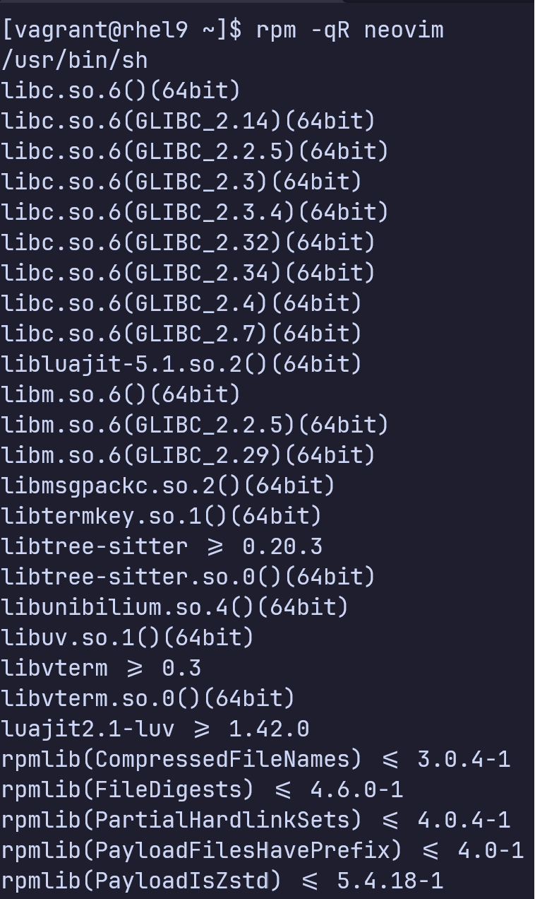
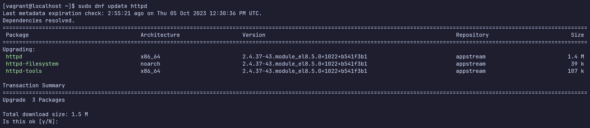

# Quản lý Package 
## 1. Tổng quan Package 
RHEL cơ bản là một tập các packages tập hợp lại với nhau để tạo nên một hệ điều hành. RHEL được xây dựng xung quanh Linux kernel và bao gồm hàng nghìn các packages đã được kí, kiểm thử, xác thực. 
## 2. Packages và Packaging 
Một software package là một tập các file tổ chức theo cấu trúc thư mục cùng với metadata tạo nên ứng dụng phần mềm. 

Packages được phân phối dưới hai kiểu
- Binary package
  
  - Binary package là những package sẵn sàng để cài đặt, và phân phối. 
  - Đuôi .rpm (trong RHEL), và chứa các script cài đặt, các file cài đặt, các file thư viện, thông tin phụ thuộc, tài liệu. 
  - Tài liệu bao gồm các hướng dẫn chi tiết cách cài đặt và gỡ cài đặt package, man page cho các file cài đặt và câu lệnh, và các thông tin khác có liên quan đến việc cài đặt và sử dụng package. - Tất cả các metadata liên quan đến package được lưu ở một vị trí tập trung và chứa thông tin như, phiên bản package, vị trí cài đặt, giá trị checksum,.. Metadata cho phép bộ công cụ quản lý package xử lý các nhiệm vụ quản lý package hiệu quả. 
  - Các thông tin về package cho phép bộ công cụ quản lý package thực thi quá trình cài đặt package. Nó có thể chứa thông tin về các phụ thuộc, thiết lập tài khoản người dùng (nếu cần thiết), và các thư mục và soft link cần được tạo. 
- Source package
  
  - Chứa mã nguồn của phần mềm, có thể được thay đổi, đóng gói lại thành định dạng binary để cài đặt hoặc phân phối. 
  - Đuôi .src 

## 3. Package Naming 

Chuẩn đặt tên package của RHEL

Ví dụ tên của một binary package 
```
openssl-1.1.1-8.el8.x86_64.rmp
```
<div align="center">

</div>

## 4. Package Dependency 
- Một package có thể yêu cầu một hoặc nhiều các package khác để có thể được cài đặt thành công 
- Một thành phần của package có thể yêu cầu chức năng cung cấp bởi một hoặc nhiều package để có thể hoạt động 

=> Hai yếu tố trên được gọi là package dependency. Một package phụ thuộc vào một hoặc nhiều package khác để có thể được cài đặt và hoạt động. 

- Các tiện ích xử lý package đọc thông tin về package dependency trong metadata của package

## 5. Cơ sở dữ liệu Package 
- Metadata cho các package đã được cài đặt và các file package được lưu trong thư mục /var/lib/rpm, thư mục này được gọi là cơ sở dữ liệu package
- Các công cụ quản lý package tham chiếu tới cơ sở dữ liệu để lấy các thông tin về package như: tên, phiên bản, quyền, kích cỡ cho mỗi file của package, phụ thuộc của package. 

## 6. Công cụ quản lý Package 
- Công cụ quản lý package chính của RHEL là rpm (redhat package manager) 
- rpm không giải quyết phụ thuộc => yum (yellowdog update, modified) được ra đời 
- yum cung cấp các chức năng như tìm và cài đặt các phụ thuộc của package một cách tự động 
- Ở RHEL 8, dnf được ra đời là một phiên bản nâng cấp của yum. 
- Câu lệnh yum vẫn có thể được sử dụng, nhưng thực chất nó là soft link tới dnf 

<div align="center">
  
</div>

## 7. Quản lý Package với rpm 
Câu lệnh rpm cung cấp các chức năng quản lý package
- Truy vấn
- Cài đặt 
- Cập nhật 
- Làm mới
- Ghi đè
- Xóa 
- Trích xuất 
- Kiểm tra
- Xác thực 
### 7.1 Câu lệnh rpm 
Các tùy chọn truy vấn cho rpm được cho trong bảng dưới 

<div align="center">
<table>
  <tr>
    <th>
      Tùy chọn
    </th>
    <th>
      Mô tả
    </th>
  </tr>
  <tr>
    <td>
      -q (--query)
    </td>
    <td>
      Truy vấn và hiển thị các packages 
    </td>
  </tr>
  <tr>
    <td>
      -qa (--query --all)
    </td>
    <td>
      Liệt kê tất cả các packages đã được cài đặt
    </td>
  </tr>
  <tr>
    <td>
      -qc (--query --configfiles)
    </td>
    <td>
      Liệt kê các file cài đặt của một package
    </td>
  </tr>
  <tr>
    <td>
      -qd (--query --docfiles)
    </td>
    <td>
      Liệt kê các file documentation của một package
    </td>
  </tr>
  <tr>
    <td>
      -qf (--query --files)
    </td>
    <td>
      Tìm xem file đến từ package nào  
    </td>
  </tr>
  <tr>
    <td>
      -qi (--query --info)
    </td>
    <td>
      Hiển thị thông tin về package đã cài đặt bao gồm phiên bản, kích cỡ, chữ kí, mô tả, kiến trúc, ngày cài đặt,... 
    </td>
  </tr>
  <tr>
    <td>
      -qip (--query --info --package)
    </td>
    <td>
      Hiển thị thông tin về package có thể cài đặt bao gồm phiên bản, kích cỡ, chữ kí, mô tả, kiến trúc, ngày cài đặt,... 
    </td>
  </tr>
  <tr>
    <td>
      -ql (--query --list)
    </td>
    <td>
      Liệt kê tất cả các file của một package  
    </td>
  </tr>
  <tr>
    <td>
      -qR (--query --requires)
    </td>
    <td>
      Liệt kê tất cả các file và package mà package phụ thuộc vào 
    </td>
  </tr>
  <tr>
    <td>
      -q --whatprovides
    </td>
    <td>
      Liệt kê các package cung cấp package hoặc file  
    </td>
  </tr>
  <tr>
    <td>
      -q --whatrequires 
    </td>
    <td>
      Liệt kê các packages yêu cầu package hoặc file 
    </td>
  </tr>
</table>
</div>


Các tùy chọn cho cài đặt, gỡ cài đặt, xác thực được cho trong bảng dưới 
<div align="center"> 
<table>
  <tr>
    <th>
      Tùy chọn
    </th>
    <th>
      Mô tả 
    </th>
  </tr>
  <tr>
    <td>
      -i (--install)
    </td>
    <td>
      Cài đặt một package 
    </td>
  </tr>
  
  <tr>
    <td>
      -U (--upgrade)
    </td>
    <td>
      Cập nhật hoặc cài đặt package đã được cài đặt tới một phiên bản mới. Giống với install, nhưng tất cả các phiên bản khác của package bị xóa sau khi package mới được cài
    </td>
  </tr>

  <tr>
    <td>
      -F (--freshen)
    </td>
    <td>
      Cập nhật các packages, nhưng chỉ cho các packages đã được cài đặt mà có phiên bản cũ 
    </td>
  </tr>

  <tr>
    <td>
      -h (--hash)
    </td>
    <td>
      Hiển thị # biểu diễn cho thời gian cài đặt package
    </td>
  </tr>

  <tr>
    <td>
      -K 
    </td>
    <td>
      Xác thực chữ kí số 
    </td>
  </tr>

  <tr>
    <td>
      --import
    </td>
    <td>
      Nhập khóa công khai
    </td>
  </tr>

  <tr>
    <td>
      -v (--verbos)
    </td>
    <td>
      Hiển thị thông tin chi tiết
    </td>
  </tr>

  <tr>
    <td>
      -V (--verify)
    </td>
    <td>
      Xác thực tính toàn vẹn của package  
    </td>
  </tr>
</table>
</div>

### 7.2 Truy vấn các packages 
Liệt kê tất cả các packages được cài đặt 

<div align="center">

</div>

Kiểm tra xem một package đã được cài đặt hay chưa

<div align="center">

</div>

Liệt kê các file cài đặt của một package

<div align="center">

</div>

Liệt kê các file documentation của một package 

<div align="center">

</div>

Lấy ra package sở hữu của file 

<div align="center">

</div>


Hiển thị thông tin chi tiết về package đã cài đặt

<div align="center">

</div>


Liệt kê tất cả phụ thuộc của package có thể cài đặt

<div align="center">

</div>


Liệt kê tất cả phụ thuộc của package

<div align="center">

</div>

Liệt kê các package yêu cầu package hiện tại để hoạt động 

<div align="center">

</div>


### 7.3 Cài đặt một package 

```
sudo rpm -ivh [path/to/package]
```

<div align="center">

</div>

Nếu package trên yêu cầu các package bị thiếu khác, lỗi sẽ xảy ra. 

### 7.4 Cập nhật một package 
Cập nhật package nếu package đã có trên hệ thống, cài đặt nếu package chưa có trên hệ thống


```
sudo rpm -Uvh [path/to/package]
```
<div align="center">

</div>

Câu lệnh trên tạo bản sao của các file cài đặt trong quá trình upgrade và thêm đuôi .rpmsave. 

### 7.5 Làm mới một package 
Bắt buộc có một phiên bản của package trên hệ thống 

```
sudo rpm -Fvh [path/to/package]
```
<div align="center">

</div>

Câu lệnh trên không làm gì bởi vì có một package với cùng phiên bản đã có trên hệ thống. Nó chỉ hoạt động khi package là một phiên bản mới hơn của package đã có trên hệ thống

### 7.6 Ghi đè một package 

```
sudo rpm -ivh --replacepkgs [path/to/package]
```
<div align="center">

</div>

### 7.7 Gỡ cài đặt một package 

```
sudo rpm -ve [path/to/package]
```
<div align="center">

</div>


Câu lệnh trên sẽ thất bại nếu như có một package khác cần package hiện tại để hoạt động

### 7.8 Trích xuất file từ một binary package 

Giả dụ như bạn mất file cài đặt /etc/chrony.conf, và muốn lấy nó ra tù package và đặt nó lại, đầu tiên phải xác định nó đến từ package nào

<div align="center">

</div>

Sử dụng rpm2cio để trích xuất (-i) tất cả file từ package "chrony" và tạo cấu trúc thư mục (-d) cần thiết trong quá trình trích xuất. 

<div align="center">

</div>

<div align="center">

</div>

<div align="center">

</div>

### 7.9 Xác thực tính toàn vẹn tính tin cậy của package 

- Trước khi cài đặt package, có thể kiểm tra tính toàn vẹn và tính tin cậy. Sử dụng checksum MD5 để xác thực tính toàn vẹn và khóa chữ ký công khai GNU Privacy Guard (GnuPG hay GPG) để đảm bảo tính tin cậy của nhà phát hành. 
- Phiên bản thương mai của GPG có tên là PGP (Pretty Good Privacy), GPG open-source, PGP không open source
- GPG và PGP đều được cài đặt dựa trên chuẩn OpenPGP 

Kiểm tra tính toàn vẹn của một package 

```
rpm -K [path/to/package]
```

<div align="center">

</div>

Red Hat kí lên các sản phẩm với khóa GPG (bằng khóa bí mật), trên máy client có khóa công khai để xác thực. Với RHEL, khóa công khai ở /etc/pki/rpm-gpp/ trong quá trình cài đặt OS.  

Để kiểm tra tính tin cậy của một package, import khóa GPG có liên quan và xác thực. 

```
sudo rpmkeys --import [path/to/key]
sudo rpmkeys -K [path/to/package]
```

<div align="center">

</div>

### 7.10 Xem GPG Keys
Liệt kê các khóa công khai đã được imported
```
rpm -q gpg-pubkey
```
<div align="center">

</div>

Xem chi tiết khóa công khai 
<div align="center">

</div>

### 7.11 Xác thực các thuộc tính của package 

- So sánh thuộc tính của file của package với thuộc tính gốc được lưu trữ tại cơ sở dữ liệu package tại thời điểm cài đặt package 
- Quá trình xác thực sử dụng câu lệnh rpm với tùy chọn -V để so sánh chủ, nhóm, quyền, kích cỡ, thời gian thay đổi, digest,... 

<div align="center">

</div>

Câu lệnh không trả về gì cả, tức là các thuộc tính của file đều không làm sao. Thử thay đổi quyền của file /usr/share/doc/neovim/README.md 

<div align="center">

</div>

Đầu ra cho thấy có sự thay đổi về quyền của file. Có thể chạy trực tiếp lên file với cò -f và đưa đường dẫn tới file làm đầu vào

<div align="center">

</div>

Đầu ra trả về 3 cột 
- Cột 1 có 9 trường 
- Cột 2 là kiểu file 
- Cột 3 là đường dẫn tuyệt đối của file 

Ý nghĩa của 9 trường của cột 1 được cho trong bảng dưới 
<div align="center">
<table>
  <tr>
    <th>
      Mã
    </th>
    <th>
      Mô tả 
    </th>
  </tr>

  <tr>
    <td>
      S
    </td>
    <td>
      Xuất hiện nếu có sự khác biệt về kích cỡ
    </td>
  </tr>

  <tr>
    <td>
      M
    </td>
    <td>
      Xuất hiện nếu có sự khác biệt về quyền
    </td>
  </tr>

  <tr>
    <td>
      5
    </td>
    <td>
      Xuất hiện nếu checksum MD5 không giống
    </td>
  </tr>

  <tr>
    <td>
      D
    </td>
    <td>
       Xuất hiện nếu có sự thay đổi về major hoặc minor device number
    </td>
  </tr>

  <tr>
    <td>
      L
    </td>
    <td>
      Xuất hiện nếu symlink có đường dẫn bị thay đổi
    </td>
  </tr>

  <tr>
    <td>
      T
    </td>
    <td>
      Xuất hiện nếu thời gian bị thay đổi
    </td>
  </tr>
  
  <tr>
    <td>
      P
    </td>
    <td>
      Xuất hiện nếu có sự khác biệt về capability 
    </td>
  </tr>

  <tr>
    <td>
      .
    </td>
    <td>
      Xuất hiện nếu không có gì thay đổi
    </td>
  </tr>
</table>
</div>


Ý nghĩa của các kiểu file của cột 2 được cho trong bảng dưới 


<div align="center">
<table>
  <tr>
    <th>
      Kiểu file 
    </th>
    <th>
      Mô tả 
    </th>
  </tr>

  <tr>
    <td>
      c
    </td>
    <td>
      File cài đặt
    </td>
  </tr>

  <tr>
    <td>
      d
    </td>
    <td>
      File documentation
    </td>
  </tr>

  <tr>
    <td>
      g
    </td>
    <td>
      File ghost
    </td>
  </tr>

  <tr>
    <td>
      l
    </td>
    <td>
      File license 
    </td>
  </tr>

  <tr>
    <td>
      r
    </td>
    <td>
      File README 
    </td>
  </tr>

</table>
</div>

## 8. Package groups 

- Một package groups là tập các packages có liên quan tới nhau được thiết kế để phục vụ một mục đích chung 
- Tiện trong việc truy vấn cài đặt xóa các package như một đơn vị, thay vì phải xử lý từng package một 
- Có hai loại package groups 
  
  1. environement groups
  Trong RHEL có các environement group là server, server với GUI, minimal install, worktation, virtualization host, custom os.

  2. package groups  
    Bao gồm container management, smart cart support, security tools, system tools, network servers, etc.

## 9. Application Streams và Modules 
- Khái niệm mới được giới thiệu trong RHEL 8 
- Cách tổ chức theo module các phiên bản của một ứng dụng phần cùng với các phụ thuộc của nó, sẵn sàng để cài đặt từ một repository. 
- Một module có thể được coi là một tập các packages và tất cả những thứ cần thiết để cài đặt nó, bao gồm, các file thực thi, thư viện, tài liệu, công cụ, các thành phần,... 
- Module cho phép lựa chọn phiên bản của phần mềm cần thiết 
- Ở phiên bản cũ của RHEL, mỗi phiên bản của một package sẽ phải tới từ một repository khác nhau. Bây giờ module của một ứng dụng duy nhất có thể được lưu trữ ở chung một repository. Các công cụ quản lý package đã được nâng cấp để xử lý module 
- RHEL 8 có sẵn hai repositories chính là BaseOS và Application Stream (AppStream)

## 10. BaseOS Repository 
- Chứa các thành phần chính của RHEL bao gồm kernel, modules, bootloader, các package phần mềm nền tảng khác 
- Có ở định dạng .rpm
## 11. AppStream Repository 
- Có thêm các ứng dụng add-on như phần mềm web server, ngôn ngữ lập trình, phần mềm cơ sở dữ liệu, etc.
- Có ở định dạng .rpm và module. 


## 12. Điểm mạnh của phân chia BaseOS và AppStream 
- Tách các thành phần ứng dụng khỏi các thành phần chính của hệ điều hành 
- Cho phép nhà phát triển đưa ra các cập nhật thường xuyên hơn, người dùng cập nhật ứng dụng thường xuyên hơn
- Ở các phiên bản trước của RHEL, cập nhật OS sẽ mặc định cập nhật tất cả các thành phần bao gồm kernel, service và các ứng dụng tới phiên bản mới nhất. Điều này có thể dẫn tới một hệ thống bất ổn định. Tách các thành phần OS khỏi các thành phần ứng dụng, hai thành phần này có thể được cập nhật độc lập với nhau. 
## 13. Module Streams 
- Module stream là tập các packages tổ chức theo phiên bản 
- Mỗi module có thể có nhiều stream 
- Một stream có thể được bật hoặc tắt 
- Stream được bật cho phép các packages nó chứa được truy vấn và cài đặt 
- Chỉ có một stream của một module được bật ở một thời điểm 
- Mỗi module có một stream mặc định, cung cấp phiên bản mới nhất hoặc phiên bản được khuyên dùng

Ví dụ module perl cung cấp hai stream độc lập cho cùng một phần mềm, một cho phiên bản 5.24, và một cho phiên bản 5.26. Stream 5.26 là mặc định, hệ thống sẽ tự động cài Stream 5.26 nếu nó được yêu cầu cài perl. 
## 14. Module Profiles 

- Module profile là danh sách các packages được khuyên dùng để tiện cho việc deploy, hỗ trợ nhiều usecase, etc. 
- Một profile có thể chứa package từ repository BaseOS hoặc phụ thuộc của stream. 
- Mỗi module strem có thể có 0, 1 hoặc nhiều hơn profile có liên kết tới nó, và chỉ có một profile được đánh dấu là mặc định 

## 15. dnf/yum Repository 
- dnf repostiory là một thư viện số để lưu trữ các package phần mềm 
- Một repository được truy cập để lấy package, truy vấn, cập nhật và cài đặt, có thể nó phải trả phí hoặc phải trả phí 
- Hai repository - BaseOS và AppStream - có chứa ISO image RHEL 8. 
- Có các repositories khác được duy trì bởi các nhà phát hành như Red Hat và CentOS 
- Có thể tự xây dựng private custom repository 

### 15.1 Liệt kê các repository
Liệt kê các repository được kích hoạt 
<div align="center">

</div>


Liệt kê tất cả các repository có trên hệ thống
<div align="center">

</div>

Sử dụng cờ --disabled liệt kê các repository không được kích hoạt 

### 15.2 Xem thông tin của repo 
```
dnf repoinfo [repository-id]
```
<div align="center">

</div>


### 15.3 Thêm repository
Để định nghĩa một repository mới có hai cách 
- Thêm phần [repository] vào /etc/dnf/dnf.conf 
- Thêm phần [repostiory] vào một file .repo ở thư mục /etc/yum.repos.d/

<div align="center">

</div>

Một vài repository có package, khi cài đặt sẽ giúp thêm repository đó vào hệ thống 
```
dnf install https://rpms.remirepo.net/enterprise/remi-release-9.rpm
```

### 15.4 Enable hoặc Disable repository
- Edit file .repo 
- Sử dụng dnf config-manager 

```
dnf config-manager set-enabled [repository-id]
```

<div align="center">

</div>


```
dnf config-manager set-disabled [repository-id]
```
<div align="center">

</div>

### 15.6 Xóa repository 
- Xóa file .repo tương ứng trong /etc/yum.repos.d/ hoặc xóa phần [repository] tương ứng trong /etc/dnf/dnf.conf 

## 16. Quản lý phần mềm với dnf 
- dnf (hoặc yum) được dùng để quản lý một package, một nhóm các packages, và một module
- dnf có một file tùy chỉnh để kiểm soát hành vi của nó 

## 16.1 File tùy chỉnh dnf 
- Vị trí của file tùy chỉnh chính cho dnf là /etc/dnf/dnf.conf

<div align="center">
  
</div>

- Phần "main" đặt ra các tùy chọn áp dụng toàn cục lên các thao tác dnf 

- Có thể định nghĩa các phần riêng cho mỗi custom repository trên hệ thống ở trên file dnf.conf. Tuy nhiên, vị trí được khuyên dùng để lưu trữ các cài đặt cho mỗi custom repository là các file riêng trong thư mục /etc/yum.repos.d

Bảng dưới giải thích một vài tùy chọn có thể định nghĩa trong file 

<div align="center">
<table>
<tr>
  <th>
    best
  </th>
  <th>
    Đặc tả tùy chọn cài đặt (hoặc cập nhật) phiên bản mới nhất
  </th>
</tr>

<tr>
  <th>
    clean_requirements_on_remove
  </th>
  <th>
    Nếu bật sẽ xóa cả phụ thuộc mà không được sử dụng khi gỡ cài đặt package 
  </th>
</tr>

<tr>
  <th>
    debuglevel
  </th>
  <th>
    Giá trị từ 1-10, tại 10 debug sẽ được lưu trong logfile. Mặc định là 2, giá trị là 0 sẽ tắt chức năng này 
  </th>
</tr>

<tr>
  <th>
    gpgcheck
  </th>
  <th>
    Nếu bật sẽ kiểm tra chữ kí GPG cho tính xác thực của package, mặc định được bật
  </th>
</tr>

<tr>
  <th>
    installonly_limit
  </th>
  <th>
    Đặc tả số package cài đặt song song. Mặc định là 3
  </th>
</tr>

<tr>
  <th>
    keepcache
  </th>
  <th>
    Nếu bật sẽ lưu package header cache sau khi cài đặt xong. Mặc định là 0 (không được bật)
  </th>
</tr>

<tr>
  <th>
    logdir
  </th>
  <th>
    Thư mục lưu log files. Mặc định là /var/log
  </th>
</tr>

<tr>
  <th>
    obsoletes
  </th>
  <th>
    Kiểm tra và gỡ bất kì các phụ thuộc nào không còn dùng nữa trong quá trình cài đặt hoặc update. Mặc định là 1 (được bật)
  </th>
</tr>
</table>
</div>

Chạy câu lệnh dưới để biết thêm tùy chọn cho file 
```
man 5 dnf.conf
```

## 16.2 Câu lệnh dnf 

### Liệt kê các package có thể cài đặt và các package đã cài đặt 

Liệt kê các package có thể cài đặt từ tất cả các repos được kích hoạt 
```
sudo dnf repoquery 
```
<div align="center">

</div>

Để giới hạn danh sách các package về một repo 
```
sudo dnf repoquery --repo [repoid]
```
<div align="center">

</div>


Liệt kê tất cả các packages đã được cài đặt trên hệ thống 
```
sudo dnf list installed 
```

<div align="center">

</div>

Output 3 cột 
1. Tên package 
2. Phiên bản 
3. Repo của package, @ là package đã được cài, @anaconda là các package được cài khi rhel được cài đặt 

Liệt kê tất cả các packages có thể cài từ tất cả các repo được enabled 
```
sudo dnf list 
```

<div align="center">

</div>


Liệt kê tất cả các packages có thể được cập nhật 
```
sudo dnf list updates 
```
<div align="center">

</div>

Kiểm tra xem một package đã được cài đặt hoặc có thể cài đặt từ bất kì repo được kích hoạt 
```
sudo dnf list [package-name]
```

<div align="center">

</div>

Có thể bật cờ --showduplicates để xem tất cả phiên bản của package 

```
sudo dnf list [package-name] --showduplicates
```

<div align="center">

</div>

### Cài đặt và cập nhật các packages 

Câu lệnh dưới sẽ cài đặt package nhưng sẽ cập nhật nếu đã có phiên bản cũ của package trên hệ thống
```
sudo dnf install [package-name]
```

Để cập nhật một package đã được cài đặt 
```
sudo dnf update [package-name]
```
Câu lệnh trên sẽ thất bại nếu như package đặc tả chưa được cài đặt 

Để cập nhật tất cả các package đã được cài đặt 
```
sudo dnf -y update
```
### Hiển thị thông tin package 

```
sudo dnf info [package-name]
```

<div align="center">

</div>

### Xóa package 
```
sudo dnf remove [package-name]
```
<div align="center">

</div>

### Tìm provider, tìm kiếm metadata của package 

Tìm xem file thuộc về package nào

```
dnf provides [file-name]
```
<div align="center">

</div>

Tìm tất cả các packages có chứa xâu đặc tả trong tên hoặc trong phần tóm tắt 
```
dnf search [package-name]
```

<div align="center">

</div>


### Quản lý nhóm package 
#### Liệt kê các package group đã cài và có thể cài 

``` 
dnf group list 
```
<div align="center">

</div>


Liệt kê số group được cài đặt và có thể cài 

<div align="center">

</div>

Liệt kê các group bao gồm cả các group bị ẩn 
```
sudo dnf group list hidden 
```

<div align="center">

</div>


Liệt kê tất cả package của một package group cụ thể 
```
sudo dnf group info [package-group]
```
<div align="center">

</div>

#### Cài đặt và cập nhật package groups 


Cài đặt nếu package group chưa được cài đặt và cập nhật nếu package group đã có trên hệ thống 
```
sudo dnf groupinstall [package-name]
```

<div align="center">

</div>


Cập nhật package group
```
sudo dnf groupupdate [package-name]
```

#### Gỡ cài đặt package group

<div align="center">

</div>

### Quản lý Module 

#### Liệt kê tất cả các module có thể cài đặt và đã cài đặt 
Liệt kê các modules từ tất cả các repos 

```
dnf module list 

```
<div align="center">

</div>

Có thể sử dụng cờ --repo để giới hạn trong một repo cụ thế

Liệt kê tất cả streams cho một module cụ thể 
```
dnf module list [module-name]
```
<div align="center">

</div>

Liệt kê tất cả module streams được enabled 
```
dnf module list --enabled
```

Tương tự có thể sử dụng --installed và --disabled để đưa ra các streams được cài đặt hoặc disabled 

#### Cài đặt và cập nhật modules

Mặc định sẽ cài stream và profile mặc định
```
sudo dnf module install [module-name]
```

<div align="center">

</div>


Cập nhật module tới phiên bản mới nhất 
```
sudo dnf module update [module-name]
```

Cài đặt module với stream và profile cụ thể sử dụng cú pháp 
<strong>module:stream/profile</strong>

<div align="center">

</div>

#### Hiển thị thông tin Module 

```
dnf module info [module-name]
```
Sử dụng cờ --profile để liệt kê các profile cho module 

<div align="center">

</div>

Giới hạn cho một stream cụ thể 

<div align="center">

</div>

#### Gỡ cài đặt module 
```
sudo dnf module remove [module-name]
```

#### Đổi module streams 
- Mục đích để upgrade hoặc downgrade phiên bản của module đã được cài đặt 
- Thao tác 
  
  1. Gỡ cài đặt phiên bản hiện tại 
  2. Chuyển sang stream khác 
  3. Cài phiên bản cần thiết 

- Mặc định, cài một module từ một stream sẽ tự động enable stream nếu như trước đó nó disable, dnf có thể được sử dụng để enable hay disable stream. 
- Chỉ một stream được enable cho một module tại một thời điểm 

Ví dụ 
Xóa stream perl 5.26 và chuyển sang stream perl 5.24. Cài phiên bản mới của module và hiển thị thông tin 

1. Kiểm tra trạng thái của tất cả các perl streams

<div align="center">

</div>

2. Gỡ cài đặt perl 5.26 

<div align="center">

</div>

3. Kiểm tra 

<div align="center">

</div>

4. Reset module

<div align="center">

</div>

5. Cài đặt perl 5.24 profile minimal 

<div align="center">

</div>

6. Kiểm tra trạng thái của module 


<div align="center">

</div>

# Misc

## Cài đặt phiên bản cụ thể của một package 

<div align="center">

</div>

## Khóa phiên bản cụ thể của một package 

Trước khi khóa phiên bản 

<div align="center">

</div>

Sau khi khóa sử dụng versionlock 

<div align="center">

</div>

## Ngăn không cho package bị remove 

<div align="center">

</div>