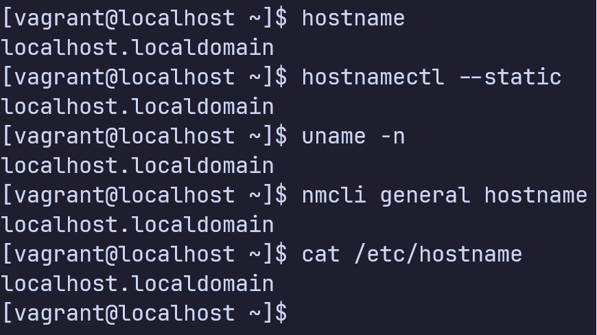

# Networking, Network Devices, and Network Connections 
- Một mạng máy tính được hình thành khi hai hoặc nhiều hơn máy tính ảo hoặc vật lý kết nối với nhau để chia sẻ tài nguyên và dữ liệu 
- Các máy tính có thể được liên kết có dây hoặc không dây
- Thiết bị như switch được dùng để kết nối các máy tính với nhau cho phép chúng giao tiếp lẫn nhau
- Để một hệ thống giao tiếp với các hệ thống khác, một trong những thiết bị mạng của nó phải được gắn một profile kết nối chứa một địa chỉ IP unique độc nhất, hostname, và các tham số mạng khác. 
- Việc gán mạng có thể được cấu hình thủ công hoặc lấy tự động từ DHCP server 
- Một vài files có liên quan đến việc cấu hình, chúng có thể được thay đổi bằng tay hoặc sử dụng câu lệnh 

## 1. Mạng máy tính cơ bản 
- Tất cả các thiết bị trong mạng máy tính (máy tính, máy in, máy quét,...) nói chung được gọi là nodes hoặc entities. 
- Một máy tính có thể được cấu hình như một file server, storage server, hoặc là cổng tới Internet cho các máy tính còn lại trong mạng
- Các nodes có thể được kết nối có dây hoặc không dây 
- Internet là mạng máy tính lớn nhất 

### 1.1 Hostname 
- Được gán cho một node để định danh nó trong mạng 
- Chỉ chứa chữ cái và các dấu hyphen(-), underscore(_), period(.) 
- Tối đa 253 kí tự 
- Trong RHEL hostname được lưu trong file /etc/hostname 

Có thể xem hostname bằng nhiều câu lệnh như hostname, hostanmectl, uname và nmcli, cũng như là xem nội dung của file /etc/hostname 

	

Cách thay đổi hostname 

Cách 1:
1. Mở file /etc/hostname và thay đổi 
	

	
	

2. Thực thi câu lệnh systemctl để restart daemon dịch vụ systemd-hostnamed
  	

	
	
 
3. Để command prompt cập nhật hostname mới thoát ra và vào lại 
   

	

Cách 2:
1. Sử dụng hostnamectl 
  

	
	

2. Để command prompt cập nhật hostname mới thoát ra và vào lại 
  

	
	

### 1.2 Địa chỉ IPv4 (Internet Protocol version 4)
- Địa chỉ phần mềm độc nhất 32 bit mỗi node trên mạng phải có để có thể giao tiếp với các node khác 
- Có thể được gán tạm thời hoặc vĩnh viễn 
- Địa chỉ tạm thời được gọi là địa chỉ động (dynamic address), thường được lấy từ server DHCP trong một khoảng thời gian cụ thể 
- Địa chỉ vĩnh viễn, được gọi là địa chỉ tĩnh (static address), được đặt thủ công 
- Sử dụng câu lệnh ip với tham số addr để xem các địa chỉ IP được gán hiện tại trên hệ thống 

	

- Đầu ra cho thấy một network được cấu hình tên eth0 với địa chỉ IPv4 10.0.2.15 được gán cho nó. 
- Kết nối còn lại (số 1), tên là lo, là một thiết bị phần mềm đặc biệt trên mỗi hệ thống Linux. Địa chỉ IPv4 của nó là 127.0.0.1 và nó được gọi là địa chỉ loopback của hệ thống (hay localhost). Các chương trình mạng giao tiếp với hệ thống cục bộ sẽ sử dụng kết nối này. 

<!---
### 1.3 Network classes 
- Địa chỉ IPv4 gồm 4 nhóm 8 bit được chia thành phần mạng (bit ID mạng) chứa Most Significant Bits (MSBs) phần node (bit node/host ID) chứa Least Significant Bits (LSBs). 
- Phần mạng định danh mạng đích đúng, phần node biểu diễn node đích trên mạng đó 
- Địa chỉ mạng public được chia thành 3 loại 
	1. Class A
	2. Class B
	3. Class C

- Địa chỉ mạng private được chia thành hai loại 
	1. Class D
	Multicast được sử dụng trong những trường hợp đặc biệt
	2. Class E
  Thử nghiệm và được giữ để dùng trong tương lai 

#### Các mạng public 
- Nhóm 8 bit lsb luôn có hai giá trị được giữ để dùng cho mục đích đặc biệt 
  1. 0: địa chỉ mạng 
  2. 255: địa chỉ quảng bá
<table>
	<tr>
		<th>
			Class 
		</th>
		<th>
			Sử dụng
		</th>
		<th>
			Network tối đa
		</th>
		<th>
			Node tối đa
		</th>
		<th>
			Minh họa
		</th>
	</tr>
	<tr>
		<td>
		Class A
		</td>
		<td>
		Sử dụng cho mạng lớn
		</td>
		<td>
		126
		</td>
		<td>
		16,777,214
		</td>
	</tr>
</table>

### 1.4 Subnetting 
- Subnetting là kĩ thuật trong đó một không gian địa chỉ mạng lớn được chia thành nhiều subnetwork logic nhỏ dễ quản lý, được gọi là subnets 
- Subnet giúp giảm  
-->

### 1.3 IPv4 Network Classes 

<table>
	<tr>
		<th>
			Class
		</th>
		<th>
			Giá trị octet đầu
		</th>
		<th>
			Mục đích
		</th>
	</tr>
	<tr>
		<td>
			A
		</td>
		<td>
			1-126
		</td>
		<td>
			Unicast (mạng lớn)
		</td>
	</tr>
		<tr>
		<td>
			B
		</td>
		<td>
			127-191
		</td>
		<td>
			Unicast (mạng vừa)
		</td>
	</tr>
		<tr>
		<td>
			C
		</td>
		<td>
			192-223
		</td>
		<td>
			Unicast (mạng nhỏ)
		</td>
	</tr>
		<tr>
		<td>
			D
		</td>
		<td>
			224-239
		</td>
		<td>
			Multicast
		</td>
	</tr>
		<tr>
		<td>
			E
		</td>
		<td>
			240-255
		</td>
		<td>
			Dùng cho mục đích thử nghiệm
		</td>
	</tr>
</table>

Tất cả các địa chỉ bắt đầu bằng 0 và bằng 127 không được sử dụng. 

<table>
	<tr>
		<th>
		</th>
		<th>
			Class A
		</th>
		<th>
			Class B
		</th>
		<th>
			Class C
		</th>
	</tr>
	<tr>
		<td>
			Giá trị octet đầu
		</td>
		<td>
			1-126
		</td>
		<td>
			128-191
		</td>
		<td>
			192-223
		</td>
	</tr>
	<tr>
		<td>
			Các bit đầu
		</td>
		<td>
			0
		</td>
		<td>
			10
		</td>
		<td>
			110
		</td>
	</tr>
	<tr>
		<td>
			Số network hợp lệ
		</td>
		<td>
			1.0.0.0-126.0.0.0
		</td>
		<td>
			128.0.0.0-191.255.0.0
		</td>
		<td>
			192.0.0.0-223.255.255.0
		</td>
	</tr>
	<tr>
		<td>
			Số network
		</td>
		<td>
		27-2 = 126
		</td>
		<td>
			214-2 = 16,384
		</td>
		<td>
			221-2 = 2,097,152
		</td>
	</tr>
	<tr>
		<td>
			Số host trên mỗi network
		</td>
		<td>
			224-2
		</td>
		<td>
			216-2
		</td>
		<td>
			28-2
		</td>
	</tr>
	<tr>
		<td>
			Số octet (bits) ở phần mạng
		</td>
		<td>
			1 (8)
		</td>
		<td>
			2 (16)
		</td>
		<td>
			3 (24)
		</td>
	</tr>
	<tr>
		<td>
			Số octet (bits) ở phần host
		</td>
		<td>
			3 (24)
		</td>
		<td>
			2 (16)
		</td>
		<td>
			1 (8)
		</td>
	</tr>
	<tr>
		<td>
			Mặt nạ mặc định
		</td>
		<td>
			255.0.0.0
		</td>
		<td>
			255.255.0.0
		</td>
		<td>
			255.255.255.0
		</td>
	</tr>
</table>

#### Số mạng của mạng Class A, Class B, Class C 

	

#### Định dạng địa chỉ 
Địa chỉ được chia thành hai phần 
- Phần mạng 
- Phần host 

Khi so sánh hai địa chỉ IP bất kì ta có 
- Các địa chỉ ở cùng mạng sẽ có cùng giá trị ở phần mạng 
- Các địa chỉ ở cùng mạng sẽ có khác giá trị ở phần host

	

Ví dụ: 
Địa chỉ IP 10.1.1.1 và 10.1.1.2 có cùng giá trị (10) ở phần mạng, nhưng khác giá trị ở phần host

#### Mặt nạ mặc định 
Mặc dù con người có thể hiểu được khái niệm ở hình trên, máy tính thì không. Để truyền đạt được khái niệm trên đến máy tính, mỗi network class có một mật nạ mặc định định nghĩa <strong>kích cỡ</strong> của các phần <strong>mạng</strong> và <strong>host</strong>.

Ví dụ: 
Mạng class A 10.0.0.0 có octet đầu tiên (8 bit) cho phần mạng, và 3 octet còn lại (24 bit) cho phần host. Nên mặt nạ mặc định của Class A là 255.0.0.0 

	

#### Số host trên mỗi mạng 
Số host trên mỗi mạng có thể được tính bằng công thức 
$2^H-2$
Trong đó $H$ là số bit cho phần host 

-2 bởi vì mỗi mạng giữ lại hai địa chỉ dùng cho mục đích đặc biệt 
- Địa chỉ network ID
- Địa chỉ network broadcast 

#### Suy ra Network ID và các số liên quan 
Mỗi classful network có 4 số chính mô tả network đó. Bạn có thể suy ra 4 số này với địa chỉ IP bất kì trong mạng. Các số này là 
- Network id 
- Địa chỉ dùng được đầu tiên (thấp nhất)
- Địa chỉ dùng được cuối cùng (cao nhất)
- Địa chỉ quảng bá network 

Quá trình xác định 4 giá trị trên khi có một địa chỉ IP bất kì 
Bước 1: Xác định class (A, B, hoặc C) dựa trên octet đầu tiên 
Bước 2: Chia phần mạng và phần host dựa trên class 
Bước 3: Để tìm network number, thay phần host bằng 0 
Bước 4: Để tìm địa chỉ đầu tiên, thêm 1 vào octet thứ 4 của network ID 
Bước 5: Để tìm địa chỉ broadcast, thay đổi các octets của phần host thành 255 
Bước 6: Để tìm địa chỉ cuối, trừ 1 khỏi octet thứ 4 của địa chỉ broadcast 

	

#### Network ID và địa chỉ Network Broadcast đặc biệt 
- Đối với Class A, giá trị của octet đầu tiên bỏ qua giá trị 0 và 127.
  - Địa chỉ 0.0.0.0 được dùng cho mục đích broadcast, nên tất cả các địa chỉ mà có octet đầu là 0 được giữ lại. 
  - Địa chỉ 127.0.0.0 được giữ lại vì một địa chỉ đặc biệt dùng cho kiểm thử, gọi là địa chỉ loopback (127.0.0.1)

### 1.4 Subnetting 
#### Giới thiệu về subnetting 
- Bắt đầu với một mạng lớn, phân chia thành nhiều mạng nhỏ (gọi là subnet) để quản lý 

#### Ví dụ cơ bản 
- Mạng lớp A, B, C chỉ là một tập các địa chỉ IP tuân theo một quy tắc nào đó. 

Ví dụ, mạng B 172.16.0.0 bao gồm tất cả địa chỉ IP bắt đầu với 172.16: 127.16.0.0, 172.16.0.1, 172.16.0.2,... tới 172.16.255.255. 

IP subnet (subdivided network) đơn giản là tập con của mạng A, B hoặc C. 
Ví dụ, một subnet của mạng Class B có thể bao gồm tất cả các địa chỉ bắt đầu với 172.16.1: 172.16.1.0, 172.16.1.1, 172.16.1.2,... tới 172.16.1.255. Một subnet cũng của mạng Class B đó có thể là tất cả các địa chỉ bắt đầu với 172.16.2. 

	

Thi