# I. Ethernet LAN cơ bản 
Phần lớn các mạng doanh nghiệp có thể được chia thành hai loại 
- **Local-area networks (LANs)**
  Kết nối các thiết bị gần nhau: các thiết bị trong cùng một phòng, một tòa nhà, hoặc dãy các tòa nhà gần nhau
- **Wide-area networks (WANs)** 
  WANs kết nối các thiết bị xa nhau 

Cùng với nhau LANs và WANs tạo thành một mạng doanh nghiệp hoàn chỉnh, làm việc với nhau để hoàn thành nhiệm vụ vận chuyển dữ liệu từ thiết bị này sang thiết bị khác 

Có tồn tại nhiều loại LANs, nhưng ngày nay mạng sử dụng hai loại LANs phổ thông: 
- **Ethernet LANs** 
  Sử dụng cáp để liên kết giữa các node, vì nhiều loại cáp sử dụng dây đồng. Ethernet LANs thường được gọi là wired LANs (LANs có dây). Ethernet LANs cũng sử dụng cáp quang, bên trong có chứa sợi thủy tinh được sử dụng bởi các thiết bị để truyền dữ liệu sử dụng ánh sáng 
- **Wireless LANs.** 
  Không sử dụng dây hoặc cáp, sử dụng sóng radio để liên kết giữa các node 

## 1. Tổng quát về LANs 

Thuật ngữ ***Ethernet*** dùng để nói về một **tập các chuẩn LAN cùng với nhau định nghĩa các tầng physical và data-link**. Các chuẩn được định nghĩa bởi Institute of Electrical and Electronics Enginners (IEEE), định nghĩa **cáp, cable connector, các quy tắc giao thức, và mọi thứ khác cần thiết để tạo ra một Ethernet LAN** 

### 1.1 SOHO LANs điển hình 
Đầu tiên, nghĩ về small office/home office (SOHO) LAN, cụ thể là LAN chỉ sử dụng công nghệ Ethernet LAN. Đầu tiên **LAN cần một thiết bị gọi là Ethernet LAN *switch*, thiết bị này cung cấp nhiều cổng vật lý mà các cáp có thể được kết nối.** 

**Ethernet sử dụng *Ethernet cables (cáp Ethernet)*, là bất kì cáp nào mà tuân theo các chuẩn Ethernet.** LAN sử dụng các cáp Ethernet để kết nối các thiết bị Ethernet hay là node với một trong những cổng Ethernet của Switch 

Hình 2-1 là hình minh họa của một SOHO Ethernet LAN. Hình vẽ có một LAN switch, 5 cáp, và 5 Ethernet nodes: ba PCs, một printer, và một thiết bị mạng gọi là router. (Router kết nối LAN tới WAN, trong trường hợp này là tới Internet)

  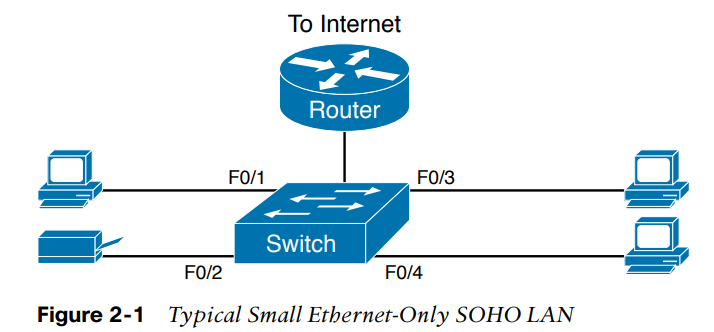

Mặc dù Hình 2-1 minh họa switch và router là hai thiết bị độc lập, **nhiều SOHO Ethernet LANs ngày nay kết hợp router và switch thành một thiết bị duy nhất.** Các nhà cung cấp bán các thiết bị mạng tích hợp hoạt động như router và Ethernet switch, cũng như là các chức năng khác. Các thiết bị này thường có "router" trong tên, nhưng nhiều model có 4-cổng 8-cổng Ethernat LAN switch tích hợp sẵn vào thiết bị. 

**Nhiều SOHO LANs ngày nay cũng hỗ trợ các kết nối LAN không dây.** Bạn có thể xây dựng một SOHO LAN vừa có công nghệ Ethernet LAN cũng như công nghệ wireless LAN, cũng được định nghĩa bởi IEEE. **Wireless LANs, định nghĩa bởi IEEE sử dụng chuẩn bắt đầu với 802.11, sử dụng sóng radio để gửi bit từ node này tới node khác.** 

**Phần lớn các wirelss LANs phụ thuộc vào một thiết bị mạng khác: một điểm truy cập (access point) wireless LAN.** AP hoạt động hơi giống switch Ethernet, tất cả các LAN nodes giao tiếp với wireless AP. Nếu mạng sử dụng một AP như một thiết bị vật lý thì nó cần một Ethernet link để kết nối AP với Ethernet LAN như trong Hình 2-2

Hình 2-2 minh họa router, Ethernet switch, wireless LAN access point là 3 thiết bị khác nhau để bạn có thể hiểu rõ các vai trò khác nhau. **Tuy nhiên, phần lớn SOHO networks ngày nay sử dụng một thiết bị duy nhất, thường được gọi là "wireless router", có tất cả các chức năng của 3 thiết bị trên** 

  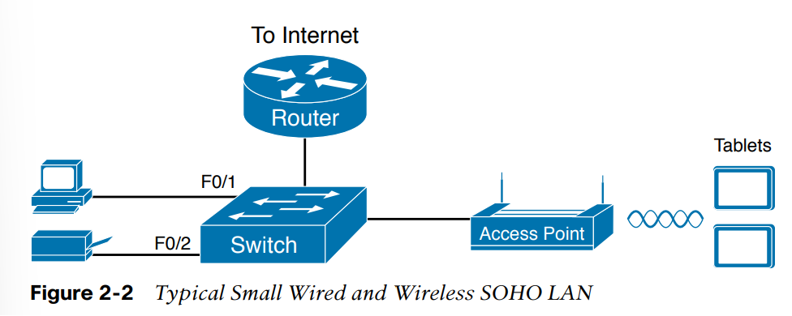

### 1.2 Enterprise LANs điển hình 

Mạng enterprise có cùng nhu cầu với mạng SOHO, nhưng ở quy mô lớn hơn. Ví dụ, enterprise Ethernet LANs bắt đầu với các LAN switches cài đặt ở một phòng sau một cánh cửa bị khóa (wiring closet) ở mỗi tầng của một tòa nhà. Các thợ điện cài đặt cáp Ethernet từ wiring closet tới các phòng làm việc và hội thảo mà có các thiết bị cần kết nối với LAN. Cùng một lúc, nhiều doanh nghiệp cũng hỗ trợ wireless LANs trong cùng một không gian, cho phép nhiều người làm việc và để hỗ trợ các thiết bị không có giao diện Ethernet LAN. 

Hình 2-3 là minh họa về một enterprise LAN điển hình trong một tòa nhà ba tầng. Mỗi tầng có một Ethernet LAN switch và một wireless LAN AP. Để giao tiếp giữa các tầng, switch của mỗi tầng kết nối với một switch tập trung. Ví dụ, PC3 có thể gửi dữ liệu cho PC2, nhưng dữ liệu sẽ đi qua switch SW3 tới tầng 1 tới switch tập trung (SWD) và tới switch SW2 ở tầng 2. 

  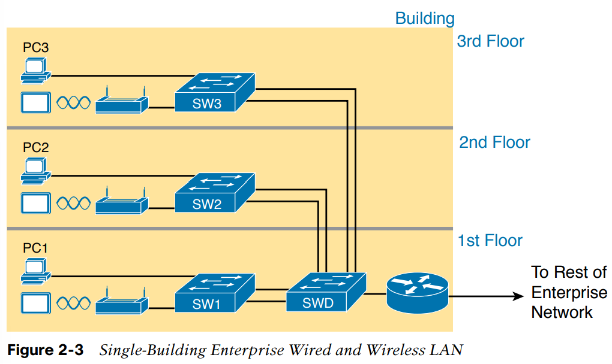

Hình vẽ cung minh họa một cách điển hình để kết nối LAN tới WAN sử dụng một router. Các LAN swtiches và wireless access points hoạt động để tạo ra LAN. Routeres kết nối với cả LAN và WAN. Để kết nối với LAN, router sử dụng một giao diện Ethernet LAN và một cáp Ethernet, ở phần dưới bên phải của Hình 2-3. 

### 1.3 Các chuẩn Ethernet Physical Layer 

Thuật ngữ *Ethernet* dùng để nói về một tập các chuẩn. 

**Một số chuẩn định nghĩa các cấu hình để gửi dữ liệu qua một loại cáp cụ thể, ở một tốc độ cụ thể.** 

Các chuẩn khác định nghĩa các giao thức hay quy tắc, mà các Ethernet nodes phải tuân theo để trở thành một phần của Ethernet LAN. 

Tất cả các chuẩn Ethernet đều đến từ IEEE và có chứa số 802.3 là phần đầu của tên chuẩn 

Ngày nay, Ethernet bao gồm nhiều chuẩn cho nhiều loại cáp quang và đồng, và cho tốc độ từ 10 megabits trên giây (megabits per second - Mbps) tới 400 gigabits trên giây (gigabits per second - Gbps). Chuẩn cũng khác nhau tương ứng với các loại và chiều dài của dây. 

Có hai loại vật liệu được sử dụng bên trong cáp để truyền bits vật lý:
- **Dây đồng (copper wires)**
  Các thiết bị **sử dụng cáp UTP truyền dữ liệu qua mạch điện thông qua dây đồng bên trong cáp.**
- **Sợi quang (glass fibers)**
  Cáp quang (đắt), cho phép các node Ethernet **gửi ánh sáng qua sợi quang ở giữa của cáp.** Mặc dù tốn kém hơn, cáp quang thường cho phép khoảng cách cáp dài hơn giữa các node 

IEEE định nghĩa chuẩn Ethernet tầng physical sử dụng một vài quy chuẩn đặt tên. Tên bắt đầu bằng 802.3 theo sau bởi một vài chữ cái. IEEE cũng sử dụng các tên tắt có ý nghĩa giúp định danh tốc độ, cũng như về cáp là UTP (với hậu tố T) hoặc cáp quang (hậu tố là X) 

Bảng 2-2 liệt kê một vài chuẩn Ethernet tầng physical. 

  

### 1.4 Hành vi nhất quán đối với tất cả kết nối sử dụng tầng Ethernet Data-Link 
Mặc dù **Ethernet có nhiều chuẩn cho tầng physical**, Ethernet hoạt động như là một công nghệ LAN vì nó **sử dụng cùng chuẩn tầng data-link cho tất cả các loại kết nối vật lý Ethernet.** 

Chuẩn data-link định nghĩa Ethernet header và trailer. **Không quan trọng dữ liệu đi từ cáp UTP hay bất kì loại cáp quang nào, không quan trọng tốc độ, header và trailer data-link đều sử dụng cùng một định dạng**

Trong khi các chuẩn tầng physical tập trung vào việc gửi bit qua một cáp, **các giao thức Ethernet tập trung vào việc gửi một Ethernet frame từ Ethernet node nguồn tới Ethernet node đích. Dưới góc nhìn của data-link, các nodes xây dựng và chuyển tiếp *frames*.** Các Ethernet nodes chỉ đơn giản là chuyển tiếp frame, qua các link được yêu cầu, để chuyển frame tới đích 

Hình 2-4 mô tả ví dụ của quá trình trên. Trong trường hợp này, PC1 gửi Ethernet frame tới PC3. Frame đi qua UTP link tới Ethernet switch SW1, rồi qua fiber links tới Ethernet switchs SW2 và SW3, và cuối cùng qua một UTP link tới PC3. Lưu ý rằng các bits di chuyển ở bốn tốc dộ khác nhau trong ví dụ này: 10 Mbps, 1 Gbps, 10 Gbps, và 100 Mbps.

  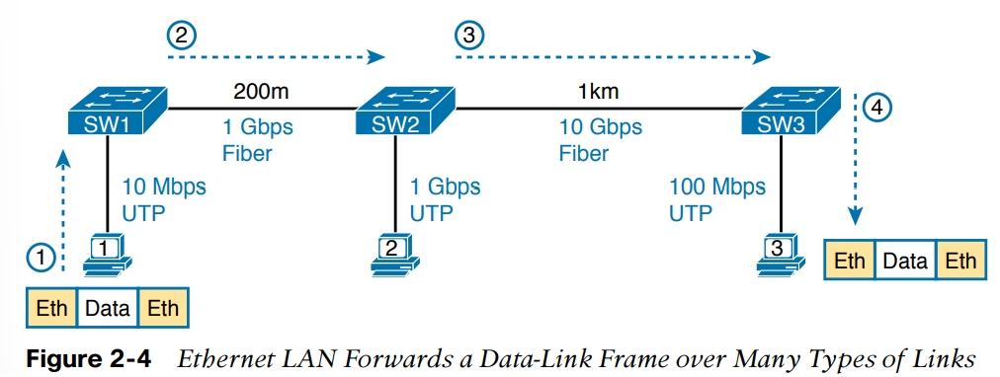

**Vậy, Ethernet LAN là gì ? Nó là tập hợp các thiết bị người dùng, LAN switches và các loại cáp khác nhau. Mỗi kết nối có thể sử dụng các loại cáp khác nhau, ở các tốc độ khác nhau. Tuy nhiên, chúng đều hoạt động với nhau để chuyển Ethernet frames từ một thiết bị trên LAN tới một thiết bị khác**

## 2. Xây dựng Physical Ethernet LANs với UTP 

Phần tiếp theo tập trung vào các kết nối vật lý giữa hai Ethernet nodes, đặc biệt là các nodes sử dụng cáp UTP (Unshielded Twisted Pair). Trước khi mạng Ethernet có thể gửi Ethernet frames giữa các thiết bị, mỗi node phải sẵn sàng và có thể gửi dữ liệu qua một link vật lý. 

**Phần này tập trung vào ba chuẩn Ethernet phổ biến: 10BASE-T (Ethernet), 100BASE-T (Fast Ethernet, hay FE), và 1000BASE-T (Gigabit Ethernet hay GE).** Đặc biệt phần này nhìn vào chi tiết của việc gửi dữ liệu từ hai hướng qua cáp UTP. Và xét các **cách lắp dây của cáp UTP sử dụng cho Ethernet 10-Mbps, 100-Mbps, và 1000-Mps**

### 2.1 Chuyển dữ liệu sử dụng cặp dây xoắn 
Về mặt vật lý dữ liệu được chuyển sử dụng dòng điện chạy qua các dây bên trong cáp UTP. Để hiểu rõ hơn về cách Ethernet gửi dữ liệu sử dụng dòng điện, chúng ta sẽ chia ý tưởng làm hai phần
- Cách tạo ra mạch điện 
- Cách mã hóa 1 và 0 vào tín hiệu điện 

Đầu tiên để tạo ra mạch điện, Ethernet định nghĩa cách dùng hai dây như trong Hình 2-5, hình vẽ không minh họa cáp UTP giữa hai node, mà minh họa hai dây độc lập ở bên bên trong cáp UTP. Một mách điện yêu cầu một loop, nên hai node, sử dụng cổng Ethernet, kết nối hai dây thành một cặp để hoàn thành loop, cho phép dòng điện chạy. 

  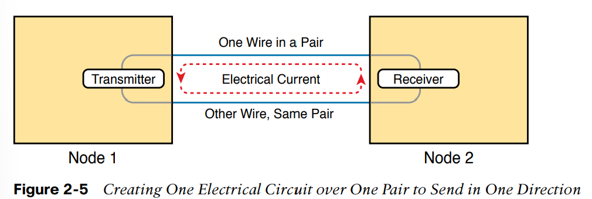

Để gửi dữ liệu, hai thiết bị tuân theo quy tắc gọi là *encoding scheme*. Ý tưởng giống như với hai người nói chuyện với nhau sử dụng cùng ngôn ngữ, thì có thể hiểu nhau. Với encoding scheme, node truyền dữ liệu thay đổi tín hiệu theo thời gian, trong khi node nhận, sử dụng cùng quy tắc, diễn giải các sự thay đổi đó thành 0 hoặc 1 (Ví dụ 10BASE-T sử dụng một encoding scheme mã hóa 0 là một sự chuyển từ điện thế cao tới điện thế thấp ở giữa chu kỳ 1/10,000,000 giây)

Lưu ý rằng trong một cáp UDP thật, các dây sẽ được xoắn với nhau, thay vì song song như Hình-2.5. Việc xoắn các dây với nhau giúp giải quyết một vấn đề, khi dòng điện chạy qua bất kì dây nào, nó tạo ra nhiễu (electromagnetic interference - EMI) ảnh hưởng tới các tín hiệu điện của các dây gần đó, bao gồm cả các dây trong cùng cáp. Xoắn các dây lại với nhau sẽ giúp loại bỏ phần lớn nhiễu, vì vậy phần lớn liên kết mạng vật lý sử dụng dây đồng thường sử xoắn các cặp dây lại. 

### 2.2 Đi sâu về liên kết UTP Ethernet

Thuật ngữ *Ethernet link* dùng để nói về bất cứ cáp vật lý giữa hai node Ethernet. Để hiểu về cách hoạt động của UTP Ethernet link, chúng ta sẽ phân chia nó thành các phần cơ bản như trong Hình 2-6. Các thành phần cơ bản của UTP Ethernet link là: cáp, connector ở các đầu của cáp, và cổng tương xứng trên ccacs thiết bị mà connector sẽ được lắp vào 

  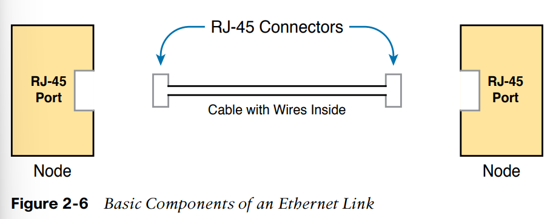

Đầu tiên cáp UTP chứa các dây đồng, nhóm lại với nhau thành các cặp xoắn. Chuẩn 10BASE-T và 100BASE-T yêu cầu hai cặp dây, trong khi 1000BASE-T yêu cầu 4 cặp. Mỗi dây được phủ mã màu, các dây cùng cặp có quy tắc đánh màu. Ví dụ, với một cặp có một dây là xanh dương, dây còn lại sẽ có sọc xanh dương và trắng. 

Nhiều cáp Ethernet UTP sử dụng RJ-45 connector ở cả bai đầu. RJ-45 connector có 8 vị trí cho 8 dây của cáp, gọi là *pin positions*, hay *pins*. Các pins này là nơi mà điểm kết thúc của dây động có thể tiếp xúc với thiết bị điện bên trong nodes ở cuối kết nối vật lý để điện có thể chạy 

Để hoàn thiện physical link, các nodes cần cổng RJ-45 Ethernet tương ứng với các RJ-45 connectors trên cáp để connectors ở cuối cáp có thể kết nối với mỗi node. PCs thường có cổng RJ-45 Ethernet là một phần của network interface card (NIC), có thể lắp thêm vào PC hoặc có thể được tích hợp sẵn vào. Các switches thường có nhiều cổng RJ-45 vì switches cho phép các thiết bị người dùng kết nối với Ethernet LAN. Hình 2-7 là các hình ảnh của cáp, connectors, và cổng. 

  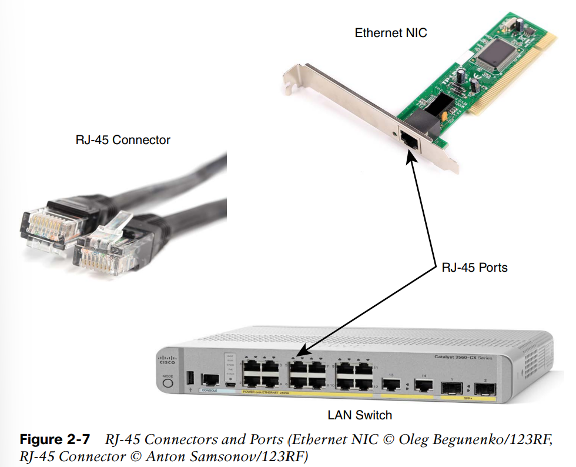

Hình vẽ minh họa connector ở bên trái và port ở bên phải. Hình ở bên trái minh họa 8 pin positions ở cuối RJ-45 connector. Phần trên bên phải là một Ethernet NIC chưa được cài trong máy tính. Phần dưới bên phải là một Cisco switch, với nhiều RJ-45 ports, cho phép nhiều thiết bị kết nối với mạng Ethernet 

Cuối cùng, trong khi RJ-45 connectors với cáp UTP là phổ thông nhưng các Cisco LAN swiches cũng hỗ trợ các loại connector khác. 

Để tăng tính linh hoạt của các Ethernet links, Cisco switch cung cấp một vài cổng vật lý có transceiver có thể thay đổi 

Ví dụ, Hình 2-8 minh họa một bức ảnh của Cisco switch với transceiver có thể thay đổi. Trong trường hợp này, hình vẽ cho thấy một transceiver small form-factor pluggable (SFP+), chạy ở 10 Gbps, ở bên ngoài hai SFP+ slots trên một Cisco 3560CX switch. SFP+ là phần màu ghi ở dưới switch, được kết nối với cáp đen. 

  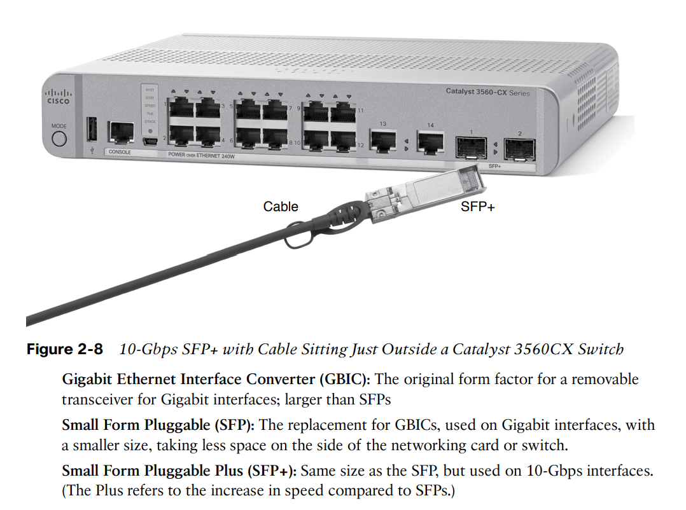

### 2.3 Pinouts của cáp UTP cho 10BASE-T và 100BASE-T 
Phần này nói về các quy tắc về cáp Ethernet: các quy tắc đảm bảo các thiết bị chuyển dữ liệu sử dụng đúng dây bên trong cáp. Cụ thể các quy tắc cho 10-Mbps 10BASE-T và 100-Mbps 100BASE-T. Cả hai sử dụng cáp UTP giống nhau (đều dùng hai cặp). Đồng thời so sánh với 1000BASE-T (Gigabit Ethernet - sử dụng 4 cặp dây

#### Straight-Through Cable Pinout 
10BASE-T và 100BASE-T sử dụng hai cặp dây trong cáp UTP, một cho mỗi hướng, như trong Hình 2-9. Hình vẽ cho thấy bốn dây, tất cả đều năm trong một cáp UTP kết nối một PC với một LAN switch. Trong ví dụ này, PC ở bên trái truyền sử dụng cặp trên, và switch ở bên phải truyền sử dụng cặp dưới. 

  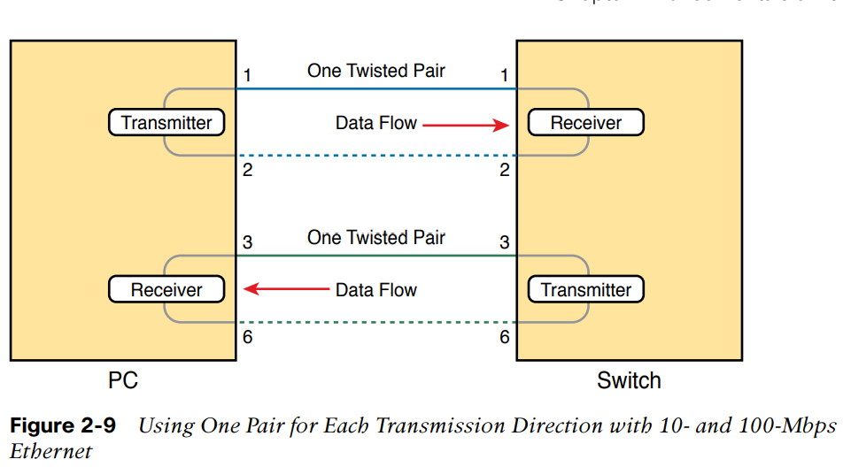

Để có thể truyền đúng dữ liệu, các dây bên trong cáp UTP phải được kết nối tới đúng vị trí pin ở RJ-45 connectors. Ví dụ, ở Hình 2-9, bộ phát ở PC phải biết vị trí pin của hai dây nó dùng để truyền. Hai dây đó phải được kết nối tới đúng pin ở RJ-45 connector ở switch để logic nhận của switch có thể dùng đúng dây. 

Để hiểu được sự lắp đặt dây của cáp - dây nào cần được ở vị trí pin nào ở hai đầu cáp - bạn cần hiểu cách NICs và switch hoạt động. Như là một quy tắc, bộ phát của Ethernet NIC sử dụng cặp kết nối tới pins 1 và 2; bộ nhận NIC sử dụng cặp ở pin 3 và 6. LAN switches thì ngược lại: chúng nhận sử dụng cặp dây ở pin 1 và 2, và bộ phát của chúng sử dụng cặp dây ở pin 3 và 6. 

Để cho phép PC NIC giao tiếp với switch, cáp UTP cũng phải sử dụng *straight through cable pintout*. Một Ethernet straight-through cable kết nối dây ở pin 1 ở một đầu cáp với pin 1 ở đầu còn lại của cáp; tương tự dây ở pin 2 với pin 2,... như trong Hình 2-10 

  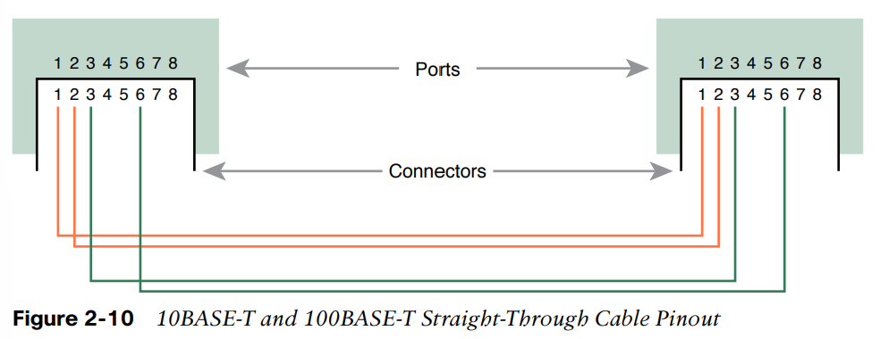

Hình 2-11 minh họa một góc nhìn về straight-through cable pinout. Trong trường hợp này, PC Larry kết nối tới LAN switch. Lưu ý rằng hình vẽ không minh họa cáp UTP, nhưng minh họa các dây bên tỏng cáp, để nhấn mạnh khái niệm về cặp dây và pins. 

  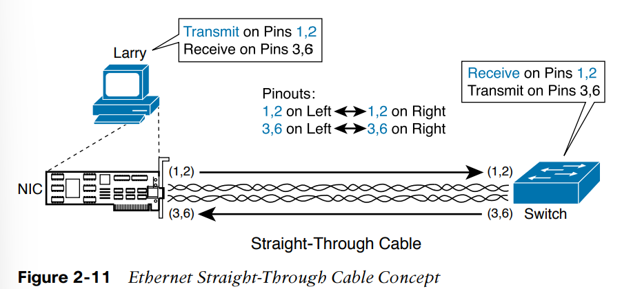

#### Crossover cable pinout 

Straight-through cable hoạt động khi các node sử dụng các cặp đối lặp nhau để truyền dữ liệu. Tuy nhiên, hai thiết bị giống nhau kết nối với một Ethernet link, chúng cùng truyền trên cùng pins. Trong trường hợp đó, bạn cần một loại cabling pinout gọi là crossover cable. Crossover cable pinout đan chéo cặp của một thiết bị từ transmit pin tới receive pin của thiết bị còn lại 

Hình 2-12 minh hoạ liên kết giữa hai switches. Hai switches đều truyền với cặp pins 3 và 6, và nhận với pins 1 và 2. Nên cáp phải kết nối cặp pins 3 và 6 ở mỗi bên tới pins 1 và 2 ở bên còn lại. 

  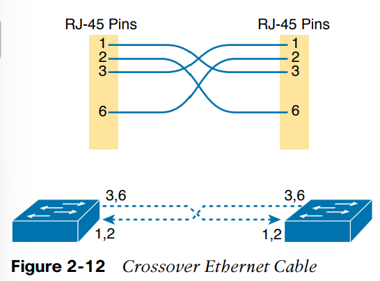

#### Lựa chọn cable pinouts đúng 

Mấu chốt là biết được một thiêt thiết bị hoạt động như một PC NIC, truyền ở pins 1 và 2 hoặc như switch, truyền ở pins 3 và 6. Và áp dụng logic: 
- Crossover cable: Nếu các endpoints cùng truyền qua cùng cặp pin 
- Straight-through cable: Nếu các endpoints truyền qua khác cặp pin 

Bảng 2-3 liệt kê các thiết bị và cặp pin nó có thể sử dụng, giả dụ là chúng dùng 10BASE-T và 100BASE-T

  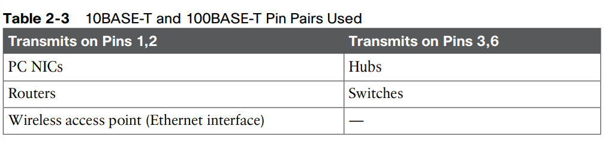

Ví dụ, Hình 2-13 minh họa một LAN. Trong trường hợp này, nhiều straight-through cables được sử dụng để kết nối PC với switches. Bên cạnh đó, các cáp kết nối các switches yêu cầu crossover cables. 

  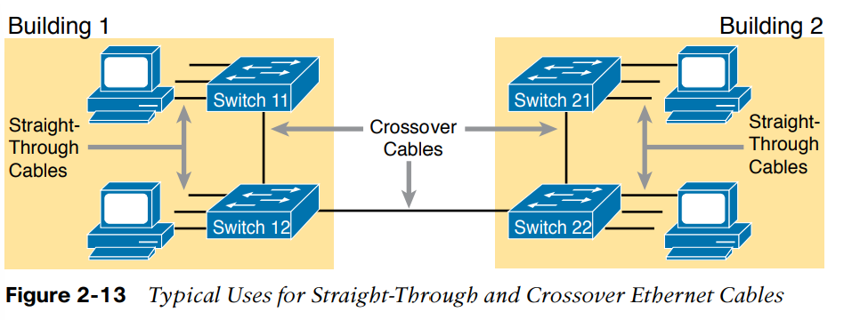

*Lưu ý* Nếu bạn có kinh nghiệp với việc cài đặt LANs, bạn có thể nghĩ rằng là bạn dùng sai cáp (straight-through hoặc crossover), nhưng nó vẫn hoạt động. Vì Cisco switch có chức năng gọi là *auto-mdix*, chức năng này biết được khi cáp bị sai và tự động thay đổi logic để khiến cho link hoạt động. 

#### UTP Cabling Pinouts cho 1000BASE-T 

1000BASE-T (Gigabit Ethernet) khác so với 10BASE-T và 100BASE-T. Đầu tiên, 1000BASE-T yêu cầu 4 cặp dây. Thứ hai nó sử dụng thiết bị điện tiên tiến hơn cho phép cả hai đầu truyền và nhận cùng lúc trên mỗi cặp dây. 

Về wiring pinouts cho 1000BASE-T hoạt động gần như y hệt với các chuẩn trước 

Straight-through cable cho 1000BASE-T sử dụng 4 cặp dây để tạo 4 mạch, nó thêm một cặp ở pins 4 và 5 và một cặp ở pins 7 và 8 như trong Hình 2-14.

  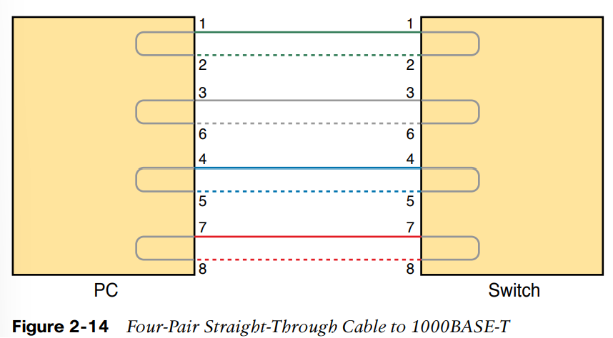

Crossover cable cũng đan chéo cặp giống như các loại Ethernet khác (cặp ở pins 1,2 và 3,6) đồng thời nó cũng đan chéo hai cặp mới (cặp 4,5 với cặp 7,8)

## 3. Xây dựng Physical Ethernet LANs với sợi quang 
Giới hạn của nhiều chuẩn Ethernet dựa trên UTP sử dụng chiều dài cáp dài tới 100 mét, tức là phần lớn cáp Ethernet trong doanh nghiệp sử dụng cáp UTP. Khoảng cách từ một switch Ethernet tới mỗi endpoint trên một tầng của một tòa nhà khả năng cao là ngắn hơn 100m. Trong một vài trường hợp, cáp quang có thể được sử dụng cho một số link ở trong Ethernet LAN, để truyền được xa hơn, và có thể vì lý do khác. Phần này xét về các tradeoffs sau khi bàn luận về các cách cơ bản dữ liệu được truyền qua cáp quang 

### 3.1 Các khái niệm truyền cáp quang 
Cáp quang sử dụng kính để cho ánh sáng đi qua, thay đổi áng sáng đó theo thời gian để mã hóa 0 và 1. Kính sử dụng ở đây không phải là kính trong cửa sổ. Kính cửa sổ cứng, khó bẻ, và dễ vỡ - đều là các đặc tính xấu để làm cáp 

Thay vào đó, cáp quang sử dụng fiberglass (sợi thủy tinh). Cáp quang giữ sợi thủy tinh ở giữa cáp, cho phép ánh sáng đi qua - là một thuộc tính rất quan trọng trong việc truyền dữ liệu 

Mặc dù glass fiber có thể sử dụng để gửi dữ liệu rất tốt, bản thân nó vẫn cần giúp đỡ. Glass fiber có thể vỡ, nên nó cần được bảo vệ. Hình 2-15 mô tả các thành phần của cáp quang 

  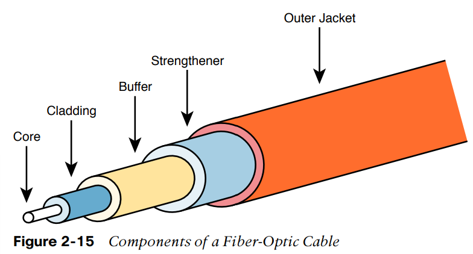

Ba lớp ngoài cùng bảo vệ phần bên trong của cáp giúp cáp dễ cài đặt và quản lý, trong khi *cladding* và *core* hoạt động với nhau để tạo ra môi trường cho phép truyền ánh sáng qua cáp. Một nguồn sáng, gọi là *optical transmitter* chiếu ánh sáng vào lõi. Ánh sáng có thể đi qua core; tuy nhiên, ánh sáng sẽ phản chiếu vào cladding lại vào core. Hình 2-16 mô tả ví dụ với bộ phát ánh sáng LED (light emitting diode). Bạn có thể thấy cladding phản xạ ánh sáng lại về core khi nó đi qua core 

  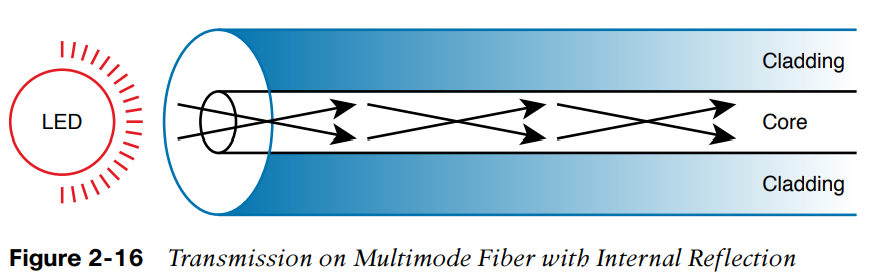

Hình trên minh họa multimode fiber, nó cho phép nhiều góc (modes) các sóng ánh sáng đi vào core 

Ngược lại single-mode fiber sử dụng một core với đường kính bé, tầm khoảng 1/5 so với multimode cable. Để truyền ánh sáng vào core nhỏ hơn, một bộ truyền laser-based truyền ánh sáng ở một góc duy nhất (lý do tên single-mode)

  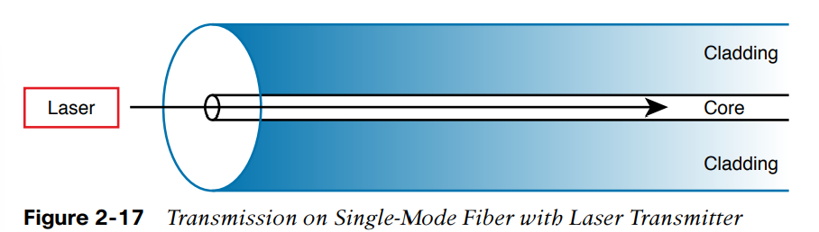

Cả multimode và single-mode đều có vai trò quan trọng trong Ethernet. Multimode cải thiện khoảng cách tối đa so với UTP, và nó sử dụng bộ phát ít tốn kém hơn so với single-mode. Cũng tùy vào các chuẩn; ví dụ chuẩn cho 10 Gigabit Ethernet cho Fiber cho phép khoảng cách tối đa là 400m. Single-mode cho phép khoảng cách tối đa khoảng chục km, nhưng tốn kém hơn về phần cứng SFP/SFP+

Để truyền giữa hai thiết bị, bạn cần hai cáp, một cho mỗi hướng, như trong Hình 2-18. Khái niệm giống như hai mạch điện với chuẩn UTP Ethernet. Lưu ý rằng cổng truyền trên một thuyết bị kết nối với một cáp kết nối với cổng nhận ở thiết bị còn lại, và ngược lại với cáp còn lại. 

  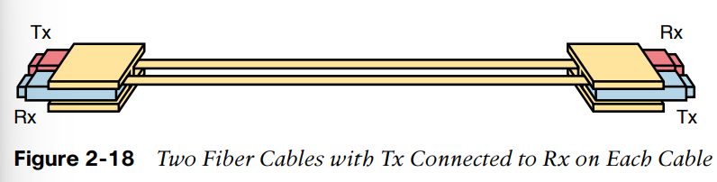

### 3.2 Sử dụng Fiber với Ethernet 
Để sử dụng fiber với Ethernet switch, bạn cần sử dụng một switch với các cổng được tích hợp sẵn có hỗ trợ một chuẩn Ethernet quang, hoặc một switch với cổng modular cho phép bạn thay đổi chuẩn Ethernet sử dụng trên cổng. Quay lại Hình 2-8, có minh họa một switch với hai cổng SFP+, bạn có thể cắm bất kì SFP+ module vào. Các cổng SFP+ hỗ trợ các chuẩn 10-Gbps như trong Bảng 2-4. 

  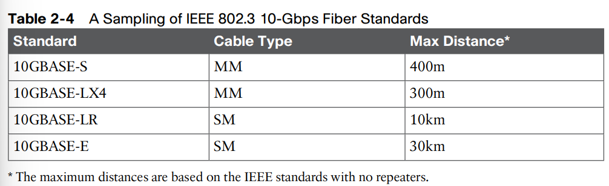

Mặc dù khoảng cách là tiêu chí đầu tiên để xét tới khi nghĩ về sử dụng cáp UTP hay cáp quang, nhưng có các tradeoffs khác. UTP thắng vì nó không tốn kém. Tuy nhiên UTP có một vài điểm yếu. Đầu tiên, nó có thể hoạt động kém trong môi trường ô nhiễm điện, như là nhà máy, vì nó có thể bị ảnh hưởng bởi nhiễu điện. Hơn nữa, cáp UTP phát tín hiệu nhỏ ra ngoài các cáp, nên các mạng bảo mật thường sẽ chọn fiber. Bảng 2-5 tổng quát hóa các tradeoffs này. 

  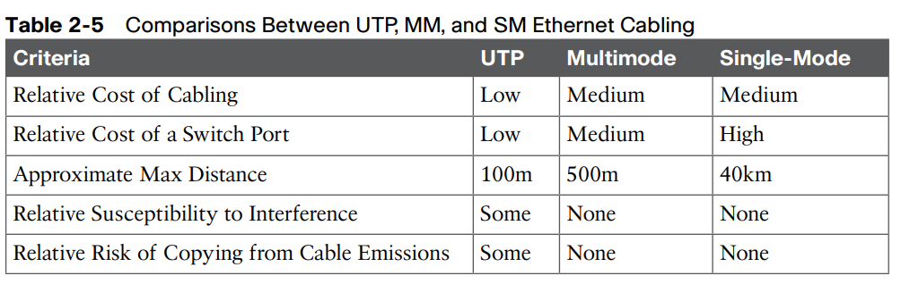

## 4. Truyền dữ liệu trong Ethernet Network
Mặc dù chuẩn tầng physical khác nhau, các phần khác của chuẩn Ethernet hoạt động giống nhau không quan trọng loại Ethernet link vật lý nào. Phần này nói về các giao thức và quy tắc mà Ethernet sử dụng không quan trọng kiểu link. Cụ thể, phần này xét về chi tiết của giao thức Ethernet data-link, và cách Ethernet nodes, switches và hubs chuyển tiếp Ethernet frame qua Ethernet LAN. 

### 4.1 Các giao thức Ethernet Data-Link 
Một điểm mạnh của các giao thức Ethernet là chúng sử dụng cùng chuẩn data-link. 

Giao thức Ethernet data-link định nghĩa Ethernet frame: Ethernet header ở phần đầu, dữ liệu được đóng gói ở giữa, và Ethernet trailer ở cuối. Ethernet định nghĩa một vài định dạng cho header, với định dạng frame ở Hình 2-19 là định dạng phổ biến được sử dụng ngày nay 

  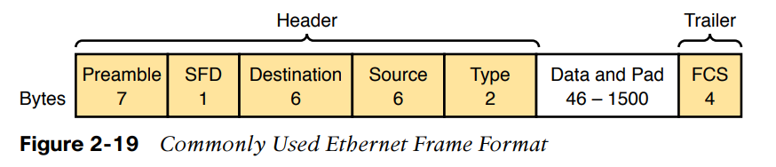

Bảng 2-6 liệt kê các trường trong phần header và trailer và mô tả ngắn gọn. 

  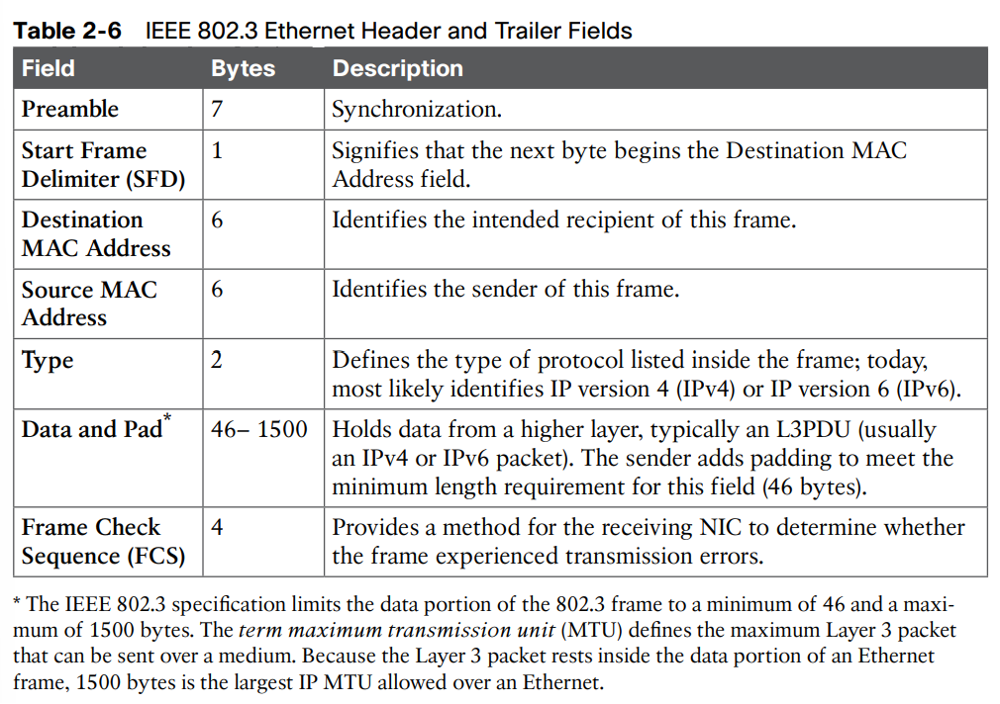

### 4.2 Ethernet Addressing 
Trường source và destination đóng vai trò quan trọng trong cách Ethernet LANs hoạt động. Ý tưởng chung khá là đơn giản: node gửi cho địa chỉ của nó vào trường source address và địa chỉ của thiết bị Ethernet đích vào trường destination address. Người gửi truyền frame, mong đợi Ethernet LAN, sẽ chuyển frame tới đúng đích. 

Địa chỉ Ethernet, cũng được gọi là địa chỉ Media Access Control (MAC), là số 6 byte (48 bit). Để thuận tiện, các máy tính sẽ hiển thị địa chỉ MAC là số hexa 12 digit. Các thiết bị Cisco thường thêm dấu chấm vào giữa các số để dễ đọc; ví dụ một Cisco switch thường hiển thị địa chỉ MAC là 0000.0C12.3456

Phần lớn các địa chỉ MAC đại diện cho một NIC hoặc các cổng Ethernet khác. Thuật ngữ *unicast* có nghĩa là địa chỉ đại diện cho một giao diện tới Ethernet LAN (thuật ngữ này đối lập với hai loại địa chỉ Ethernet khác, *broadcast* và *multicast*, sẽ được định nghĩa sau)

Ý tưởng gửi dữ liệu tới một đích sủ dụng MAC address hoạt động chỉ khi tất cả địa chỉ MAC là độc nhất. Nếu hai NICs sử dụng cùng địa chỉ MAC, khi gửi frame thì nên gửi đến NICs nào ? Ethernet giải quyết vấn đề này bằng một quá trình quản trị sao cho, tại thời điển sản xuất, tất cả các thiết bị Ethernet được gán một địa chỉ MAC độc nhất (universally unique MAC address). Trước khi các nhà sản xuất xây dựng các sản phẩm Ethernet, họ yêu cầu IEEE gán cho họ một mã sản xuất độc nhất dài 3-byte, gọi là organizationally unique identifier (OUI). Nhà sản xuất đồng ý cho tất cả các NICs (và các sản phẩm Ethernet khác) một địa chỉ MAC bắt đầu với 3-byte OUI. Các nhà sản xuất cũng gán một giá trị độc nhất cho 3 byte cuối, một số mà họ chưa dùng với OUI của họ. Kết quả là, địa chỉ MAC của mỗi thiết bị trong vũ trụ là độc nhất 

  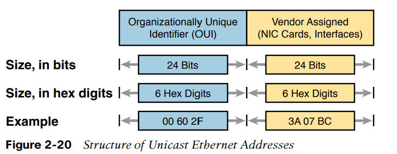

Ethernet address có nhiều tên: LAN address, Ethernet address, hardware address, burned-in address, physical address, universal address, hoặc MAC address. Ví dụ thuật ngữ burned-in address (BIA) có nghĩa là một địa chỉ MAC vĩnh viễn được mã hóa (burned vào) ROM chip trên NIC. Một ví dụ khác, IEEE sử dụng thuật ngữ *universal address* để nhấn mạnh vào điều địa chỉ được gán cho một NIC bởi một nhà cung cấp phải độc nhất trong vũ trụ. 

Bên cạnh các địa chỉ unicast, Ethernet cũng sử dụng các địa chỉ nhóm. *Group addresss* định danh nhiều hơn một LAN interface card. Một frame được gửi tới một group address sẽ được chulyeenr tới một tập các thiết bị trong LAN, hoặc có thể là tới tất cả các thiết bị trên LAN. IEEE định nghĩa hai loại group address cho Ethernet: 
- Broadcast address: Các frame gửi đến địa chỉ này sẽ được chuyển tới tất cả thiết bị trên Ethernet LAN. Nó có giá trị là FFFF.FFFF.FFFF 
- Multicast address: Frames gửi tới địa chỉ multicast Ethernet sẽ được chuyển tiếp tới tập các thiết bị trên LAN có đăng kí nhận frame gửi tới địa chỉ đó. 

Bảng 2-7 mô tả các thuật ngữ về địa chỉ MAC 

  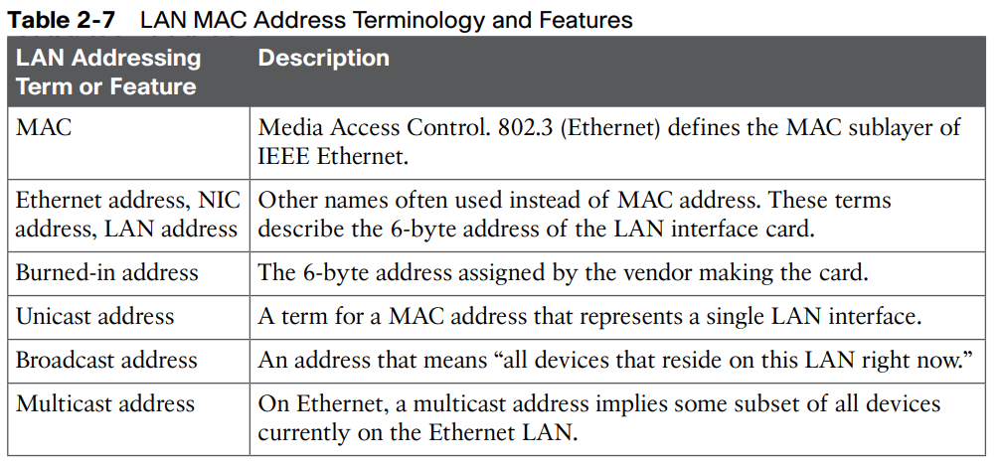

### 4.3 Định danh các giao thức tầng network với trường Ethernet Type 

Các trường liên quan đến địa chỉ của Ethernet header có vai trò quan trọng và rõ ràng trong Ethernet LANs, trường Ethernet Type đóng vai trò ít rõ ràng hơn. Trường Ethernet Type, hay EtherType, nằ ở trong header của Ethernet data-link layer, nhưng mục đích của nó là giúp routers và hosts xử lý network. Cơ bản **trường Type định nghĩa loại packet tầng network (Layer 3) nằm bên trong Ethernet frame**

Đầu tiên, hãy nghĩ về nội dung ở phần data của Ethernet frame ở HÌnh 2-14. Thông thường, nó giữ packet tầng network tạo ra bởi các giao thức tầng network trên một thiết bị nào đó trong mạng. Ngày nay các giao thức tầng network phổ biến đều từ TCP/IP: IP version 4 (IPv4) và IP version 6 (IPv6)

Host có một nơi để đặt giá trị để định dạng kiểu packet được đóng gói bên trong Ethernet frame. IEEE quản lý một danh sách các giá trị EtherType, để mỗi giao thức tần network cần một giá trị EtherType độc nhất có thể có số. Người gửi chỉ cần biết danh sách (lên www.ieee.org và tìm EtherType)

Ví dụ, một host có thể gửi một frame Ethernet với packet IPv4 và Ethernet frame tiếp theo với IPv6 packet. Mỗi frame sẽ có một giá trị cho trường Ethernet Type khác nhau, sử dụng các giá trị quản ý bởi IEEE, trong Hình 2-21. 

  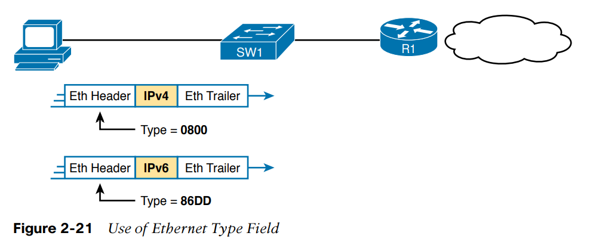

### 4.4 Phát hiện lỗi với FCS 

Ethernet cung cấp một cách để các node biết được các bit của frame thay đổi khi đi qua Ethernet link (Thường thay đổi vì nhiễu hoặc NIC dởm). Ethernet, giống như phần lớn các giao thức data-link, sử dụng một trường trong trailer data-link để phát hiện lỗi 

Trường Ethernet Frame Check Sequence (FCS) ở trong Ethernet trailer - trường duy nhất trong Ethernet trailer - cho phép node nhận một cách để phát hiện lỗi trong frame. Người gửi áp dụng thuật toán lên frame, lưu kết quả vào trường FCS. Người nhận áp dụng cùng thuật toán trên frame nhận được. So sánh kết quả với kết quả của người gửi. Nếu kết quả là như nhau, thì frame không thay đổi; ngược lại là có lỗi, người nhận loại bỏ frame. 

Lưu ý rằng *phát hiện lỗi* không có nghĩa là *phục hồi lỗi*. Ethernet định nghĩa rằng frame bị lỗi nên bị loại bỏ, và không cố hồi phục frame bị mất. Các giao thức khác như TCP, phụ hồi dữ liệu bị mất bằng cách biết được rằng nó bị mất và gửi lại dữ liệu 

### 4.5 Gửi Ethernet Frames với Switches và Hubs
Ethernet LANs hoạt động khác tùy thuộc vào nếu như LAN có các thiết bị hiện đại, cụ thể là LAN switches thay vì các thiết bị LAN cũ hơn như là LAN hubs. Về cơ bản việc sử dụng các switch hiện đại cho phép sử dụng *full-duplex*, nhanh hơn và đơn giản hơn *half-duplex*, phải sử dụng khi dùng hubs 

#### Gửi Ethernet LANs hiện đại sử dụng Full Duplex 
Quá trình rất đơn giản, full-duplex cho phép mỗi thiết bị có thể gửi một lượng lớn frames trên giây. Hình 2-22 minh họa ví dụ PC1 gửi Ethernet frame tới PC2. 

  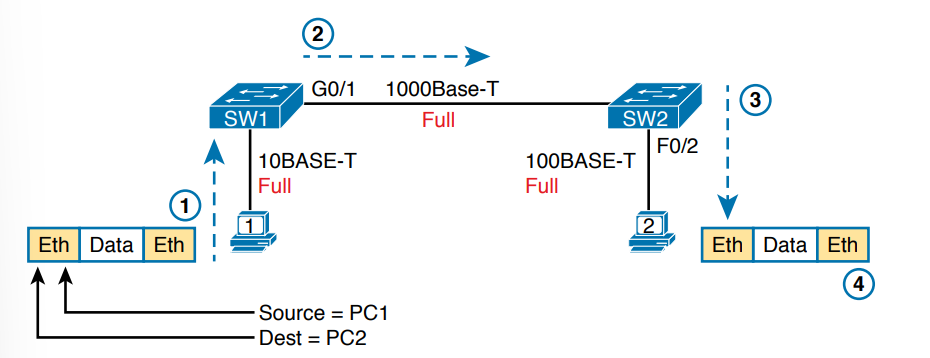

Các bước trong hình 
1. PC1 xây dựng và gửi Ethernet frame sử dụng địa chỉ MAC của nó làm nguồn và địa chỉ MAC PC2 làm đích 
2. Switch SW1 nhận và chuyển tiếp Ethernet frame ra khỏi giao diện G0/1 (Tắt cho Gigabit interface 0/1) tới SW2 
3. Switch SW2 nhận và chuyển Ethernet frame ra khỏi giao diện F0/2 (Viết tắt cho Fast Ethernet interface 0/2) tới PC2 
4. PC2 nhận frame, đọc địa chỉ MAC đích và thấy giống với của nó, xử lý frame 

Mạng Ethernet ở Figure 2-22 sử dụng full duplex ở mỗi link, nhưng khái niệm có thể khó thấy. 

Full duplex có nghĩa là cổng NIC hoặc switch không có hạn chế half-duplex. Để hiểu full duplex cần phải hiểu half duplex 
- *Half duplex*: Thiết bị phải đợi không được gửi nếu nó đang nhận một frame; nói cách khác nó không thể gửi và nhận cùng một lúc 
- *Full duplex*: Thiết bị không phải đợi trước khi gửi; nó có thể gửi và nhận cùng lúc 

Nếu mạng Ethernet chỉ dùng PCs và LAN và không sử dụng LAN hub, tất cả các node có thể dùng full duplex. Tất cả các node có thể gửi và nhận trên các cổng cùng một lúc. Ví dụ, ở Hình 2-22, PC1 và PC2 có thể gửi frame cho nhau cùng một lúc, ở cả hai hướng. 

#### Sử dụng half duplex với LAN Hubs 

Để hiểu về half-duplex, bạn cần hiểu một tí về một thiết bị networking cũ gọi là LAN hub. 

Giống như switch LAN hub cung cấp một số cổng RJ-45 để kết nối link với PCs; tuy nhiên hubs sử dụng quy tắc khác để chuyển tiếp dữ liệu 

LAN hubs chuyển dữ liệu sử dụng chuẩn tầng physical thay vì chuẩn tầng data-link vì thế nó được coi là thiết bị Tầng 1. Khi một tín hiệu điện đi vào cổng của hub, nó phát lại tín hiệu đó ra tất cả cổng còn lại. Bằng cách đó, dữ liệu tới tất cả các phần còn lại của nodes kết nối với hub, và nó sẽ có thể tới được đích. Hub không có khái niệm về Ethernet frame, địa chỉ, nó không đưa ra lựa chọn dựa trên các địa chỉ,... 

Điểm yếu của việc sử dụng LAN hubs là nếu mà có nhiều hơn hai thiết bị truyền tín hiệu tại cùng một thời điểm, các tín hiệu điện sẽ va chạm với nhau. Hub sẽ lặp tất cả các tín hiệu điện mà nó nhận được, ngay kể cả khi nó nhận được nhiều tín hiệu cùng lúc. Ví dụ, Hình 2-23 mô tả ý tưởng, với PCs Archie và Bob gửi tín hiệu điện tại cùng một thời điểm tại bước 1A và 1B và hub lặp cả hai tín hiệu ra tới Larry ở bên trái (Bước 2)

  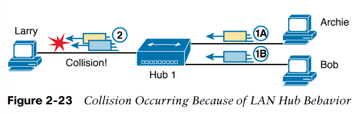

*Lưu ý*: Hub lặp các tín hiệu ra tất cả các cổng (trừ cổng nhận). Nên Frame của Archie đi tới Larry và Bob; và frame của Bob đi tới Larry và Archie 

Vấn đề tạo ra bởi hub: xung đột. Để ngăn chặn xung đột, các node Ethernet phải sử dụng logic half-duplex thay vì full-duplex. Vấn đề xảy ra khi hai hoặc nhiều hơn thiết bị gửi cùng một lúc; logic half-duplex nói với nodes rằng nếu như có ai đó đang gửi, đợi trước khi gửi. 

Ví dụ, ở Hình 2-23, tưởng tượng rằng Archie bắt đầu gửi frame đủ sớm để Bob nhận được các bit đầu của frame đó trước khi Bob gửi frame của Bob. Ở bước 1B, Bob sẽ biết được rằng mình đang nhận được frame từ ai đó khác và sử dụng logic half-duplex, Bob đợi để gửi frame ở Step 1B 

Các nodes sử dụng half-duplex logic sử dụng một thuật toán gọi là carrier sense multiple access with collision detection (CSMA/CD). Thuật toán xử lý trường hợp dễ thấy nhưng cũng như trường hợp hai nodes có thể kiểm tra frame tới cùng một lúc, khi đó cả hai node sẽ thấy là không ai đang gửi và cả hai sẽ gửi dẫn tới xung đột. CSMA/CD xử lý cả những trường hợp này, như sau: 
*Bước 1:* Một thiết bị với một frame để gửi lắng nghe tới khi Ethernet không bận 
*Bước 2:* Khi Ethernet không bận, người gửi bắt đầu gửi frame 
*Bước 3:* Người gửi nghe khi gửi để phát hiện nếu có xung đột xảy ra; xung đột có thể bị gây ra bởi nhiều lý do, do đen. Nếu xung đột xảy ra, tất cả các node đang gửi sẽ:
  1. Gửi tín hiệu gây nghẽn báo hiệu cho tất cả các node có xung đột 
  2. Chúng độc lập chọn thời gian ngẫu nhiên để thử trước khi thử lại để tránh xung đột 
  3. Quay lại bước 1 

Mặc dù phần lớn mạng LANs hiện đại thường không sử dụng Hub, vì vậy không sử dụng half duplex, tuy nhiên, các hub cũ vẫn tồn tại trong mạng doanh nghiệp. Mỗi cổng NIC và switch có cài đặt duplex. Với tất cả link giữa PCs và Switch hoặc giữa các switch, thì sử dụng full duplex. Tuy nhiên bất kì link nào có LAN hub, cổng của switch LAN và NIC sẽ sử dụng half duplex. Lưu ý rằng bản thân hub không sử dụng half-duplex, nó chỉ lặp các tín hiệu ra khỏi các cổng mà không phải cổng nhận. 

  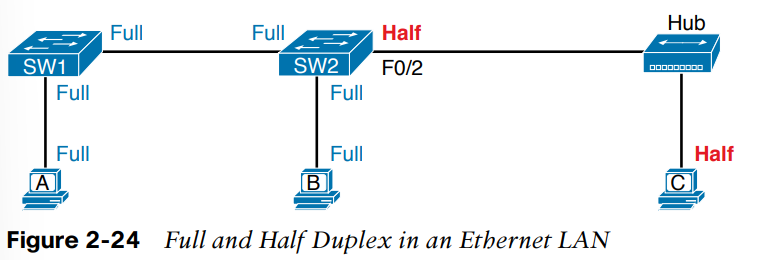

*Lưu ý:* Thuật ngữ *Ethernet point-to-point* nhấn mạnh vào việc trong một mạng xây dựng bằng các switches, mỗi (point-to-point) link hoạt động độc lập với nhau. Vì full-duplex, frame có thể được gửi đồng thời từ nhiều link trong Ethernet. 

# II. WANs cơ bản và định tuyến IP 
Chương này giới thiệu WANs và các tính năng của tầng network TCP/IP 

Để hiệu định tuyến IP, bạn cần hiểu cơ bản về hai loại liên kết WANs: serial links và Ethernet WANs links. Các WANs links kết nối các routers cách xa nhau hàng dặm hoặc hàng trăm dặm, cho phép chúng giao tiếp với nhau. 

Phần còn lại của chương sẽ chú trọng vào tầng Network TCP/IP, với IP là chủ đề chính. Phần thứ hai của chương bàn về tính năng lớn của IP: định tuyến, địa chỉ và các giao thức định tuyến. Phần cuối cùng của chương xét một vài giao thức khác ngoài IP cũng giúp tầng Network TCP/IP tạo ra một mạng cho phép giao tiếp giữa các endpoints. 

## 1. Wide-Area Networks 

Tưởng tượng một ngày ở một doanh nghiệp nào đó. Người dùng đang sử dụng một thiết bị endpoint như: PC, tablet, điện thoại. Thiết bị đó kết nối với một LAN, thông qua cáp Ethernet hoặc LAN không dây. Tuy nhiên, người dùng đang xem thông tin trên một website, và web server nằm ở home office của company. Để người dùng có thể xem website đó, dữ liệu phải **di chuyển qua một hoặc nhiều liên kết WAN**

**Công nghệ WAN định nghĩa các chuẩn tầng physical (Layer 1) và các giao thức tầng data-link (Layer 2) để giao tiếp khoảng cách xa.** Phần đầu tiên xem xét về hai công nghệ **leased-line WANs** và **Ethernet WANs**. Leased-line WANs đã được sử dụng gần một nửa thế kỉ, và ít phổ biến ngày nay. Ethernet WANs links sử dụng cùng giao thức data-link với Ethernet LANs, nhưng chúng sử dụng thêm các tính năng để giúp các liên kết hoạt động với khoảng cách xa hơn. 

### 1.1 Leased-Line WANs

#### Chi tiết vật lý của Leased Lines 

#### Cách Routers sử dụng WAN Data Link

### 2.2 Ethernet làm công nghệ WAN 

